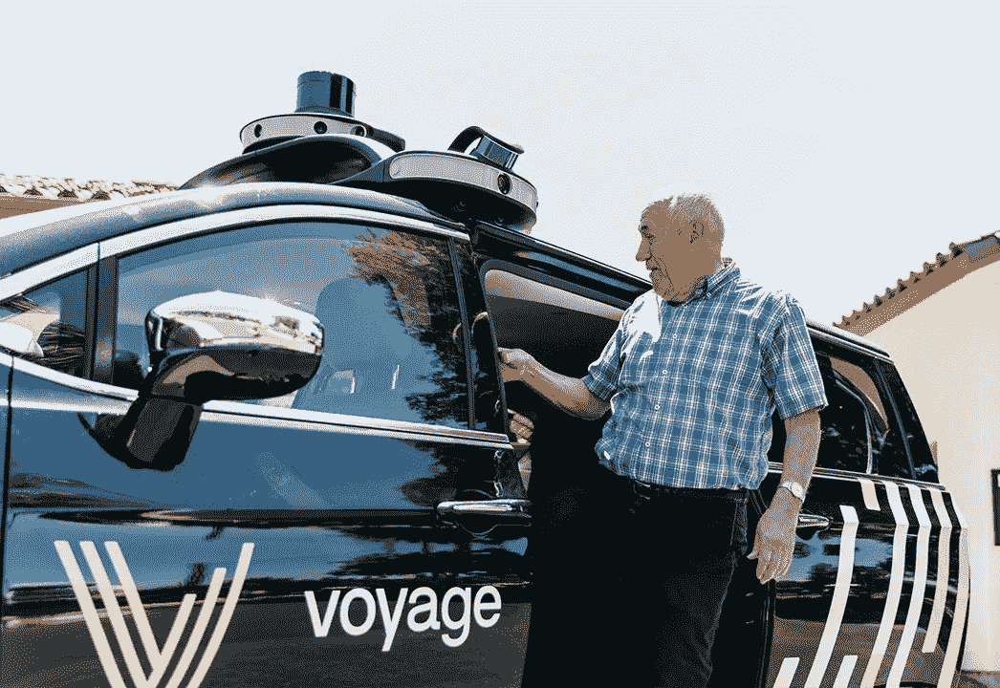
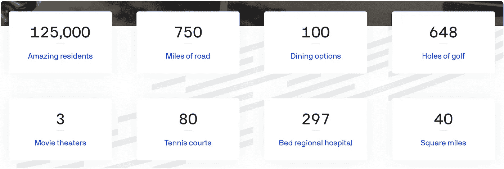

# 这个 Robotaxi 创业公司有实际的客户，而不是十位数的资金

> 原文：<https://medium.datadriveninvestor.com/instead-of-ten-figure-funding-this-robotaxi-startup-has-actual-customers-48bd468782fa?source=collection_archive---------0----------------------->

在汽车巨头和他们肿胀的支票书写手腕中，有一个小的创业公司武装着弹弓和吹牛的权利。这家初创公司名为 [Voyage](https://voyage.auto/) ，它可以为移动行业提供一些经验教训。

据首席执行官奥利弗·卡梅伦(Oliver Cameron)介绍，从 Udacity 自动驾驶汽车纳米学位项目中剥离出来的团队迄今为止已经筹集了 2000 多万美元。作为参考，这比通用汽车 Cruise 宣布的上一轮投资[少了两个数量级。与 Cruise 不同的是，Voyage 现在也有客户。](https://www.forbes.com/sites/joannmuller/2018/05/31/gms-self-driving-fleet-gets-2-25-billion-capital-infusion-from-softbank-ahead-of-2019-launch/#12c876675ebb)

在某种程度上，自动驾驶出租车服务 Voyage 为两个大型退休社区(*村庄圣何塞*和*村庄佛罗里达*目前正在部署)提供了后勤方面的标准出租车服务，因为安全司机总是在场监督或纠正车辆。但从另一个更准确的角度来看，这是除了 Waymo 以外，这个领域中每个人的物流设置。就目前而言，所有的自动驾驶汽车项目都只是在这里接受教育。

为此，Voyage 至少在一个重要问题上表现出色:公众认知。在经典的精益创业风格中，他们发现了一个早期采用者市场——在这个市场中，错误是可以管理的，停机时间是可以原谅的。这听起来可能像是一个无关紧要的实验，但 Voyage 在圣何塞的位置有 4000 名居民，而佛罗里达的位置拥有 125000 名居民。在这两个社区，出租车服务都是作为已经养尊处优的生活方式的一种附加值提供的。

Overview of The Villages, Florida

对于汽车制造商来说，这是一个陌生的位置，他们习惯于在将产品像机械初次亮相一样正式展示给世界之前埋头苦干。对于将平台视为产品的科技巨头来说，这也越来越陌生，如果没有关键的集成点来捕获他们可以接受的所有消费者数据，他们不会想到推出一个解决方案。

但是，无人驾驶汽车的竞赛，如果这是一件事的话，实际上更像是一场土地争夺战。技术的成熟没有客观的障碍；如果你能把能力和需求结合起来，你就能发现机会的口袋……也许，把这些口袋扩大到竞争者不愿意涉足的细分市场。

随着人口老龄化成为自动驾驶汽车研究的全球驱动力之一，这无疑有助于任何公司在退休社区及其居民中取得成功。虽然业内人士对挖掘乘客数据的想法垂涎三尺，但 Voyage 迎合了其更老的、[更怀疑的人口统计](https://www.forbes.com/sites/kevinmurnane/2016/04/18/how-the-boomers-differ-from-everybody-in-their-approach-to-online-privacy-and-security/#465fa853254d)。当被问及这家初创公司收集哪些个人信息时，卡梅伦回答说，“非常简单:姓名、电子邮件以及他们所属的社区。”

移动性的未来远不是一个赢家通吃的命题，这种轻量级的市场跳跃在这些狂野的西部日子里是值得思考的——特别是对于那些已经开始将他们的[缺乏集成定位为竞争优势的公司](https://www.forbes.com/sites/paularmstrongtech/2018/06/04/apple-understands-something-about-privacy-that-facebook-doesnt/#3b0ef0943196)。

*这篇文章最早出现在 Forbes.com 的* [*上。*](https://www.forbes.com/sites/mitchturck/#48b30ed36821)