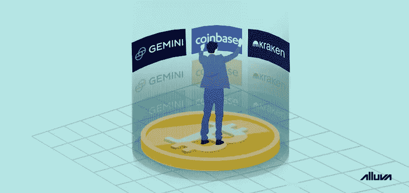

# 机构投资者正在进入加密市场——这会影响价格吗？

> 原文：<https://medium.datadriveninvestor.com/institutional-investors-are-entering-crypto-will-this-impact-prices-1f917e4394b4?source=collection_archive---------5----------------------->

区块链(以及加密货币)在过去几年中被大肆宣传，特别是自 2017 年以来。像这样的问题，*“加密货币会取代美元吗？”*还有，*“比特币会超越黄金吗？”*成为全球知名媒体的头条新闻。然而，尽管如此，加密货币交易和投资仍然相对小众。

也就是说，直到最近，像高盛和摩根士丹利[这样的大型机构玩家开始对加密市场表现出浓厚的兴趣。甚至有资格的投资者也出来支持最近的资产，包括许多著名的华尔街人士。那么，这是否意味着比特币和其他数字货币将在未来几个月呈上升趋势？我们来讨论一下影响这个问题答案的变量。](https://www.investopedia.com/news/goldman-sachs-cryptocurrency-patent-setlcoin-crypto-settlement-system/)

# 机构投资的障碍

几年前，由于交易基础设施中的一些限制或障碍以及加密市场的不稳定性，机构投资者无法进入加密货币领域。

快进到 2019 年，机构投资者已经找到了绕过这些障碍的方法，即加密衍生品市场(仍处于早期阶段)和比特币基地等交易所提供的先进交易工具。这两个因素有助于增强机构投资者的信心。特别是加密衍生品，帮助机构投资者涉足加密市场，而无需实际拥有资产，也无需处理与安全和存储相关的管理费用。

 [## 总部位于瑞士的 ETP 进入加密交易市场|数据驱动的投资者

### 虽然金融市场几乎没有沉闷的时刻，特别是在引入…

www.datadriveninvestor.com](https://www.datadriveninvestor.com/2019/03/10/swiss-based-etp-enters-the-crypto-trading-market/) 

随着大多数障碍的消除，加密货币正在成为机构投资者的既定资产类别。他们已经在他们的投资组合中增加了价值数亿美元的加密货币，以免错过任何机会。

# 密码交换的作用

到目前为止，加密货币行业的三家主要公司已经在这场机构参与者的竞赛中脱颖而出，即比特币基地、双子星和北海巨妖。

双子座在 2019 年早些时候推出了名为[双子座托管](https://gemini.com/custody/)的机构级加密托管解决方案。据该交易所称，它允许客户直接在交易所交易 18 种加密货币，而不必从安全的冷库中取出它们。另一家美国企业比特币基地正在做与[比特币基地托管](https://custody.coinbase.com/)类似的事情，这是一个合格的托管解决方案，于 2019 年 3 月推出。北海巨妖等其他交易所也纷纷效仿，与[艾塔娜托管](https://etana.com/)合作——给机构投资者更多选择。

加密交易所成为合格的托管机构是朝着正确方向迈出的一大步，因为缺乏安全的存储和托管解决方案是阻碍机构参与的主要障碍之一。

# 最大的问题是:它会影响价格吗？

与任何其他金融市场一样，投资的整体增加几乎总是会导致价格的净上涨。比特币等加密货币的供应量有限，这意味着需求的增加会让每种货币变得更有价值。Anthony pomp liano——在接受美国消费者新闻与商业频道采访时———表示，多亏了机构投资者，比特币才得以存在，并强调投资者的流入甚至可能在某个时候帮助比特币突破 6 位数大关。

鉴于加密货币市场自 2018 年初以来基本处于休眠状态，受欢迎程度和机构资金流入的增加肯定有助于 crypto 逃离熊市。

话虽如此，机构投资者可能会对市场状况做出错误判断，或者过早采取行动。由于各种因素都以各自的方式影响着加密市场，如果没有合适的工具，很难监控加密趋势。

# 像机构投资者一样监控加密趋势

加密货币可能有一天会成为主流，但目前，你仍然需要专门的工具来监控趋势和做出预测。一个错误的预测可能会让你损失一大笔投资。Alluva 是一个免费的网络应用程序，它允许任何人通过预测各种加密资产的潜在价格来获得奖励，从而缓解了这个问题。它还提供了对市场走势的预测性见解，让未来变得不那么不透明。这些丰富的信息可以决定投资的成败。

与股票市场不同，加密货币是全天候交易的，对这个行业来说是个新东西可能会有点让人不知所措。这就是为什么许多投资者建议长线投资，不鼓励选择时机。话虽如此，毫无疑问，如果操作得当，即使在短期内，加密交易也能获得巨大的利润。

要了解更多关于 Alluva 的信息并做出你的第一个预测，请在此注册一个账户[。更多加密相关内容，](http://bit.ly/ext_grp1)[关注我们](http://bit.ly/alluva_mdm)。请继续关注我们的[推特](http://bit.ly/alluva_tw)了解 Alluva 的最新动态，并加入我们的[电报组](http://bit.ly/alv_telgrp)与我们的团队聊天。