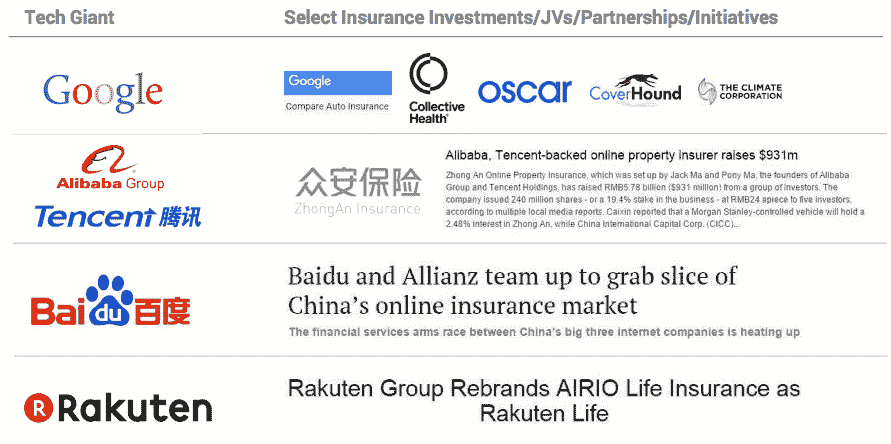

# 保险技术——三大创新趋势

> 原文：<https://medium.datadriveninvestor.com/insurance-tech-3-major-innovation-trends-3eede2f09f7a?source=collection_archive---------6----------------------->

保险业正在经历一场翻天覆地的变化，尤其是汽车和医疗这两个全球万亿美元的行业。科技公司在利用成功保险业务的内在先决条件方面一直扮演着重要角色，这些先决条件包括稳定性、分销、可信度和资产，以下是一些显著的例子:

除了这些具体的例子，技术正在从根本上重塑汽车和医疗保险。自动化程度的提高、市场的扩散和新型联盟是允许新商业模式出现的三个关键趋势。

> [DDI 编辑推荐——众所周知的保险业的终结:千禧一代、保险技术和风险投资将如何破坏生态系统](http://go.datadriveninvestor.com/insurtech2/matf)

**1)自动化又称翻转精算模型**

谈到汽车，像 [Metromile](https://www.metromile.com/) 和 [MileIQ](https://mileiq.com/) 这样的公司正在使用 GPS 和 OBD 端口开发新的保险模式，包括按英里付费。来自 dashcams 的数据为事故中的过失提供了可审计的证据，这些事故发生在 [Samsara](https://www.samsara.com/) 、 [Azuga](https://www.azuga.com/) 和 [Sompo](https://asia.nikkei.com/Business/Companies/Sompo-Japan-taps-AI-to-determine-fault-in-car-accidents) 等各种公司。 [HealthIQ](https://www.healthiq.com/) 提供测试您的健康知识的测验，该公司认为这些知识与您的健康行为以及最终的健康结果相关，从而使他们能够识别更好的人，从而降低人寿保险费用。毫无疑问，趋势是更多的数据将继续推动更精确的模型。

**2)市场又名按使用付费**

当信息不对称时，市场运作得最好——特定产品的购买者不知道谁或者如何为他们找到合适的卖家。对于我们所有与保险打过交道的人来说，考虑到很多细节都模糊不清，保险市场的时机已经成熟，这应该不足为奇。 [PolicyGenius](https://www.policygenius.com/) 为客户提供个性化报价，并对保险公司的保单进行对比。 [CoverWallet](https://www.coverwallet.com/) 也有类似的价值定位，更侧重于小企业。随着企业为消费者提供更好的透明度，利润率将持续下降。

**3)联盟又名巨人游戏**

在 19 世纪，工厂开始为工人提供从健康保险到住房的各种福利。现代公司正在重新审视这一主题，这次是通过新的联盟。亚马逊、伯克希尔·哈撒韦和摩根大通宣布成立一家合资医疗公司，旨在为 100 多万通过他们获得医疗保健的人“减少中间商”和“降低成本”。考虑到这些公司都不是供应商、付款人或制药公司，这是一个特别大胆的声明。沃尔玛和苹果也宣布了类似的计划，将医疗保险覆盖范围扩大到员工。传统医疗保健业的反应是更紧密的联盟，最近最著名的例子是 CVS 和 Aetna 的合并。趋势是，随着巨头们争夺美国 3.3 万亿美元医疗保健市场的份额，我们将看到越来越多的整合。

如果你从这篇文章中发现了什么，给个赞吧。有什么想法，请评论。

*这些都是专注于实践见解的短文(我称之为 GL；dr —良好的长度；确实读过)。如果它们能让人们对某个话题产生足够的兴趣，从而进行更深入的探索，我会感到非常兴奋。此处表达的所有观点均为本人观点；我是 HealthIQ 的创始人之一。*