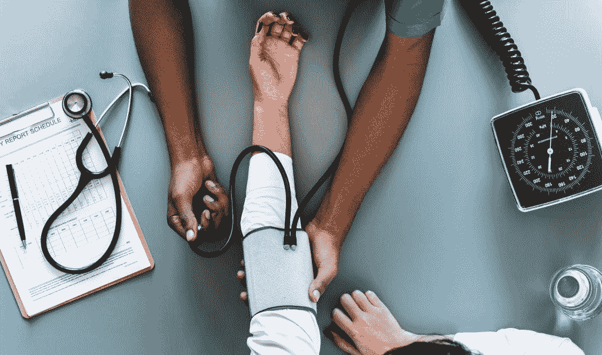

# 在全科医生手术中整合数字健康

> 原文：<https://medium.datadriveninvestor.com/integrating-digital-health-in-gp-surgeries-a085d229d731?source=collection_archive---------29----------------------->

Photo by [rawpixel](https://unsplash.com/photos/w9YHKTK-wLo?utm_source=unsplash&utm_medium=referral&utm_content=creditCopyText) on [Unsplash](https://unsplash.com/search/photos/doctor?utm_source=unsplash&utm_medium=referral&utm_content=creditCopyText)

卫生和社会福利部的国务秘书马特·汉考克承诺对国民保健服务系统进行技术改造。机会是巨大的——改善服务交付，支持从被动护理模式向主动护理模式的转变，让员工有更多时间专注于患者护理。在医疗服务的各个层面都有真正的需求，包括由全科医生诊所在社区提供的医疗服务。

实施基于证据的数字解决方案是缓解全科医生实践层面日益增长的压力的一个重要途径。这就是为什么我对 ComRes 代表 [Doctorlink](https://www.doctorlink.com/) 进行的 [GP 调查的结果感兴趣。Doctorlink 的重点不是“破坏”服务提供模式，而是设计数字解决方案来支持初级保健的提供，包括通过分流系统。](http://www.comresglobal.com/polls/doctorlink-gp-survey-on-digital-health-services/)

# 该调查

该调查于 2018 年 8 月在英国对超过 1000 名全科医生进行。这些数据在全国范围内具有代表性。调查的重点包括:

*   60%的人说数字服务的影响被夸大了——在英国服务时间最长的全科医生(从业超过 30 年)中上升到 70%
*   42%的人认为所有的诊所都应该使用相同的数字分类服务，而 34%的人认为个体诊所应该能够选择他们使用的服务
*   全科医生认为数字服务需要做的最重要的事情是减少面对面的预约(33%的人选择了这个选项，这是最受欢迎的选择)
*   但 61%的人预计 NHS 的数字分流应用程序将增加希望亲自看全科医生的患者数量。

# 为什么这很重要？

这些数字标志着政府目前在医疗和社会保健领域对数字技术的雄心，与提供服务的人对这一雄心的看法之间存在差距。

但是我们确实有一个没有简单解决办法的问题。患者数量越来越多，这些患者的需求越来越多样，有时甚至很复杂，再加上全科医生严重短缺。这导致手术压力越来越大。

除此之外，英国医学协会最新季度工作量和健康调查( [Q2 2018](https://www.bma.org.uk/collective-voice/policy-and-research/education-training-and-workforce/quarterly-survey/quarterly-survey-results/quarterly-survey-q2-2018) )的结果也令人触目惊心。这项调查涵盖了包括全科医生在内的一系列医疗专业人员。士气低落，42%的受访者认为他们的士气低落或非常低落。自英国退出欧盟公投以来，57%的人表示非英国公民的申请数量有所下降。全科医生仍然最有可能“经常”在正常工作时间之外工作。

很明显必须做点什么。

# 数字技术的承诺

数字技术确实大有可为。对全科医生来说，真正的好处是腾出时间，减少对流程的关注，更多地关注病人。对于患者来说，好处是拥有准确的在线信息，支持良好的自我护理和长期护理状况管理。从 Doctorlink 的试点来看，面对面预约的请求减少了 10%，释放了宝贵的全科医生时间。

这一点的核心是需要确保解决方案是循证的，并与全科医生、更广泛的卫生和护理社区、患者和公众合作开发。

**我们会看到国民医疗服务系统的数字化转型吗？你认为关键的机遇和挑战是什么？**

*Doctorlink 是连接患者和初级保健系列的数字网关。他们是在该领域工作的许多提供商之一，拥有数字分类、建议工具和服务查找解决方案。目的是降低患者需求水平，同时改善患者的护理体验。他们目前在英国国民保健服务系统与可持续发展和转型伙伴关系(STPs)、临床委托组(CCGs)、全科医生和 111 服务机构合作。他们目前与 400 家全科诊所签约，覆盖 320 万患者。

我是一名政策分析师和作家，研究人工智能在健康、社会保健和房地产方面的应用。如果你想了解更多，就来[科亚咨询](http://keyahconsulting.com/)打个招呼吧。

*原载于 2018 年 10 月 10 日*[*keyahconsulting.com*](http://keyahconsulting.com/integrating-digital-health-in-gp-surgeries/)*。*