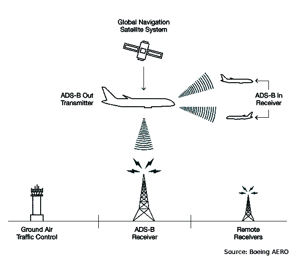
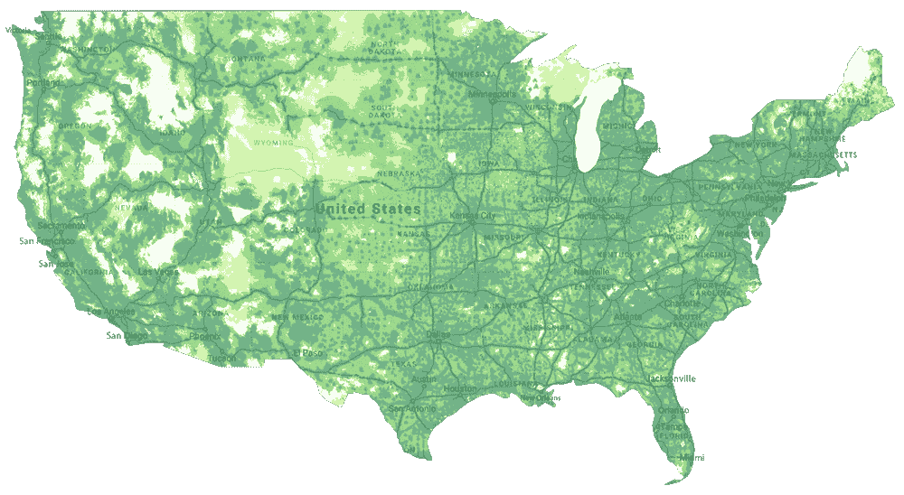

# 利用现有网络基础设施将无人机整合到商业空域

> 原文：<https://medium.datadriveninvestor.com/integrating-drones-into-commercial-airspace-using-existing-network-infrastructure-b69169a38a00?source=collection_archive---------9----------------------->

## 纳伦德兰·穆拉利·达兰·[narendran.m@aptusai.com]

在美国，使用国际民用航空组织(ICAO)的 A 级到 G 级对空域进行分类，f 级除外。实施空域分类是为了最大限度地提高飞行员的灵活性，同时最大限度地降低碰撞风险。空域分类在高密度空中交通区域(如高速航线和主要机场附近)提供分隔和主动控制。为了提供高质量的空中交通管制服务，在空域中对商用和军用飞机进行跟踪。

一次雷达最初是为军事用途开发的，是空中交通监视的一种基本形式，它使用传统的雷达传感器发射电磁波，并测量接收目标反射信号的时间。利用这个时间，可以估计到目标的距离。雷达天线的方向和距离可以用来估计目标的位置。在现代，一次雷达只是作为备用。

二次雷达，后来被称为民用二次监视雷达(SSR ),是商业运营中首选的空中交通雷达。二次雷达使用雷达信标系统，该系统依靠飞机上的“应答机”来传送它们的位置、高度、呼号、呼叫代码等。TCAS、S 模式和 ADS-B 是二次雷达的现代方法。

# ADS-B:看到和被看到

自动相关监视—广播(ADS-B)是一种使用基于卫星的 GPS 确定飞机位置并定期广播的技术。“ADS-B Out”广播包由地面上装有“ADS-B In”和 ADS-B 接收器的其他飞机接收，并跟踪发射飞机的位置。ADS-B 本身就足以取代一次雷达。

为了使用 ADS-B 进行跟踪和被跟踪，要求飞机配备应答器。包括 Stratus 和 Garmin 在内的许多航空电子公司为通用航空飞机提供 ADS-B 转发器，价格在 1500 美元到 4000 美元之间。

随着无人机行业的快速发展和公司意识到无人驾驶飞机的潜力，确保安全融入商业空域比以往任何时候都更加重要。目前，美国联邦航空管理局(FAA)限制无人机只能在离地面 400 英尺以下和不受控制的空域飞行。在飞行员需要在机场 5 英里范围内操作无人机时，他们需要联系机场空中交通管制(ATC)塔台并请求许可。

大多数无人机都是远程操作的，或者至少通过无线遥测下行链路连接到基站。无人机飞行员也需要保持对飞机的目视观察。这将操作限制在视觉视线(V-LOS)内。如果无人机要飞越 V-LOS，遥测链路将向地面站提供无人机的位置、高度和速度。目前，这仍然局限于操作员和其他飞行员——有人驾驶和无人驾驶飞机都没有精确的方法来跟踪这些无人机。这是非常不安全的，最近几天出现了大量关于无人机和商用有人驾驶飞机险些相撞的报道。2016 年，美国售出了 120 万架无人机，同年有人驾驶飞机的飞行员报告了约 1800 起无人机目击事件。这比 2015 年增长了 25%。一架波音 737 或空客 A320 以大约 160 节的速度接近时，只有不到 8 秒的时间对无人机做出反应。美国联邦航空局咨询通告 90–48D 显示，普通飞行员需要 12.5 秒的总反应时间才能看到障碍物、识别障碍物、意识到碰撞路线并做出必要的转向。因此，允许无人机在商业空域飞行而不被跟踪是非常危险的。

# 无人驾驶飞机的低功率 ADS-B 系统

FAA 和一些公司正在探索通过 ADS-B 跟踪无人机的可能性，就像有人驾驶飞机一样。这将允许无人机被其他飞机跟踪，并且可以提前遵循适当的交通回避程序。跟踪无人机并允许超越 V-LOS 飞行的能力是无人驾驶飞机行业的重要一步。如果能够安全地集成到商业空域，无人机可以用于送货，医疗运输，监视，检查，农业和许多其他应用。

DIY 无人机爱好者已经设法“侵入”1090 MHz 电视接收器，并使用它们接收附近飞机的 ADS-B 数据包。uAvionix 还推出了 pingRX，这是一种低功耗 ADS-B In 接收器，用于跟踪其他飞机。在接收器中使用这些 ADS-B，无人机可以跟踪商业飞机的位置，并保持安全间隔。最近，低功耗和轻型 ADS-B 收发器(输入和输出)也已推出。通常，商用有人驾驶飞机转发器的发射功率高达 350W。为无人机设计的 ADS-B 收发器额定发射功率高达 20W。这极大地限制了其他飞机、ATCs 和 ADS-B 接收器跟踪无人机的距离。而且就算这样，20W 对于小型无人机来说也是很大的功率了！许多小型无人机的发动机功率低于 100W，额外的 20%功率要求会显著影响其续航能力。

在 Aptus，我们正在研究这个问题的潜在解决方案——我们希望将机载收发器的发射功率进一步降低到 1W 以下，并将跟踪范围增加到接近商用 ADS-B 转发器的范围。

# 最大的无线网络就在您的口袋里

乘坐商业航班时，我们被要求关掉手机，但我们大多数人都忘记了或者懒得去做。当我们在 6000 英尺的高空收到通知或短信时，我们通常会被提醒。一些乘客报告说，即使在距离地面 16，000 英尺的高度，4G LTE 也有覆盖！美国和现在许多其他国家也有非常大的移动网络基础设施。下面是谷歌项目 Fi 的 4G 覆盖图。

此外，超低功耗嵌入式 LTE-M 网络的发展允许开发更便宜和更低功耗的移动网络接入设备。无人机目前被限制只能在 400 英尺的高度飞行，但大多数操作在距离地面 1000 到 5000 英尺之间是最有效的。嗯，如果我们可以在这些高度通过 4G LTE 连接到互联网，无人机应该可以通过 LTE-M 调制解调器将他们的位置广播到一个集中的在线数据库。这仍然没有解决其他飞行员和 ATC 看到无人机的问题。在美国飞行的每架飞机上安装互联网连接系统是一项非常昂贵、耗时且乏味的任务，联邦航空局很可能不会批准。

ADS-B 的独特之处之一是，ADS-B 发射机的实际源位置不会影响其他飞机和 ATC 看到发射飞机的位置。飞机位置仅由作为 ADS-B 数据包一部分传输的 GPS 位置确定。如果有遍布全国的高功率 ADS-B 发射机，它们只是轮询无人机位置的数据库，并从数据库中将它们作为飞机实际位置周围的 ADS-B 数据包进行中继，ADS-B 接收机和 ATC 塔将能够接收到无人机。该数据库还将包括其他装有 ADS-B 的有人驾驶飞机传输的位置。这可以从诸如 [FlightRadar24](https://www.flightradar24.com/) 和 [FlightAware](https://flightaware.com/) 等来源进行查询。这有可能解决问题的方方面面！

# 构建无人机网络基础设施

为了实现这一点，我们需要为无人机建立中央数据库来记录它们的位置。需要开发允许无人机连接到互联网的硬件，特别是使用 LTE-M 的数据库。此外，为了简化集成，将与该系统一起使用的飞行控制器必须强制执行交通和防撞程序。该项目的最困难部分将是建立一个地面 ADS-B 输出发射机阵列，以中继来自数据库的无人驾驶飞机的位置。然而，这比让所有其他飞机直接连接到数据库要容易得多，也便宜得多。

我的团队正在为该系统制定实施计划。我们正试图与有关系的合适的人取得联系，以使这成为现实，并推动无人机安全融入商业空域。我们正在积极寻找合作伙伴来完成这个项目。请查看我们的网站 [https://aptus.aero](https://aptus.aero) 或[联系我](mailto:narendran.m@aptus.aero)如果你有兴趣合作。

阅读我们网站上的文章:[https://aptus.aero/updates?article=drones-airspace-adsb](https://aptus.aero/updates?article=drones-airspace-adsb)