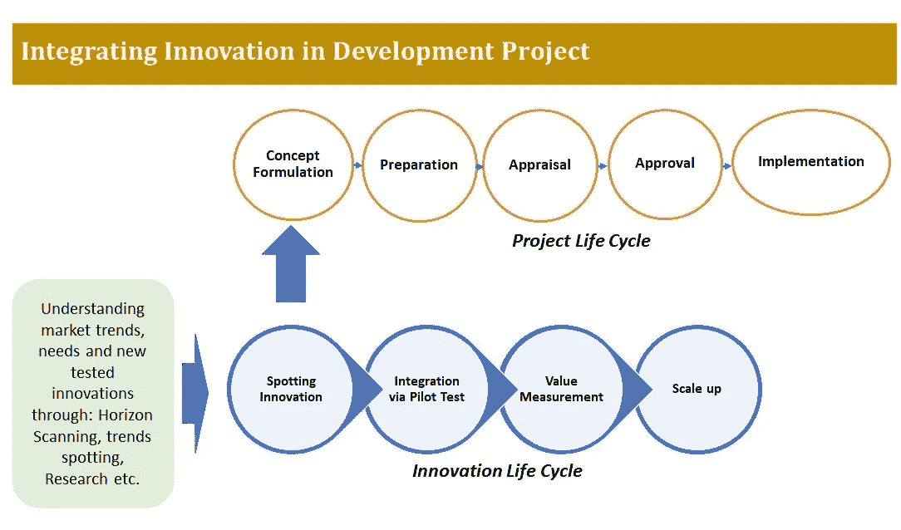

# 在开发项目中整合创新！

> 原文：<https://medium.datadriveninvestor.com/integrating-innovation-in-development-projects-10a4b5f109ac?source=collection_archive---------18----------------------->

Photo by [NordWood Themes](https://unsplash.com/@nordwood?utm_source=medium&utm_medium=referral) on [Unsplash](https://unsplash.com?utm_source=medium&utm_medium=referral)

雄心勃勃的可持续发展目标越来越多地促使发展组织重新思考其运营和商业模式。这些解决方案需要灵活、可扩展、与受益者共同设计和创造。组织本身需要具有高度的适应性、灵活性、快速性和前瞻性，只有这样，才能交付高影响力的创新解决方案。

这种组织转变是许多组织的主要任务，他们一直在处理遗留系统、政策和根深蒂固的官僚作风。改变文化是一项艰巨的任务，尤其是在员工队伍保持不变的情况下。颠覆性技术的进步给开发人员带来了大量的机会，只要他们知道如何有效地利用它们。

像区块链这样的颠覆性技术将在更大程度上提高援助工作的效率和透明度。嵌入无人机、社交数据分析、机器学习、人工智能、机器人流程自动化等新技术将提高各国发展干预的有效性。

问题是如何成功地将它们整合到开发项目周期中？

我的个人经验表明，这项工作并不容易，尤其是当人们习惯于照常做生意的时候。 ***因此，要有毅力。*** 在一个传统项目中添加一个新的组件总是会增加其实现中的某种程度的风险。最重要的是，客户可能看不到拥有新组件的价值，因为这可能会增加成本和实施时间。

***其次，不要试图嵌入一个没有经过正面结果测试的创新。如果创新没有经过测试，并且处于基础研究水平，那么由于管理层的低买入水平，与项目整合将会非常困难。***

***其三，拥有一个*** *的飞行员。*在不太复杂的项目中开始实施小的创新，衡量价值，然后扩大规模。

下图描述了创新可以集成到哪个阶段:

如图所示，要发现创新机会，需要做大量的工作。视野扫描、研究、专题焦点小组讨论。一旦发现了创新，就与相关的项目官员讨论将组件添加到项目设计中。

通常，任何开发项目都是从制定概念开始，然后是准备和评估。创新解决方案的集成可以在项目的概念化阶段完成。此时，计算可能需要多少额外预算，为这些额外成本寻求赞助，一旦获得管理层批准，就开始小规模实施。一个成功的试点总是会引发更广泛的实施。但是首先，你必须证明它是有效的。

# **案例研究**

两年前，我们实施了一个具有创新成分的基础设施项目，将道路耐久性提高了 3 倍。我们在年会组织的创新展上发现了来自三个不同国家的三项创新，随后确定了一个潜在客户——非洲的一个成员国。

在客户的目的地，政府机构与所有三个创新者一起组织了几次技术研讨会。经过仔细考虑，其中一项创新被认为与国家需求高度相关。

在创新者的原籍国组织了一次技术考察，在那里进行了详细的研究和观察。确信这一创新对道路基础设施的影响后，制定了项目建议书，并向客户国提供了融资。

应该注意的是，许多创新，尤其是在早期阶段，并不便宜。例如，机器人、无人机、区块链和人工智能工具仍然不容易获得或在商业上不可行。

将它们纳入正常的发展项目可能会大大增加融资成本。一个建议是寻找社区驱动/领导的低成本的节俭创新。世界各地存在许多低成本创新，它们需要培育和品牌推广，才能在全球可见。一个节俭创新的例子是 Chotukool——一个为印度下层阶级家庭设计的价格合理的食物储藏解决方案。储存在一个 45 升的塑料容器中，依靠 12 伏的电池可以将食物冷却到大约 8 到 10 度。该解决方案使用热电或固态冷却系统，而不是家用冰箱中使用的压缩机技术。Chotukool 由 Godrej & Boyce Manufacturing 设计，通过保存易腐食品和允许小店向顾客出售冷饮，改善了农村社区的生活。*(来源:*[*https://www . WIPO . int/WIPO _ magazine/en/2013/06/article _ 0003 . html*](https://www.wipo.int/wipo_magazine/en/2013/06/article_0003.html)*)*

# **先决条件**

在“一切照旧”的环境下尝试任何创新，都需要一种风险容忍、责任共担和适应性强的企业文化。如果不存在这样的文化，一个组织需要经历一个重大的转变来建立这样的文化。一种方法是在孵化器中测试新想法，孵化器是一个专门的单位，在常规业务流程环境之外。给孵化器分配一些资金，并允许例外和失败。

那么，你准备好为你的下一个项目尝试新的东西了吗？