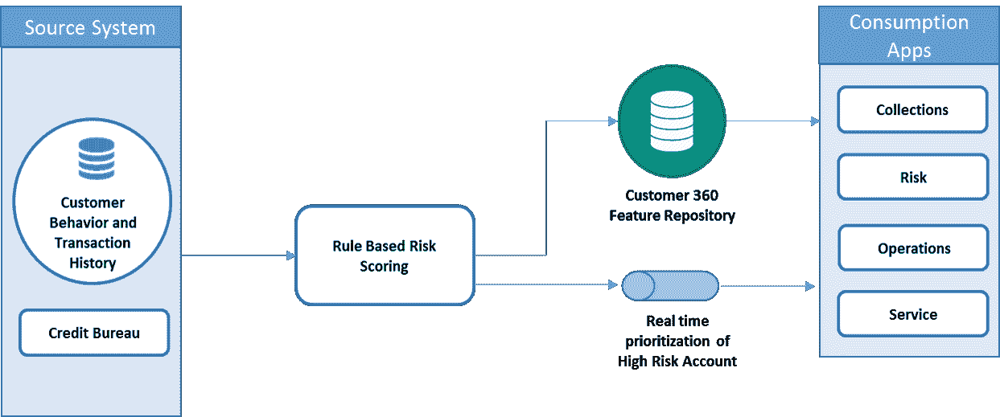
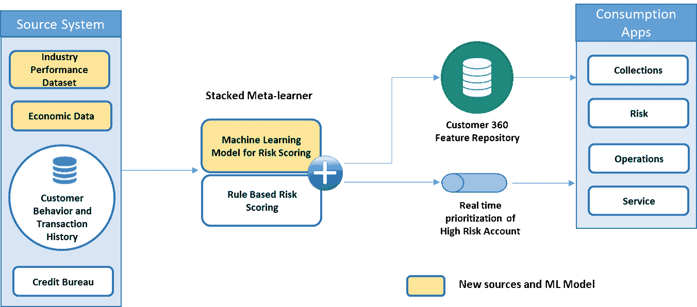
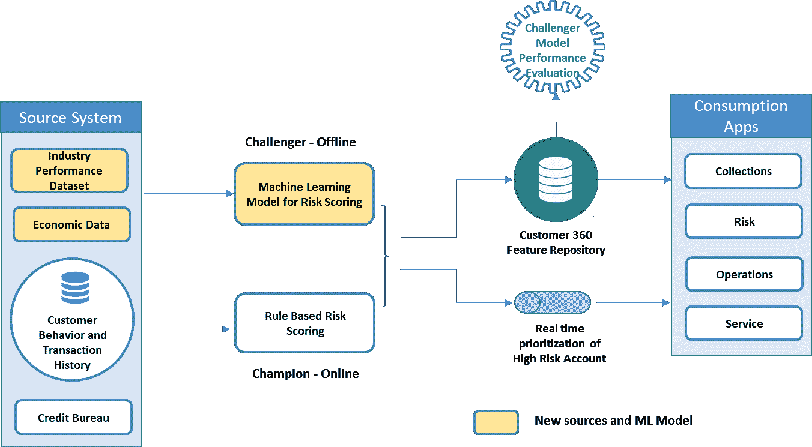
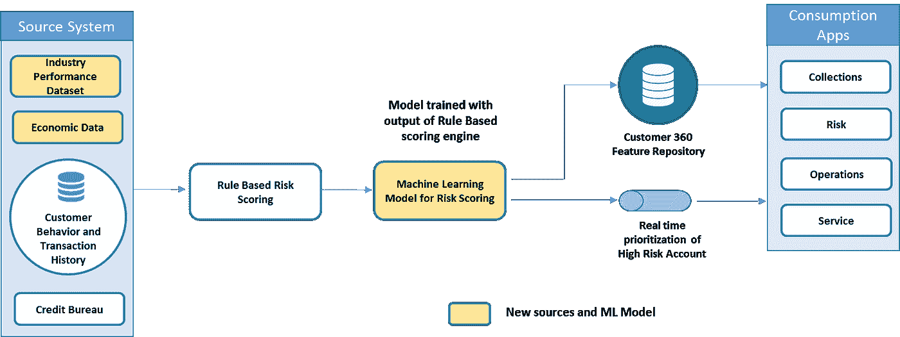

# 在成熟的业务流程中集成机器学习模型

> 原文：<https://medium.datadriveninvestor.com/integrating-machine-learning-models-within-matured-business-process-7d6fec8337ff?source=collection_archive---------2----------------------->

今天，机器学习正在进入企业的每个业务流程，帮助创造价值，增强客户体验或带来运营效率。如今的企业拥有必要的基础设施、合适的工具和数据，能够比以前更快地产生洞察力。

虽然机器学习模型可以对业务流程如何运行产生重大而积极的影响，但如果在合理的时间内不对这些模型进行监控，就将其投入实际生产，这也可能是有风险的。遇到的主要障碍是当组织将某种形式的业务规则嵌入到他们的关键业务流程中时。这些规则可能会随着时间的推移而演变，将现实世界的领域知识发挥作用，也可能表现得非常好。在这种情况下，利益相关者通常会完全摒弃现有的规则生态系统。

基于规则的系统面临的挑战是，如今数据和业务场景的变化越来越快，要么规则无法跟上现实世界的变化，要么创建和维护额外的规则非常耗时

在这样的背景下，这篇文章是关于我们如何利用两个世界(规则+机器学习)的优点，并且随着时间的推移，用真实世界的数据来测量机器学习模型的性能，以查看它们是否可以独立存在。

 [## DDI 编辑推荐:5 本机器学习书籍，让你从新手变成数据驱动专家…

### 机器学习行业的蓬勃发展重新引起了人们对人工智能的兴趣

www.datadriveninvestor.com](https://www.datadriveninvestor.com/2019/03/03/editors-pick-5-machine-learning-books/) 

我将采用一个银行业用例“小企业风险评分”作为业务流程，来阐述模型部署选项。也就是说，下面的部署选项可以应用于任何业务流程。

典型的风险评分架构如下所示

风险评分是基于客户行为/历史和来自信用局的数据进行的。这些分数连同基础交易数据存储在一个集中的特征存储中，该特征存储再次分发给银行下游系统，如托收、监管、风险等。逾期 30 天以上的高风险客户将被优先安排给实时服务代理。

如今，分数计算的大脑是一个基于规则的评分引擎，它是在过去十年中应用领域上下文以及随时间变化的风险模式而构建的。今天的企业希望升级评分引擎，以考虑外部数据源，如微观和宏观经济因素，以及小型企业运营的行业数据，以确定可能将良好信誉帐户变为拖欠帐户的外部风险因素。

因此，引入新的数据源可能会给增强和维护基于规则的系统带来额外的复杂性。这正是机器学习可以从底层数据中学习而无需显式编程的地方。

假设我们已经有了一些用客户行为/交易历史、局数据、微观和宏观经济数据以及行业细分数据构建机器学习模型，让我们进入几个部署方法。

**方法 1 —使用元学习者的堆叠评分模型**

在这种情况下，我们使用基于规则和 ML 模型的输出来预测客户风险。输出或者作为规则堆叠在一起，或者优选地作为简单的逻辑回归模型(元学习者)

**优势**

*   随着堆叠的元学习者从手动编码的规则以及机器学习模型中学习，提高了模型准确性
*   易于监控单个模型的性能并了解每个系统的优势和劣势

**缺点**

*   执行时间增加，部署复杂性稍高
*   需要培训和监控多个 ML 模型(风险评分 ML 模型和元学习者)
*   基于规则的引擎总是在循环中(虽然还不错)。随着时间的推移，如果对 ML 模型感到满意，可以删除规则引擎和元学习器

**方法 2——冠军/挑战者模型部署**

在冠军/挑战者模式中，机器学习模型被部署在基于规则的引擎的并行管道中。两个管道并行对传入的事务进行评分。首先，使用基于规则的引擎进行风险评分决策，而 ML 模型在黑暗模式下运行，分数用于离线分析。随着时间的推移，一旦我们对 ML 模型性能有了足够的正面度量，就可以将 ML 模型切换为冠军，将规则切换为挑战者。

另一个选项是按区段查看个人绩效，并基于区段级别绩效平衡两个评分组件的负载。假设规则引擎更适合高信用评分客户，而 ML 模型更适合低信用评分客户，我们可以设置一个简单的规则，根据信用评分级别将传入的交易转移到相应的评分组件

**优点**

*   简单管道
*   根据性能轻松切换负载，或者在两者之间平衡负载

**缺点**

*   如果需要在冠军和挑战者模型之间智能地平衡传入交易，情况会很复杂
*   可能不如元学习者方法准确

**方法 3 —串行管道部署**

在串行部署中，ML 模型的训练与其他两个部署选项略有不同。在这种情况下，使用规则引擎的输出作为单独的特征以及来自其他数据源的特征来训练机器学习模型。当您希望用 ML 模型来补充和扩充当前基于规则的系统以获得更好的决策边界时，这是一种可行的方法。

**优点**

*   与堆叠输出相比，流水线更简单

**缺点**

*   规则引擎总是在循环中

上述每种方法都有其用途，并取决于业务流程流、业务流程的关键程度、当前规则生态系统中编码的业务/领域上下文以及当前流程的最终决策准确性。

以我在银行和金融方面的经验，我认为方法 1 在反洗钱和承保项目方面更有利。方法 2，更多关于营销和欺诈分析方面；方法 3，在目前存在黑盒或 Actimize、Kofax 等供应商产品的地方，使用来自这些供应商产品的分数以及其他新功能来训练新的机器学习模型。

> 是时候选择一个更适合您的业务流程，并且符合所有利益相关者期望的方法了

机器学习部署愉快！