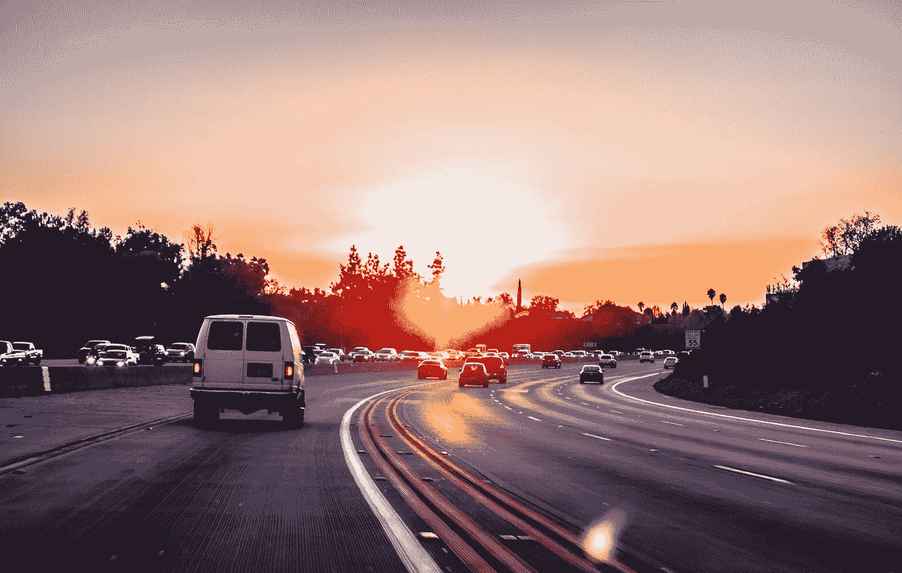

# 自动驾驶汽车融入公路狂飙世界

> 原文：<https://medium.datadriveninvestor.com/integration-of-autonomous-vehicles-to-road-rage-world-cd0316122b42?source=collection_archive---------20----------------------->

Photo by [Xan Griffin](https://unsplash.com/@xangriffin?utm_source=medium&utm_medium=referral) on [Unsplash](https://unsplash.com?utm_source=medium&utm_medium=referral)

随着自动驾驶汽车上路，情况正在发生变化。从这项技术已经取得的进展来判断，我可以很容易地预测这不会按计划进行。让我进一步解释一下。

制造商和技术专家努力解决这个复杂的新概念，他们的眼睛盯着奖金，但球会移动，真的。

这些车辆已经准备好能够“看到”车道标志、路标、其他车辆和行人，以及其他不胜枚举的道路危险。但是有些挑战超出了逻辑和可预测的自动化控制的范围。

为了在公路上与车手竞争，我们将不得不解决正常和教科书般的驾驶挑战，但这还不够。为了说明我的观点，这里有一些我们应该准备的驾驶场景。

例如，自动驾驶汽车在三条车道的中间接近道路右侧的“拉链合并”出口。汽车的程序遵循正确的协议，打开右转向灯，并扫描右车道的开口。道路上的其他司机正在高速超过右侧的一辆自动驾驶汽车，并在它前面疾驰，以并入左侧。自动驾驶汽车后面的司机咆哮着进入右侧车道的开口，当他们从右侧通过时，他们很高兴地合并，这也阻止了自动驾驶汽车合并到右侧的任何机会。软件在预计合并时间耗尽时开始变慢，这加剧了合并问题。司机们切断了自动驾驶汽车，变得极具侵略性，除了有人让车辆进来的机会，这几乎是不可能的。对此的解释是人性。在这种情况下，驾驶员完全知道车辆是自动驾驶的，并有意利用这一点。

这种情况将很常见，因为驾驶员相信自动驾驶汽车总是会让出空间，并在谨慎方面“犯错”。

为了促进自动驾驶汽车融入困难的交通，并赢得其他司机的尊重，自动驾驶汽车本身必须表现得不那么合乎逻辑，并具有一些侵略性的外观，尽管软件中内置了编程的信心。

首先，无人驾驶汽车不应该与其他汽车区分开来。有色车窗有助于掩饰两侧或后部没有徽章或标志的空座位。摄像机和扫描仪需要朝向车辆的前方和/或完全隐藏，尤其是在侧面或后面。

此外，让我们考虑一下人类处理这种“拉链合并”的方式

对于这种情况，更成功的协议应该是这样的。中间车道的自动驾驶车辆接近“拉链式并线”，需要驶出右侧，在右转向灯上转弯。不考虑张贴的速度限制(给予或接受+-10mph)，自动驾驶汽车扫描右侧和后方最近的车辆，并估计它们的速度与之匹配，并继续移动到既定车道的最右侧，以此作为信心的表现，向激进的驾驶员发出信号，让他们松开油门并允许并线。在第一次移动后，如果有足够的空间，车辆会并入右侧车道，一切正常。如果右侧最近的并线车辆超车到自主车辆前面，则鸣笛。这些举措是其他期待自动驾驶汽车的司机所没有预料到的，并将促进更公平的竞争环境，因为在许多大城市，这些都是“交战规则”。

未来就在眼前，克里斯·李维斯