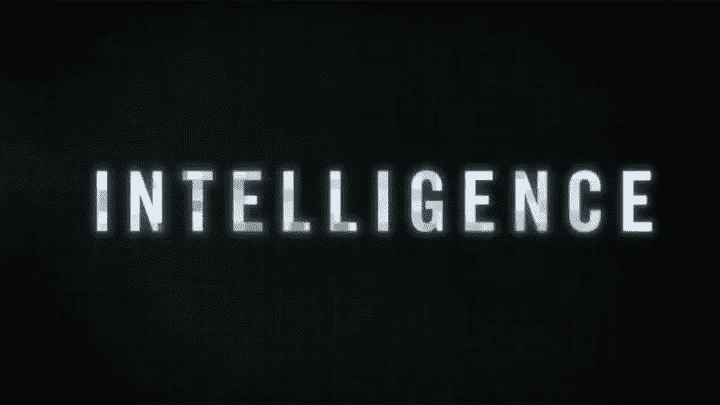

# 智力被高估了

> 原文：<https://medium.datadriveninvestor.com/intelligence-is-overrated-7ce0abda7882?source=collection_archive---------9----------------------->

你是你所读到的，你所看到的，你所经历的和你所想到的。在这个过程中，智力被高估了。

把人脑这个产生导致我们整个身体运动包括言语、动作、态度、手势、面部表情的决定性指令的指挥官，想象成一个意识盒子，就像你如何训练 AlphaGo 这样的 AI 机器一样，你需要向意识盒子输入海量数据，让它消化、处理并开发出自己复杂的内部程序。当它成熟时，你输入信息，结果就会随之而来。大量的数据是我们以前对世界的经验。它是信念、立场和是非的基石。

所有这些中的智能是什么？智能是一个人处理信息的速度，以及一个人将信息消化到程序树中的能力。在大多数情况下，这不是瓶颈。然而，瓶颈是训练我们大脑的原材料，也就是我们读到的，看到的，经历的。如果有相同水平的教育、童年经历、成长导师、阅读材料、环境接触，我们都应该和其他人一样处于相同的“智力”水平。智力是最直观、最可评估的结果，而不是根源。

智力有两种。一个是事实性知识，我知道就是我知道，我不知道就是我不知道。如果你告诉我，我就会知道。比如桌子上有个花瓶或者重力加速度是 9.8。我知道是因为我看到过，读到过，或者别人告诉过我。另一种智能是扩展相关性。我知道 A 但我不知道 B，然而 B 有 A 的一些痕迹，所以 B 一定具有 A 的某些特征。所以即使我知道我仍然不知道 B，我知道关于 B 的某些事情。这种推理行为是基于第一种智能的真实事实知识。如果我们对 A 的事实了解不准确，那么任何延伸的相关性或合理性都是错误的。或者另一个例子，我看见桌子上有一个花瓶，地板上有一只猫，经验主义告诉我们一些偶然的事情可能会发生。我看到了 A，也看到了 B，A 和 B 的组合往往导致 c。经验主义往往是智慧的标志，因为它预见到某些事情的到来，但事实上它只不过是经验，可以通过实践、尝试和失败来锻造和提升，或者简单地说，活得更久。

基础教育教给我们事实知识。就像月亮绕着地球转一样。重力加速度是 9.8。哈耶克相信自由经济，而不是计划专制。这是一份完整的声明，仅此而已。但是有了事实知识的集合，这种放大可能是不可思议的，不可估量的。我们视为智慧标志的最终结论被高估了。很简单，我知道的事实比你多，而且我把这些事实联系起来的能力也比你强。

我认为教育应该更注重推理而不是事实知识。首先，并不是每一个事实知识都是有用和有趣的。在游泳池里游泳，不需要知道浮力的公式。我们对周围世界的好奇心反映了我们对生活的不同看法。第二，事实性知识不会创造新知识。我告诉你这是事实，没有争议，就是这样。然而，推理的行为是一个人在生活中创造和产生新知识的工具箱。我知道 A 但我不知道 B，然而 B 有 A 的一些痕迹，所以 B 一定有 A 的某些特征。所以即使知道我仍然不知道 B，我也知道 B 的某些事情。这比直接告诉你什么是 B 要有用得多，也有趣得多。背诵不会有一半的乐趣。

总结这篇文章，我们是我们所读到的，我们所看到的和我们所经历的结合体。智力被高估是因为它是最可见、最可评估的结果，而不是根源。

# DDI 特色数据科学课程:

*   [**用于数据科学的 Python**](http://go.datadriveninvestor.com/intro-python/mb)
*   [**深度学习**](http://go.datadriveninvestor.com/deeplearningpython/mb)
*   [**数据可视化**](http://go.datadriveninvestor.com/datavisualization/mb)

**DDI 可能会从这些链接中收取会员佣金。我们感谢你一直以来的支持。*