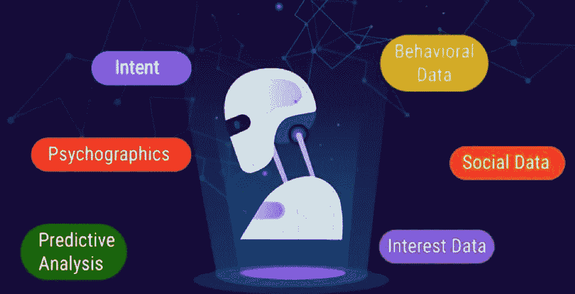
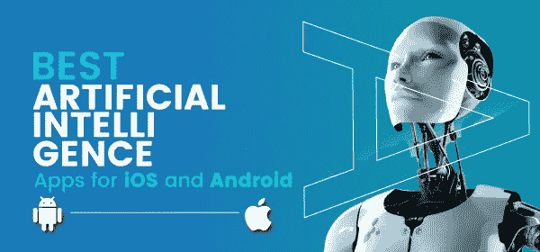

# 智能应用及其在未来移动解决方案中的应用

> 原文：<https://medium.datadriveninvestor.com/intelligent-apps-and-its-use-for-future-mobile-solutions-af117e372400?source=collection_archive---------0----------------------->

在这个数字化的世界里，每样东西都包含着令人惊叹的技术或创新，这些技术或创新旨在提高现在的福利和对未来的信心。在所有可用的技术中，找出最重要和最糟糕的技术是人工智能的突出之处。这些令人着迷的技术充满了无限的优势，最适合这个快速发展的世界，并使用户在各个方面更加容易。

由于智能手机的出现，我们看到了过多的应用程序，这些应用程序被开发来寻找信息和帮助日常活动。如今，云基础设施和机器学习方面的技术创新为未来的智能应用奠定了基础。I-Apps 是创新发明或 [**人工智能**](https://www.volansoft.com/blog/artificial-intelligence-the-latest-trending-technology) ，它充当企业家的支持领导者。

 [## 2019 年移动应用开发之路——数据驱动投资者

### 任何在移动应用程序开发行业工作的人，无论他们是专注于在伦敦开发 iOS 应用程序还是…

www.datadriveninvestor.com](https://www.datadriveninvestor.com/2019/01/15/the-path-of-mobile-app-development-in-2019/) 

**什么是智能应用？**

智能应用程序是从用户交互和其他来源获取实时和历史数据的应用程序，以便提供建议和做出预测。它提供个性化和自适应的用户体验；数据分析和机器学习是智能应用的核心组成部分。在理解用户的需求后，这些应用程序会提供上下文和相关信息，并在问题出现前对用户进行评估。在高度预测分析的帮助下，智能应用程序可以预测用户的行为，从而轻松获取信息。

人工智能用于开发智能应用程序，这种应用程序通过算法变得更加复杂；它自动执行多少任务。有几个 B2C 公司将通过增加灵活性来采用和执行智能应用程序，但它的移动性和增长预计在 B2B 环境中。功能包括-

*   它处理大量的数据，能够读取和存储大量的人类互动。它将过程与感官输入相结合，由 IOT 提供动力，可能会产生有价值的见解。
*   大公司和初创企业青睐智能应用的另一个吸引力是适应性。它提供了更高的投资回报。因此，流畅感是固有的行为，它允许应用程序适应新的需求，因为它有持续的学习路径。
*   一个真正智能的应用程序可以通过读取手势、动作和语音输入来产生结果。它还允许用户不再需要使用业务密钥。

**工作中的智能应用**

员工满足于简单的移动访问关键业务应用和数据的时代已经一去不复返了。今天的数字原生用户要求的远不止这些，他们期待智能用户体验和高度可用的消费应用程序。而且，智能应用程序保证提供同样的功能。此外，IA 帮助员工以不同的方式完成工作，例如-

*   通过提供高度个性化和上下文敏感的信息，智能应用程序使员工能够根据自己的需求快速筛选和精简高度合适的信息。它有助于决策过程。
*   对于移动工作人员来说，智能应用能够提供正确的信息，以有效的方式完成当前的工作。
*   它通过将复杂的问题处理成自然语言来实现自动化，它有助于提高输出，加快响应时间。

在不久的将来，企业将继续使用其遗留的工具或系统来寻找利用 IA 来扩展其业务运营或流程的方法。例如，简单的应用程序，如电子邮件不能完全消失；从这个意义上说，组织可以开发智能应用程序，该程序具有提醒员工注意敦促快速行动的电子邮件的功能。智能应用程序的总体目标是与现存工具协调工作，并呈现更有针对性和个性化的信息；它使员工能够提高工作质量和产量。

在过去的几十年里，管理人员一直专注于制定他们的数字信息计划，为此，他们需要将智能应用添加到他们的蓝图中。新 IA 的出现确保了新的增长领域、实时采集、内部和外部数据源，将最好的技术投入使用、处理和分析。

以下是 T2 评选出的安卓和 iOS 最佳人工智能应用。

1.  **Cortana —** 在推出 Windows 10 之后，Cortana 已经是众人皆知的应用。此前，这款应用只适用于 Windows phone，但现在也适用于 Android 设备。这个应用程序帮助你管理任务，否则需要做。例如，你只需要安排一个会议，休息工作将由 Cortana 处理。
2.  **Hound** —与[T3【谷歌语音搜索】的 一样，你也可以通过自然说话来使用 Hound，并立即显示结果。猎犬也有各种各样的功能——你可以用你的声音听你最喜欢的音乐。此外，您还可以使用该应用程序了解当前的天气状况和未来几天的天气预报。您可以设置多个闹钟，根据需要设置计时器，查找 bets 美食餐厅，预订乘车服务，查找电影放映，进行计算，并通过在网上说任何关键字来搜索信息。更多的还在后面，所以请确保继续关注独特的人工智能应用。](https://becominghuman.ai/how-voice-search-can-lift-your-business-720cc39f879e)
3.  **最近新闻**——这是一个新的聚合应用，由人工智能算法驱动，它将检查你的阅读习惯。因此，它会让你了解最新的新闻、博客、文章和其他符合你兴趣标准或过去活动的阅读材料。最近的新闻是了解你喜欢的话题的最佳选择。您也可以将此应用程序与其他设备同步。此外，容易出口你的历史和书签；它还可以通过取消后台的活动来帮助你节省电池。

**4。你疯狂地通过支付更高的费用来改善你的英语口音吗？Elsa 是来拯救你的，它是一个人工智能应用程序，提供专业的发音课程，有大量的练习和教学材料。**

**5。谷歌 Allo**——很多时候，当你没有心情打一个单词，但当你超级懒但仍希望继续工作时，它会帮你。然而，个人助理应用程序的工作方式类似于 Messenger，它可以代表你的同类执行不同的任务——回答问题、在给定时间提醒信息、向日历添加事件等等。

**阅读更多** — [阐述 2019 年云计算发展趋势](https://www.volansoft.com/blog/top-cloud-computing-trends-2019)

毫无疑问，智能应用程序为更快的业务决策铺平了道路，提高了员工的效率，获得了更好的业务成果，并确保了长期收益；所有这些都需要以正确的方式加以利用。现在投身于信息产业的商业组织在未来肯定会有竞争优势。那么，你准备好做出“明智”的决定了吗？？