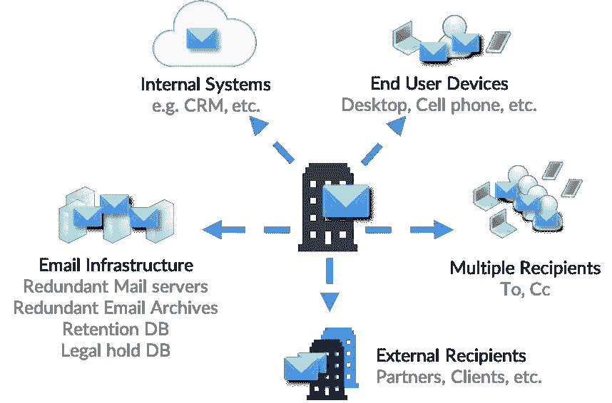
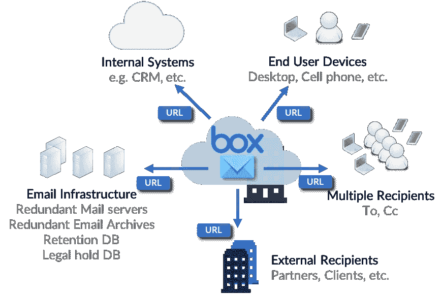

# 数字时代的智能内容安全

> 原文：<https://medium.datadriveninvestor.com/intelligent-content-security-for-the-digital-age-ad458b2d1e58?source=collection_archive---------23----------------------->

*未来的企业将受益于为企业内容提供单一真实来源的趋势，同时支持用户、简化工作流程并推动企业范围的安全性*

MxHero 的 Mail2Cloud 产品套件是一个强大的解决方案，可以增强未来企业从 Box 等云内容管理(CCM)平台中受益的方式。正如 Box 首席产品官 Jeetu Patel 在 BoxWorks 2018 和 2018 年 11 月 15 日与 Box 首席执行官兼联合创始人 Aaron Levie 的虚拟峰会上所说，“内容在 Box 中更有价值。”在 mxHero，我们开发了新的解决方案，允许内容在整个企业范围内的可移植性。未来的工作将需要基于企业的内容的单一真实来源，以增强组织跨广泛的 IT 堆栈解决方案有效、智能地呈现内容的能力。无论员工是在营销自动化平台、Salesforce 等 CRM 系统中工作，还是与同事和合作伙伴交换电子邮件，这些平台中企业内容的相关和智能呈现对于满足未来工作的用户体验需求至关重要。

The security challenge of email sprawl — emails multiply across the organization into multiple silos required for backups, internal systems (e.g. CRMs) and regulatory compliance. Additional copies go to recipients and all their devices. Email will copy on average 5.5x upon entering an organization. Studies suggest that those in copy (cc) only access file attachments 6% of the time — representing further waste of transmission and storage resources, but most of all, unnecessary data exposure risk. (sources: Radicati, mxHero)

其核心是，这种广泛的内容转换将依赖于组织为企业内容和非结构化数据创建单一真实来源的能力。通过简化和智能地将所有企业内容映射到像 Box 这样的单一平台，组织将能够以一种有意义的方式智能和安全地在整个组织中呈现这些内容，而不管员工所在的 IT 解决方案的边界堆栈有多复杂。通过捕捉由 Box 的 CCM 平台解决方案以及 mxHero 的 Mail2Cloud 平台等应用程序支持的全部企业内容，组织将能够推动内容融合，并获得他们所寻求的好处。通过 mxHero 的 Mail2Cloud 解决方案，组织可以自动捕获电子邮件和基于电子邮件的附件内容(双向和实时)，并将其呈现在 Box 的 CCM 平台中。通过这样做，mxHero 增强了企业以有意义的方式整合内容的能力，并通过 Box 强大的开放式 API 集成架构在整个组织中呈现内容。

Email sprawl contained — automatically moving email content into Box's cloud content management platform dramatically reduces email data sprawl by ensuring that email message and/or attachments are stored in one place and accessed through secure links. Audit trails, real-time monitoring, access rights now extend to email content for significantly greater security, compliance and control of corporate data.

一旦包括基于电子邮件的内容(和附件)在内的企业内容通过 mxHero 被成功捕获并放入 Box，对于正在实施战略性内容管理计划的企业来说，激动人心的事情就开始发生了。首先，实现了企业内容的单一真实来源。第二，可以推动跨企业应用程序堆栈的工作流自动化和内容发现，以支持未来员工的实时信息需求。这种转变可能是解决约 90%的企业基于内容的工作流和业务流程需求的关键。例如，一旦 mxHero 通过 Mail2Cloud 自动捕获电子邮件附件，该内容就可以根据指定的 Box 文件夹中的关键字触发 Box 内的工作流。此外，元数据标记的自动化可以改进最终用户的发现，加速搜索并提高整个企业的生产效率。最后，安全性得到增强。与电子邮件泄露相关的威胁载体显著减少(因为电子邮件中的附件已被安全的 Box 链接所取代)，并且通过 Box 强大的图形和 Box Shield 功能，可以智能地为企业安全官员检测与 Box 中的企业内容相关的异常，这些官员的目标是减少适用于企业数据的威胁面。如果一名员工突然下载 2tb 的内容，或者如果同一名员工同时从两个不同的地理位置捕获 Box 中的内容(这是一个站不住脚的使用事件)，Box Shield 可以自动发现这一异常，并围绕该企业内容提供安全第一的见解。如今，与基于企业电子邮件的内容相关的威胁载体很高(如每周新闻周期所示)。通过自动捕获基于电子邮件的内容和相关附件，mxHero 增强了组织推动数字化转型、推动企业内容和数据的单一来源的能力，我们增强了组织推动基于内容的工作流自动化的能力，同时提高了同一企业内容的安全性和治理能力。指出简化是关键也很重要。在 mxHero，我们开发了智能 Mail2Cloud 平台，不需要终端用户软件，不需要培训，也不需要改变员工或知识工作者与其电子邮件的交互方式。通过 mxHero 的 Mail2Cloud 平台，电子邮件内容附件被自动捕获并放置在具有上下文适当安全性的盒子中，而不需要改变员工的工作行为。

一旦为未来的企业实现了上述优势，其他令人兴奋的功能就会浮出水面，包括机器学习以驱动工作流自动化和利用新发布的 Box 技能，然后可以应用人工智能算法来驱动围绕企业范围的内容和数据的人工智能解决方案。正如 Box 的 CEO 兼联合创始人亚伦·列维(Aaron Levie)在 2018 年 11 月 15 日 Box 虚拟峰会上所说的“AI 会来内容，内容不应该非得去 AI”。在 mxHero，我们的新集成增强了这种能力。

工作的未来就是现在。用户将要求即时访问他们的内容，这些内容出现在他们工作的集成应用生态系统中，同时期望这些内容由单一的真实来源提供支持。无论设备类型、位置或他们使用的应用程序如何，用户在未来都会有这些期望，今天我们很高兴地宣布 mxHero 能够自动捕获基于电子邮件的内容，并扩展 Box 的功能，通过其强大的 CCM 平台解决方案套件推动未来的工作。在 mxHero，我们扩展了 Box 的能力，为企业内容驱动一个智能的基于内容的安全和工作流支持覆盖，我们相信，这也应该适用于企业基于电子邮件的内容和附件。电子邮件不是一个有效的内容存储平台。它从来就不是为了满足当今对内容工作流、协作、集成或安全性的新兴需求而构建的。事实上，盒子里的内容更有价值。在 mxHero，我们建立了一个解决方案，将这一强大的声明扩展到电子邮件。

[www.mxhero.com](https://mxhero.com)