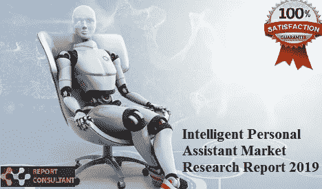

# 智能个人助理市场在全球蓬勃发展

> 原文：<https://medium.datadriveninvestor.com/intelligent-personal-assistant-market-booming-across-the-world-352fa7a99f23?source=collection_archive---------19----------------------->

报告咨询公司的分析师预测，全球智能个人助理市场预计将以+36.7%的 CAGR 增长。

 [## DDI 编辑推荐:5 本机器学习书籍，让你从新手变成数据驱动专家…

### 机器学习行业的蓬勃发展重新引起了人们对人工智能的兴趣

go.datadriveninvestor.com](http://go.datadriveninvestor.com/5ML1) 

智能个人助理是一个具有人工智能(AI)的系统，它模仿人类的互动来执行特定的任务。由于机器学习以及人工智能技术的其他进步，这个系统正越来越多地被使用。智能个人助理具有强大的学习、推理和理解能力，这是模仿客户服务代理解决问题能力所需的三个基本要素。

**样本报告请求书@**

【https://www.reportconsultant.com/request_sample.php?id=5496 

**智能个人助理市场的主要参与者:**

苹果公司。

谷歌有限责任公司

IBM 公司

甲骨文公司

微软公司

**智能个人助理行业类型展望:**语音识别，测试转语音识别

**智能个人助理行业服务展望:**客服、营销助理

**智能个人助理行业应用前景:** BFSI、汽车、IT &电信、零售、医疗、教育、其他

**智能个人助理行业终端使用前景:**中小型企业、大型企业、个人用户

**请求报告上的折扣/定制@**

[https://www.reportconsultant.com/ask_for_discount.php?id=5496](https://www.reportconsultant.com/ask_for_discount.php?id=5496)

根据该研究报告，全球智能个人助理市场在最近几年获得了巨大的发展势头。研究表明，人们对该市场产品的认识在不断加深，需求在不断增长，需求也在不断增长。除此之外，本研究报告还提到了影响消费者接受度的特征。这份市场报告对全球市场的整体情况进行了全面分析。

如果您有任何特殊的要求，请告诉我们，我们将为您提供您想要的报告。