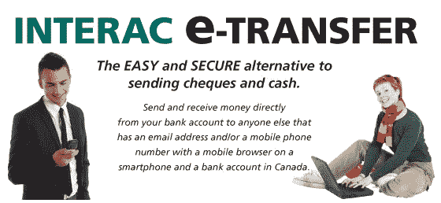

# 内部电子转账

> 原文：<https://medium.datadriveninvestor.com/interac-e-transfer-is-it-as-safe-as-the-banks-claim-4b724912fc9d?source=collection_archive---------12----------------------->

电子转账真的像银行宣称的那样安全吗？

最近有一则新闻报道，一位老年妇女通过互联网电子转账支付了服务费。付款在途中的某个地方被拦截，她的钱被转移到一个未知的账户。她现在损失了 3000 美元，还有一张未付的账单。银行在这一点上拒绝偿还她的钱。

我也有一个 Interac 电子转账的问题。在我的案例中，在一个银行关闭三天的长周末，2000 美元被神秘地从我的账户中转出。我第一次知道这件事是在我接到银行打来的电话，告知我的借记卡被盗用了，另一张卡正在邮寄中。给我打电话的银行职员没有提供进一步的信息。

由于我的银行分行离我的住处只有几分钟的步行路程，我去了银行，把我的卡插入自动取款机，果然，卡坏了。我回到家，试图登录我的账户，却被锁在了外面。

 [## 金融科技初创公司正在颠覆全球银行业|数据驱动的投资者

### 传统的实体银行从未真正从金融危机后遭受的重大挫折中恢复过来…

www.datadriveninvestor.com](https://www.datadriveninvestor.com/2018/10/20/fintech-startups-are-disrupting-the-banking-industry-around-the-world/) 

然后，我用卡背面的号码给银行打电话，在通常的点击银行越来越复杂的目录系统后，在 20-30 分钟的等待后，我接通了一个真实的人。

我解释了情况，他能告诉我的是一张新的借记卡正在邮寄中，要了解更多信息，我应该去我的分行。我告诉他今天是星期六，银行要到星期二才开门。他说他没什么可以告诉我的了。

直到周二早上，当我去我的银行分行时，我才发现有 2000 美元从我的账户上被非法电子转账了。分行无法提供任何额外信息，但能够为我提供一张新的借记卡并重置我的密码。然后我问我什么时候能拿回我的钱。有人告诉我，在调查后 10 天。

那天，我给蒙特利尔的银行总部写了一封信，告诉他们有人抢劫了我的银行账户并把这封信用特快专递寄出去，这让我很不高兴。就我而言，这是银行的责任，不是我的。我希望银行收到我的信后 24 小时内把钱打到我的账户上。两天后，我接到银行官员的电话，说钱第二天就会回到我的账户上，银行正在对非法转账进行调查。他不愿回答以下问题:

BMO 联系警察了吗？

那个人是怎么黑我的账户的？

钱去哪了？离岸？

为什么电子转账被称为“安全”,而事实显然并非如此。

银行第二天退还了我的钱，但是我从来没有收到对我的问题的任何回答。用“Interac 在线盗窃”在谷歌上简单搜索一下，就会发现几十起和我类似的投诉。