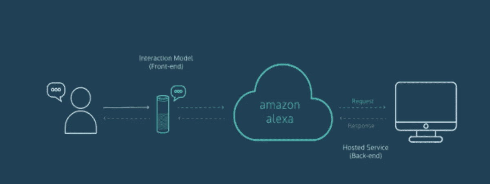
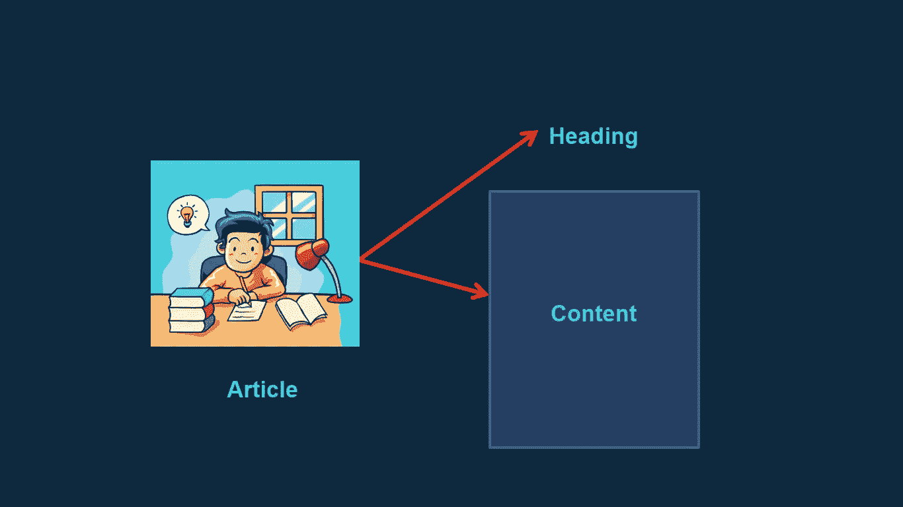
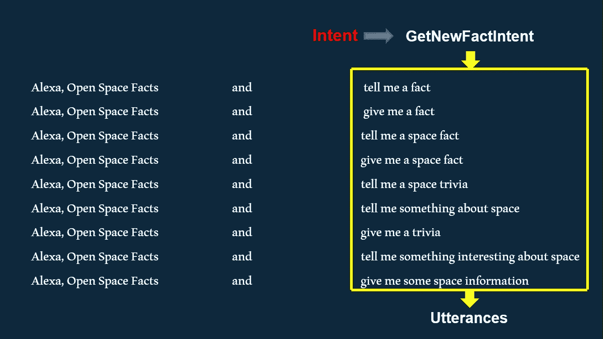
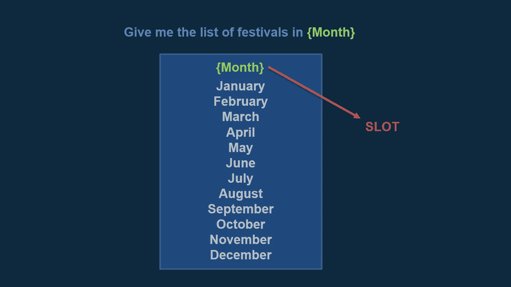
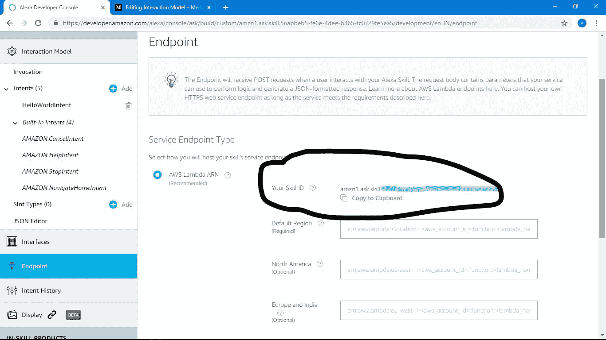
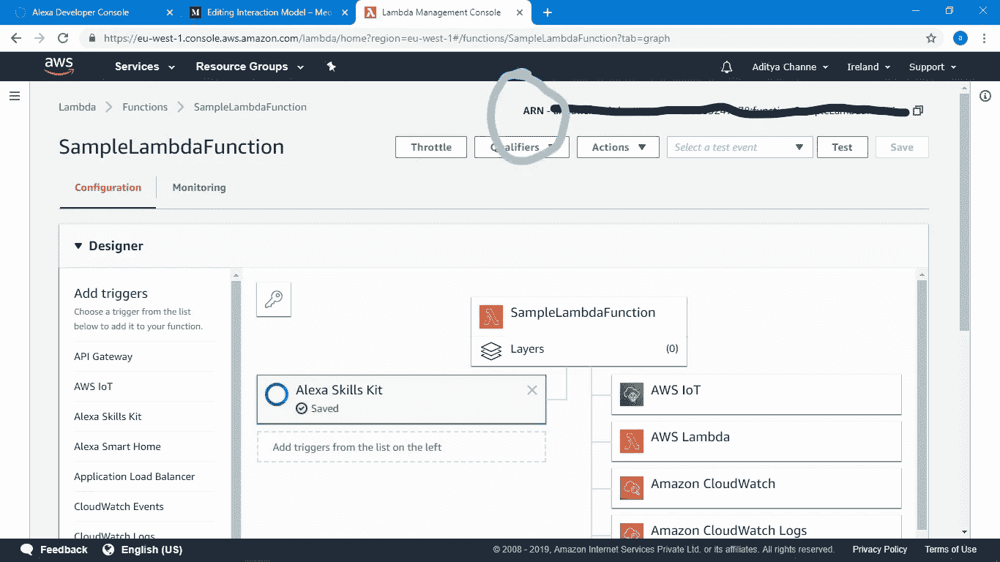
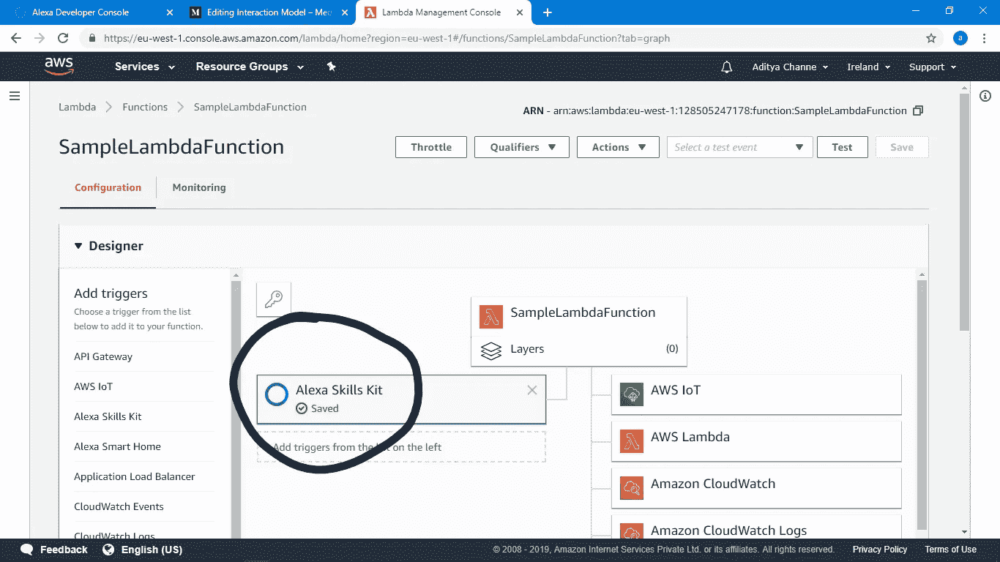

# 交互模型

> 原文：<https://medium.datadriveninvestor.com/interaction-model-b66f98d805c8?source=collection_archive---------3----------------------->

# **Alexa 术语**

大家好。我希望你一切都好。关于这一点，我希望你对 Alexa 开发者控制台非常熟悉。使用 Alexa 托管技能版本，你的第一个技能是 Hello World 技能。Alexa 托管技能是一个新的产品，让 Alexa 技能在前端管理你的技能后端的 AWS 云服务。有了 Alexa 托管的技能，你可以在不离开 Alexa 开发者控制台的情况下构建、编辑和发布技能，就像我们在上一篇博客中所做的那样。这使得开发人员可以专注于设计良好的用户体验，而不是管理云服务。但是 Alexa 托管的 SSkill 处于测试版，还有很多东西需要添加，比如 Dynamo Db 集成，对于 CloudWatch 日志，我们仍然需要 AWS 控制台。因此，了解使用 AWS lambda 的技能建设很重要，因为它比 Alexa 托管的技能更稳定。所以现在，我们将使用 AWS Lambda 构建第一个技能。但是在进入实际部分之前，最好先了解一下基础知识。在上一篇博客的制作技巧中，我们遇到了一些术语，比如意图、插槽、话语、JSON 等等。所以让我们深入学习所有这些术语，然后我们将使用 AWS Lambda 构建第一个 Alexa 技能。

 [## 2019 年学习的最佳编码语言——数据驱动的投资者

### 在我读大学的那几年，我跳过了很多次夜游去学习 Java，希望有一天它能帮助我在…

www.datadriveninvestor.com](https://www.datadriveninvestor.com/2019/02/21/best-coding-languages-to-learn-in-2019/) 

# **意图:**

我们在学校生活中都写过一篇作文。一篇文章有一个标题和内容，标题告诉你文章的全部内容。类似于文章的标题，我们在 Alexa 中有意图。

有两种类型的意图

1] **内置意图**:亚马逊已经像亚马逊一样提供的意图。停止意图，亚马逊。取消亚马逊。FallbackIntent 等等。这些是每个 SSkill 必须具备的意图，因此它是由 Amazon 默认提供的。

2] **自定义意图**:开发者会根据技能需求创建意图。

# 言论

话语是文章的内容部分。内容是用户将如何要求你的技能来完成特定的任务。

让我们打破它。

把你自己想象成一个用户，现在想象你有多少种方法可以调用 SSkill 或者要求你的技能来完成一个特定的任务。

**例子**:你有一项技能，会告诉你关于空间的不同事实。现在想一想，你可以用多少种不同的方式来调用技能或要求你的技能说出事实，这些将是你的话语，就像用户可以用以下方式要求技能说出事实一样。

1.  Alexa，开放空间的事实
2.  告诉我一个事实
3.  请给我一个事实
4.  告诉我一个太空事实
5.  给我一个太空事实

所有这些话语将被总结在一个叫做意图的骗子标题下，就像下面的图片一样。

你可以在上面的图片中看到，我们可以用不同的方式来询问完成特定任务的技能。这里的任务是要求 Alexa 说出一个事实(话语)的其他方法，所有这些方法都被总结在一个标准标题(意图)下，称为 **GetNewFactIntent。**

# **插槽**

为了理解插槽，让我们快速回顾一下 c++中数组的概念。数组只不过是相似类型数据项的同质集合。现在，在 Alexa 中，技能培养槽只不过是一个包含所有相似类型事物列表的数组。

**例如**我们一年有 12 个月。因此，一个标准标题下的所有月份的集合就是你在 Alexa 技能中的位置。

同样有两种类型的插槽。

1] **内置槽**:内置槽就是亚马逊自己提供的那种，像亚马逊。名称、AMAZON.number 和其他。亚马逊已经提供了这些，因为这些槽中的数据是如此之大，以至于开发者每次制作技能时都要制作这些槽，这是一个挑战。

**2】自定义槽**:自定义槽是开发者根据技能制作的槽。就像我们在{Month} slot 上面创建的包含从 1 月到 12 月的所有月份的列表。

# JSON 编辑器

在 JSON 编辑器中，您会发现所有的意图、话语和片段都以 JSON 代码的形式自动转换。如果熟悉 JSON 编码，可以直接写 JSON 代码，所有的意图、话语、槽点都会自动添加。

# **技能 ID**

技能 Id 是每项技能的唯一标识。它是随机加密数字的组合，为每个技能提供了一个唯一的身份。您将在开发人员控制台中找到您的技能 ID。

它以 amzn1.ask.skill 开头，后面是单词和数字的随机组合。

# 自动气象站λ

AWS Lambda 是一个在云中运行代码的 AWS 服务。
AWS Lambda 是无服务器的，你可以轻松编码，不需要管理 ram 或者容错等东西。AWS Lambda 将负责所有资源，并在后端自动管理它们，以便直接关注您的代码。

# 亚马逊资源名称

Amazon Resource name 由 Amazon 自动生成，为开发者在后台创建的资源赋予唯一的身份。

对于 Alexa Skill，资源将是你将在 Lambda 的文本编辑器上编写的技能的后端代码，ARN 将为你的代码提供一个唯一的身份，以在云中识别你的代码。您将在 AWS 控制台中找到您的 ARN。

# 引发

触发器是一个简单的过程，它启动一个动作，并在特定事件发生时自动启动。它使技能更具交互性和用户友好性。

例如:Alexa 技能包、Alexa 智能家居等等

# 终点

端点是连接前端和后端的地方。

在这里你会发现两个选项 1] **AWS 拉姆达 ARN** 和 2] **HTTPS。**

亚马逊推荐 AWS Lambda ARN，当你用 Lambda 编写后端代码时，它会被选中。

HTTPS 是指你不想使用 AWS Lambda，并且你已经用任何其他 web 服务管理了你的后端，比如 Azure 或除 AWS Lambda 之外的任何服务。

这些都是你在建立 Alexa 技能之前应该知道的基本术语。现在所有的理论部分都已经完成了，点击这个 [**链接**](http://fact-skill.s3-website-us-east-1.amazonaws.com/) ，按照步骤使用 Lambda 制作你的第一个 SSkill。当你使用 AWS Lambda 完成你的第一个 SSkill 时，事情会清楚得多。试试吧，在下面的评论区让我知道效果如何，如果在制作技能或我今天讨论的任何事情上有任何问题，请随时联系我。我的下一篇博客再见。

**接下来:使用 AWS Lambda 的 Alexa 技能**