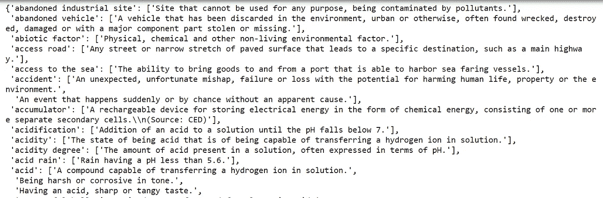

# Python 中的交互式词典应用

> 原文：<https://medium.datadriveninvestor.com/interactive-dictionaryapplication-in-python-16899fe5ae1d?source=collection_archive---------1----------------------->

这个博客是关于用 Python 创建一个交互式词义词典应用程序的。JSON、文件读取、Python 数据结构和 difflib 的概念

*模块正在使用中。*

我们将建立一个交互式词典，让用户搜索所需的单词及其含义，并在用户拼写错误或打字错误的情况下提供最合适的单词建议。

首先，需要创建一个包含单词及其不同含义的数据集。

 [## 对话营销是一个词|数据驱动的投资者

### 在购买之前，先谈一谈。这样做的营销人员将走在游戏的前面。这是保罗·因斯的前提…

www.datadriveninvestor.com](https://www.datadriveninvestor.com/2019/01/31/conversational-marketing-is-the-word/) 

让我们使用 JSON 文件将单词存储为键，将含义存储为值。

Data in JSON file

你可以从这个链接获得你的 json 文件:[https://raw . githubusercontent . com/dil Jeet 1994/Python _ Tutorials/master/Blog % 20 work/Dictionary/Interactive % 20 Dictionary/words . JSON](https://raw.githubusercontent.com/diljeet1994/Python_Tutorials/master/Blog%20Work/Dictionary/Interactive%20Dictionary/words.json)

我们需要执行以下步骤来使我们的字典应用程序完美地工作:

*   将 JSON 文件加载到 python。
*   求用户一句话。
*   将这个单词传递给 word_meaning()函数，代码将在这个函数中查找 words.json 文件中输入单词的含义。
*   word_meaning()函数不仅会在 words.json 文件中查找意思，还会分析单词，以检查用户是否以某种方式打错了单词并表达了其他意思，这将使我们的字典具有交互性。

> 在下面的代码中，我在 word_meaning()函数中使用了 **difflib** 模块的 **get_close_matches** ()函数来分析单词并使我们的应用程序具有交互性， **difflib** 模块提供了用于比较序列的类和函数。
> 
> **get_close_matches** :返回“足够好”的最佳匹配列表。单词是需要紧密匹配的序列(通常是字符串)，而可能性是匹配单词的序列列表(通常是字符串列表)。

让我们从导入所需的库开始。

现在，我们需要用代码加载 json 数据。

最后是我们代码的主要部分，word_meaning()函数，它将分析单词并返回期望的结果。

让我们通过输入任何单词来测试我们的功能。

而这就是 word_meaning()函数要返回的内容。

让我们用一些拼写错误再试一次，看看 word_meaning()函数如何分析它，并为我们提供正确的单词选择。

你可以在上面的代码片段中看到，我们询问“wrd”的含义，它可能是['word '，' world '，' verged ']的拼写错误，然后代码要求选择所需的选项并返回我们所需的结果。

就这样，我们创建了一个字典应用程序，即使在拼写或打字错误的情况下也能帮助用户。

玩得开心，不断学习，一直坚持编码。

谢了。