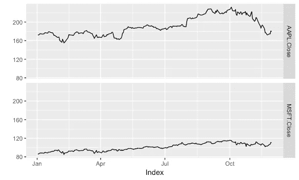

# R 中的交互式时间序列图

> 原文：<https://medium.datadriveninvestor.com/interactive-time-series-plots-in-r-bceff3a7bb04?source=collection_archive---------4----------------------->

[](http://www.track.datadriveninvestor.com/1B9E)

## 使用 dygraphs 包的用户可配置图形


Photo by [Markus Spiske](https://unsplash.com/photos/3Tf1J8q9bBA?utm_source=unsplash&utm_medium=referral&utm_content=creditCopyText) on [Unsplash](https://unsplash.com/search/photos/stocks?utm_source=unsplash&utm_medium=referral&utm_content=creditCopyText)

在绘制数据时，通常没有“一刀切”的解决方案。通常有某些类型的图表比其他图表更适合数据，但是，对于静态图，为了显示您想要从数据中传达的关键信息，通常必须做出妥协。

鉴于静态绘图的局限性，交互式绘图有时可能是一个很好的解决方案，使数据的最终用户能够专注于他们感兴趣的东西，而这些东西可能不是您感兴趣的东西。

交互式图表可以为数据提供一个有用的“前端”,让消费者有一定的自由和灵活性来快速轻松地探索数据，而不需要数据争论方面的专业知识，也不需要访问原始数据集。使用基于 web 的绘图方法使得共享发现变得容易，并且是构建报告仪表板的很好的解决方案。

我一直在使用这些方法来建立一个内部营销分析仪表板。这使我能够获取原始数据，进行预处理，总结并展示关键的带回家的信息，但也使利益相关者能够钻取数字以获得更多细节，而不会迷失在大量的原始数据中。

一个这样的交互式绘图工具是 [dygraphs](http://dygraphs.com/) :一种基于 JavaScript 的绘制时间序列数据的方法。有益的是，dygraphs 也作为 R 的一个包提供，因此您可以生成交互式输出，作为您的基于 R 的数据探索工作流的一部分。

## 用 dygraphs 绘制交互式时间序列

R 中的`dygraphs`函数处理时序对象，将 ts 或 xts 数据集作为第一个参数。对于本文，我们将为 2018 年前十一个月的两个股票价格创建一个测试数据集:

```
# get stock price data
library(quantmod)start <- as.Date("2018-01-01")
end <- as.Date("2018-11-30")getSymbols("AAPL", src = "yahoo", from = start, to = end)
getSymbols("MSFT", src = "yahoo", from = start, to = end)# extract closing pricesaapl <- AAPL$AAPL.Close
msft <- MSFT$MSFT.Close# create single datasetstocks <- cbind(aapl, msft)head(stocks) AAPL.Close MSFT.Close
2018-01-02     172.26      85.95
2018-01-03     172.23      86.35
2018-01-04     173.03      87.11
2018-01-05     175.00      88.19
2018-01-08     174.35      88.28
2018-01-09     174.33      88.22class(stocks)[1] "xts" "zoo"
```

如果我们使用 ggplot2 快速绘制我们的`stocks`对象，我们可以很快看到数据中的主要趋势:

```
# plot with ggplotlibrary(ggplot2)autoplot(stocks)
```



如果我们想更深入地研究波动，找到价格跌破特定水平的确切日期，我们就必须回到原始数据，或者在过滤数据或改变 *x* 轴的界限后重新绘制我们的数字。如果我们有一个互动的情节，我们可以放大。

用 dygraph 创建一个基本的交互式绘图很容易，从下面的代码中可以看出。为了简洁起见，我没有在这里发布这个简单的图表，但是您可以看到这个函数有多简单。不过，出于我们的目的，我想说明 dygraphs 如何添加额外的工具，例如第二个 *y* 轴(这可能会使我们的测试数据集变得模糊不清，但是我想确保我包括了这段代码，以便我可以在以后适当的时候再回来看它！)、范围选择器和平均窗口选项。

```
# create plot using dygraphlibrary(dygraphs)# basic chart
dygraph(stocks)# customised chartlibrary(dplyr)stock_dyg <- dygraph(stocks, main = "AAPL and MSFT Closing Price 1st Jan - 30th Nov 2018") %>%
  dySeries("MSFT.Close", axis = "y2") %>% 
  dyAxis("y", 
         label = "AAPL") %>%
  dyAxis("y2", 
         label = "MSFT",
         valueRange = c(80, 120),
         independentTicks = TRUE) %>%
  dyRangeSelector(dateWindow = c("2018-01-01", "2018-11-30")) %>%
  dyRoller()stock_dyg# save as htmllibrary(htmlwidgets)saveWidget(stock_dyg, 
           "stock_dy.html",
           selfcontained = TRUE)
```

我们现在有一个图表，可以放大(双击缩小)，用平均窗口平滑波峰和波谷，并通过悬停获得每天的原始数据。在 R Studio 中，输出会立即在查看器中呈现，或者在本例中，我们使用`htmlwidgets`包将输出保存为 html。

快乐的互动图形和仪表板！

*要进一步了解如何在业务分析中快速使用数据科学工具，* [*在 Twitter 上关注克里斯*](https://twitter.com/chrisBowdata) *。*