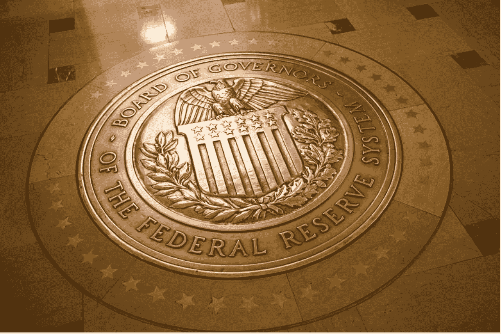
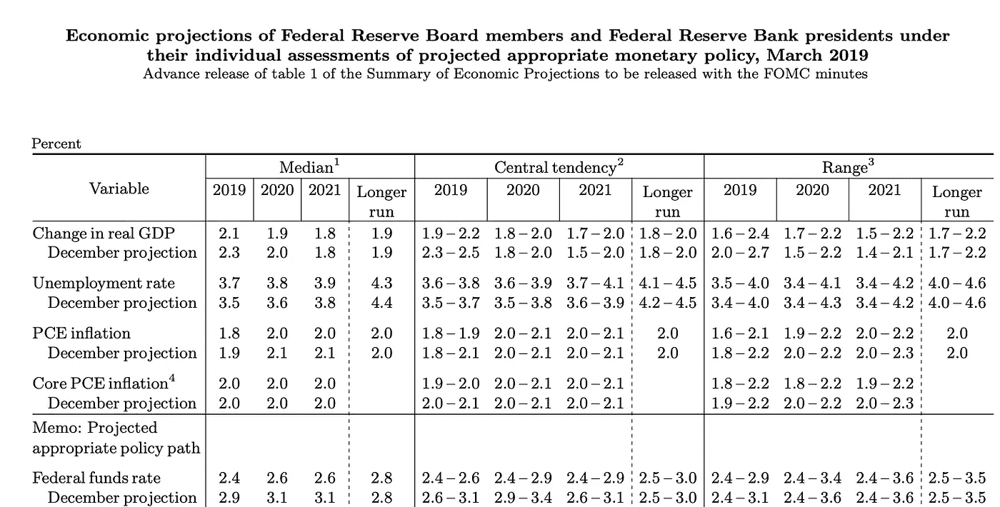

# 美联储:利率非正常化

> 原文：<https://medium.datadriveninvestor.com/interest-rate-denormalization-at-the-federal-reserve-61d92f3abf92?source=collection_archive---------9----------------------->

*提要:随着贸易战的加剧，美联储和金融市场之间降息市场定价的分歧以及多边机构和市场参与者之间不同的经济前景也在加剧。在即将举行的会议上，美联储将寻求平衡经济增长高于趋势和强劲的劳动力市场与当前政策不确定性可能带来的不利影响。它最近决定下调超额准备金利率，这可能是一个更加温和的立场的前兆，或者是降息的前兆，尽管这是不合理的。*

谁将在美中贸易战中遭受更多损失？市场、美联储和多边机构都认同对双方都不利的结果，但强度和时机却大相径庭。[我之前说过](https://medium.com/datadriveninvestor/u-s-china-trade-a-key-currency-view-b56bb76f9169)增长和通胀效应将取决于全球价值链的灵活性和美国公司吸收关税额外成本的能力。我的理论基础是话语，目前这种话语过分强调两国之间的总体贸易额，而不是分析全球价值链和进口替代的灵活性以及生产者保护消费者免受关税引发的价格上涨的可能性。所有这些将决定美联储的下一步政策举措，并允许对支撑降息的经济理论进行充分的批评。

Source: Federal Reserve

***市场、美联储和多边机构有天壤之别***

尽管美国经济增长速度低于 2017 年，但美联储目前的预测显示趋势型增长，失业率处于创纪录低位(3.6%)，工资目前为 1.6%。由于贸易战的经济成本强度随着时间的推移而不同定价，因此一些矛盾开始出现。

 [## 为什么包容性财富指数比 GDP 更能衡量社会进步？-数据驱动…

### 你不需要成为一个经济奇才或金融大师就能知道 GDP 的定义。即使你从未拿过 ECON 奖…

www.datadriveninvestor.com](https://www.datadriveninvestor.com/2019/03/08/why-inclusive-wealth-index-is-a-better-measure-of-societal-progress-than-gdp/) 

国际货币基金组织最近将其对美国国内生产总值的预测上调至 2.3%，而世界银行则更加乐观，预测 2019 年美国国内生产总值将达到 2.6%。这明显高于预测，而不同的预测反映了贸易战带来的不那么细微的冲击。在这种情况下，当前市场对一次降息的定价似乎有些道理。

***哪个经济体是最大的输家？***

贸易战对美元和美国经济的负面影响较小，因为生产商吸收了关税带来的额外成本，而美元的避险属性强调了人民币的下跌。即使市场预期降息，美联储也必须谨慎应对，否则可能会发出错误的信号，例如无意中增加美国经济衰退的风险。正如我在之前的一篇文章中所讨论的，以美元为中心的交易叙事是错误的；过分强调对中国的影响，而忽视供应和全球价值链灵活性、进口替代以及美元走强推动新兴市场贸易增长的好处。这或许可以解释美联储货币政策的变化，如果有的话。

***什么解释了发散***

有几个因素可以解释美联储、市场和多边机构之间的分歧。市场和美联储的分歧根源于金融市场结果和实体经济在政策设计中的突出地位。此外，有人可能会认为，作为贸易战的一部分，针对公司的保险削减是合理的，因为中国公司并非不可能通过针对稀土金属等一系列商品和美国旅游业等服务进行报复。

***政策变动中可能出现的错误信号***

降息可能预示着中国经济在短期内表现出更强的弹性，或者美国经济不如此前预期的强劲。此外，强劲的经济数据和金融市场结果之间的差异可能会错误地将降息视为衰退的前兆。尽管在关税争端期间一直在升值，但美元可能已经见顶，降息将强调这一说法。与此同时，人民币将在远低于 7.00 的关键水平下开始升值，因为美联储将更加温和地控制市场预期，并在必要时表达调整政策路径的意愿。

***利率非规范化***

美联储和大多数央行最近都采取了温和的立场，但我所说的“*利率利率非正常化”*正在进行中。货币政策非正常化是一个过程，在这个过程中，一个给定的立场——比如暂停加息周期——伴随着比其他情况下更温和的实施。美联储理事会在 5 月一致投票决定将法定和超额准备金余额的利率设定为 2.35%，比联邦基金利率上限低 15 个基点。此举旨在促进联邦基金市场的交易，这将表明金融市场认为美联储目前的立场过于强硬。

***反规范化是降息的前兆吗？***

最近的税法导致提款增加了借贷成本( [Barrons，2019](https://www.barrons.com/articles/the-federal-reserves-latest-fix-might-not-keep-interest-rates-under-control-51557135900) )，即联邦基金利率上升，导致美联储降低超额准备金利率(ioer)，以确保流动性，并将银行间无担保贷款保持在联邦基金利率的中间范围。然而，这标志着先前温和的美联储发出了温和的信号，似乎有可能被降息所取代。

***美联储可能会出一身汗***

美联储在即将到来的会议上面临的挑战将是在全球贸易不确定性、金融结果的特殊结果、强劲的经济活动和紧张的劳动力市场之间找到平衡。市场预期和美联储当前预测之间的分歧，可能突显出数据和情绪驱动阵营之间的分歧越来越大。众所周知，美联储将努力证明经济理论在其政策决策中的相关性，因为不确定的政策背景支撑着其决策过程。随着市场与政治风险的联系越来越紧密，货币政策将寻求减轻贸易引发的冲击的不利影响，同时忽视美国的经济现实。然而，这样的保险削减是合理的，必须伴随着对美联储前景的修正或对当前地缘政治不确定性的明确指责。

***重新关注联邦基金利率向实体经济的传导速度***

因此，金融市场和实体经济之间的低信噪比应该引起警惕，以免美联储错误估计贸易战对美国经济的影响。美联储降息不太可能增加实体经济中的贷款，而不是提振经济活动。这方面的一个指标是债券收益率，在美联储降息(如果降息的话)后，债券收益率可能会保持在低位。一些人会认为，资本没有从债券市场流向股票和实体经济投资是美联储新一轮宽松倾向的症状。这可能会重新引发人们对传导机制以及联邦基金利率向实体经济传导强度的担忧，而不是通过降息来提供答案。