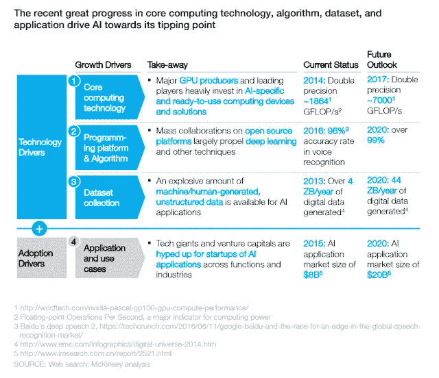

# 关于人工智能/机器学习的有趣阅读

> 原文：<https://medium.datadriveninvestor.com/interesting-read-about-artificial-intelligence-machine-learning-99531ca87eaf?source=collection_archive---------9----------------------->

**(1) Harvard Business Review: Why Companies That Wait to Adopt AI May Never Catch Up**
**Source:** [https://hbr.org/2018/12/why-companies-that-wait-to-adopt-ai-may-never-catch-up](https://hbr.org/2018/12/why-companies-that-wait-to-adopt-ai-may-never-catch-up)
**Summary:** A HBR article that discusses the importance for companies to become earlier adopters of AI/ML technology: The sourcing of substantial amount of meaningful training data, the training of AI model by using incoming dataset that continues to grow at exponential rate, and business processes re-engineering following the adoption of AI based enterprise system all take time. But once the AI system starts to produce fruitful business outcome, companies will be getting unassailable first mover advantage.

**(2) Harvard Business Review/ Andrew Ng: What Artificial Intelligence Can and Can’t Do Right Now**
**Source:** [https://hbr.org/2016/11/what-artificial-intelligence-can-and-cant-do-right-now](https://hbr.org/2016/11/what-artificial-intelligence-can-and-cant-do-right-now)
**Excerpt:** After understanding what AI can and can’t do, the next step for executives is incorporating it into their strategies. That means understanding where value is created and what’s hard to copy. The AI community is remarkably open, with most top researchers publishing and sharing ideas and even open-source code. In this world of open source, the scarce resources are therefore:

i) **[Data].** Among leading AI teams, many can likely replicate others’ software in, at most, 1–2 years. But it is exceedingly difficult to get access to someone else’s data. Thus data, rather than software, is the defensible barrier for many businesses.
ii) **[Talent].** Simply downloading and “applying” open-source software to your data won’t work. AI needs to be customized to your business context and data. This is why there is currently a war for the scarce AI talent that can do this work.
**Coursera Co-Founder Andrew Ng on Artificial Intelligence: Why AI Is the New Electricity?**
[i] [https://medium.com/syncedreview/artificial-intelligence-is-the-new-electricity-andrew-ng-cc132ea6264](https://medium.com/syncedreview/artificial-intelligence-is-the-new-electricity-andrew-ng-cc132ea6264)
[ii] [https://www.youtube.com/watch?v=21EiKfQYZXc](https://www.youtube.com/watch?v=21EiKfQYZXc) [Youtube]
**(3) MIT Technology Review: Is AI Riding a One-Trick Pony?**
**Source:** [https://www.technologyreview.com/s/608911/is-ai-riding-a-one-trick-pony/](https://www.technologyreview.com/s/608911/is-ai-riding-a-one-trick-pony/)
**Excerpt:** AI today is deep learning, and deep learning is backprop — which is amazing, considering that backprop is more than 30 years old. Geoffrey Hinton with his colleagues David Rumelhart and Ronald Williams published a breakthrough paper in 1986 that elaborated on a technique called backpropagation, or backprop for short. Backprop, in the words of Jon Cohen, a computational psychologist at Princeton, is “what all of deep learning is based on — literally everything.”

The way how Backprop works is that you start with the last two neurons [that produced the computation results], and figure out just how wrong they were: how much of a difference is there between what the excitement numbers should have been and what they actually were? When that’s done, you take a look at each of the connections leading into those neurons — the ones in the next lower layer — and figure out their contribution to the error. You keep doing this until you’ve gone all the way to the first set of connections, at the very bottom of the network. At that point you know how much each individual connection contributed to the overall error, and in a final step, you change each of the weights in the direction that best reduces the error overall. The technique is called “backpropagation” because you are “propagating” errors back (or down) through the network, starting from the output.

**My Interpretation of the article:** The danger of the hype over Deep Learning (Machine Learning) is that most of the recent breakthroughs in various application domains are achieved through the improvement of hardware processing capability in combination with the big data and not the true leapfrog development of the science itself. The fundamental of the neural network science probably hasn’t changed much in the past 30 years. It is the powerful hardware that has drastically reduced the time taken for the computation of big data. Besides, the result of computation probably will only show you the correlation and not causal relation.
**(4) Companies are suddenly declaring themselves “AI first.” Why it’s a problem for their current customers**
**Source:** [https://www.linkedin.com/pulse/companies-suddenly-declaring-themselves-ai-first-why-its-joshua-gans/](https://www.linkedin.com/pulse/companies-suddenly-declaring-themselves-ai-first-why-its-joshua-gans/)
**Summary:** Technology companies today are facing trade-off dilemma in their strategic commitment: Do they want to be AI first, Mobile first or Cloud first? As what questioned by the author: If AI is first, what becomes second?
**Additional reference about the context of Mobile first, Cloud first and AI first:**
**The Three Major Platform Shifts of Our Time — a16z Partner Frank Chen**
**Source:** [https://www.youtube.com/watch?v=OGIOAlSyHs4](https://www.youtube.com/watch?v=OGIOAlSyHs4)
**Excerpt:** We’ve seen basically three platform shifts since we started so nine years. These things don’t happen that often.

One platform shift was ‘on premise’ to ‘cloud’. At one point it was counter intuitive to start a cloud first company. In fact I remember when Databricks started and they said we’re gonna be cloud only, we’re not gonna be on premise, we were like I’m not sure that’s the right strategy. And it’s turned out great for them and so it was sort of the right time.

Another big platform shift was mobile first, which at one point it was risky to start a company and not basically build the desktop web version first and start with mobile. It was counter intuitive and then it clicked.

AI first is probably sort of the the latest incarnation of that. And at one point that was meaningful and you were differentiated. And then at some point it’s like what do you mean you don’t have AI algorithms? What do you mean you’re not doing deep learning or machine learning? Like two companies being equal doing the same thing — one with, one without machine learning, guess which one gets funded, guess which one will build together software best? Guess which one will delight their customer right? It’s obviously the one sort of with AI.
**(5) Partner at Andreessen Horowitz Benedict Evans on Ways to think about Machine Learning**
**Source:** [https://www.ben-evans.com/benedictevans/2018/06/22/ways-to-think-about-machine-learning-8nefy](https://www.ben-evans.com/benedictevans/2018/06/22/ways-to-think-about-machine-learning-8nefy) **Summary:**
1) Machine Learning AI provides opportunities to release human talents to more meaningful and impactful works.
2) It enables/accelerates the automation of repetitive works that require low to medium level of human cognitive skills. However, Machine Learning AI still cannot match the in-depth intelligence of any individuals in a single domain or multiple domains.
3) AI is the next wave of enabling technology that resembles the contribution of relational database to information system in 1980s, 1990s and 2000s. The author envisions that in the future, Machine Learning could be an integral part of almost any information system.

**Other sharing about AI by Benedict Evans, Andreessen Horowitz:**
Does AI make strong tech companies stronger?
[https://www.ben-evans.com/benedictevans/2018/12/19/does-ai-make-strong-tech-companies-stronger](https://www.ben-evans.com/benedictevans/2018/12/19/does-ai-make-strong-tech-companies-stronger)
**(6) Former Microsoft Executive, Former Baidu COO Qi Lu on AI and other technology topics**
**Source:** [https://blog.ycombinator.com/baidus-coo-qi-lu-discusses-ai-with-daniel-gross/](https://blog.ycombinator.com/baidus-coo-qi-lu-discusses-ai-with-daniel-gross/)
**Excerpt:** In this wave of technology development, there’s one aspect that is fundamentally different from the previous generation of the big technology wave, which is data plays an essential role. I’ll offer you this simple example. You can have 10,000 engineers, great engineers, or you can have a million great engineers. You will not be able to build a system that understands human conversations. You will not be able to build a system that will recognize objects or scenes of images because you need to have data. A simple analogy is very much like humans. When you and I grew up, it’s not like our parents or God is writing coding to our brains. Our builtin neuro-engines have the ability to learn, so our sensory systems, essentially, our perceptive systems, whether it’s visual systems or whether it’s auditory systems that we are able to observe the world. Our observations, those sensors, these are data. This data carries knowledge, and we are able to learn from our interaction with the world. As we grew up, we acquired knowledge. The same thing happens for AI technology. It’s not about writing code this time. It’s about writing code that implements algorithms with both soft and hard wares that are able to learn, and learn knowledge from the data.

If you take that perspective, data in my view is for the AI era. It will become a primary means of production. By definition, means of production is a form of capital. We look at, historically, in our human history, let’s say, in the agricultural era, land is the primary means of production. You can see everything is organized around the land. All the wars are competing for land. In the industrial eras, the means of productions are primary labor equipment, different type of equipment. And certainly, financial capitals, human talent. But in the AI era, my view is that data will become a primary means of production. Harnessing data becomes key. And that comes back to China, because China has a different socio-economical policy around it. For certain segments, not on everything. For certain segments, it’s much easier to acquire and harness it. With that, it creates an environment for developing AI technologies, and then commercializing those technologies towards market oriented applications or social applications.

It is in that context that China has a structural advantage. In terms of approach, there would be cultural differences, even in the entrepreneur world. The startups in the China environment, they tend to work in their ways. That, I will say, Silicon Valley and China, there’s common attitudes, there’s some different approaches, but that’s not the bigger factor. In my view, it’s the environment that’s the more determinant factor making China to be, relatively compared to other marketplaces or other regions, a better place for AI development, because of data.
**(7) Former Microsoft exec reveals why Amazon’s Alexa voice assistant beat Cortana**
**Source:** [https://www.theverge.com/2017/8/14/16142642/microsoft-cortana-amazon-alexa-qi-lu](https://www.theverge.com/2017/8/14/16142642/microsoft-cortana-amazon-alexa-qi-lu)
**Excerpt:** Google and Microsoft, technologically, were ahead of Amazon by a wide margin. But look at the AI race today. The Amazon Alexa ecosystem is far ahead of anybody else in the United States. It’s because they got the scenario right. They got the device right. Essentially, Alexa is an AI-first device.

Qi Lu believes Microsoft and Google “made the same mistake” of focusing on the phone and PC for voice assistants, instead of a dedicated device. “The phone, in my view, is going to be, for the foreseeable future, a finger-first, mobile-first device,” explains Lu. “You need an AI-first device to solidify an emerging base of ecosystems.”
**(8) Partner at Andreessen Horowitz Frank Chen on What’s working and what’s not for AI**
**Source:**
[i] [https://a16z.com/2017/12/07/summit-ai-update-frank-chen/](https://a16z.com/2017/12/07/summit-ai-update-frank-chen/)
[ii] [https://mixpanel.com/blog/2017/12/12/frank-chen-ai-andreessen-horowitz/](https://mixpanel.com/blog/2017/12/12/frank-chen-ai-andreessen-horowitz/)
**Excerpt:** You can think about there being three kinds or stages of AI. There’s “narrow AI,” which can solve very specific kinds of problems. It can play a board game, or it can predict whether or not a customer is going to churn, it can figure out what’s in a picture.

There’s “general AI,” which is basically what we think of as human intelligence. Can it learn new things? Can it pass the Turing test? That is, if a human is interacting with it, will the human know that they are dealing with a machine rather than a human?

Then there’s “Super AI,” which Elon Musk is warning us about, in which the machines move far past humans.

All of the success you read about in AI has been in “narrow AI”, and the results have been spectacular.

We don’t have a unified approach towards general AI yet — we just don’t know how to get there. And until have General AI, it’s too soon to worry about Super AI.

The way Andrew Ng puts it, worrying about Super AI is a bit like worrying about overpopulation on Mars. Someday it might be a problem, I guess, but first, let’s put the first person on Mars.

**Frank Chen、Andreessen Horowitz 关于 AI 的补充分享:** 人性+ AI:更好地在一起
**来源:**
**节选:**为什么有算法的人类同时胜过单独的算法和单独的人类？一种可能性是，算法以类似于语法和拼写检查帮助改善我们写作的方式来改善决策。一般来说，这些检查器很好地捕捉了我们的许多打字错误和语法错误(真正的肯定)。但是偶尔，检查者会标记一些不正确的东西(假阳性)或者给出一个你不同意的语法建议。在这些情况下，您最终会覆盖 checker。通过这种推拉、挑战和超越的过程，最终的结果是比任何一方自己写的都要好。
**(9)Jeffrey Towson:谷歌中国前总裁李开复分享他对中国 ai 课程的见解
来源:** 【我】[https://www . LinkedIn . com/pulse/10-things-I-learned-artificial-intelligence-from-Kai-Fu-Towson-% E9 % 99% B6 % E8 % BF % 85/](https://www.linkedin.com/pulse/10-things-i-learned-artificial-intelligence-from-kai-fu-towson-%E9%99%B6%E8%BF%85/)

节选:
第一课:中国为 AI 的实施时代做好了准备
第二课。中国在数据方面有优势——这是人工智能第三课中最重要的内容。斗志昂扬的企业家是中国人工智能的秘密武器。人工智能驱动的自动化将影响基于廉价劳动力和制造业的经济。美团的“千团大战”是数字中国的一个很好的例子
第六课:人工智能是电池和电网之间的竞争
第七课:优化和数据网络效应将变得更加复杂
第八课:接下来是在线-合并-离线(OMO)。太棒了
第九课:政府支持真的能加速中国的人工智能
第十课:美国模式和中国模式的比较

**美国模式|中国模式** 突破|融合+速度
技术|应用
视觉驱动|结果驱动
轻|重

**麦肯锡:李开复对两位全球人工智能领袖的看法:中国和美国**[https://www . McKinsey . com/featured-insights/Artificial-Intelligence/Kai-Fu-lees-perspectives-on-two-global-leaders-in-Artificial-Intelligence-China-and-The-The-United States](https://www.mckinsey.com/featured-insights/artificial-intelligence/kai-fu-lees-perspectives-on-two-global-leaders-in-artificial-intelligence-china-and-the-united-states)

**李开复:人工智能的四次浪潮**
[https://www.linkedin.com/pulse/four-waves-ai-/](https://www.linkedin.com/pulse/four-waves-ai-/)

一个是核心计算技术，基本上就是你处理和学习的速度。

你们听说过半导体中的摩尔定律吗？所以实际上现在在自然图像处理中，这真的很神奇。我们基本上是在以双倍的速度研究摩尔定律。

因此，如果你真的看看英伟达路线图，如果你看看英特尔的 Nervana 路线图，基本上每秒钟的浮点运算次数每年翻一番以上，这真是令人印象深刻。

所有这些东西的问题是它们太耗电了。所以，如果你打开一辆全自动驾驶汽车的后备箱，就像——你不能在后备箱里放任何东西。因为都是一排排耗电的 GPU 而已。这意味着你没有电池寿命。因此，这实际上不是性能问题，而是功耗问题。这必须得到解决。

第二件事是关于算法——编程语言。

这是一件非常令人着迷的事情，因为这是第一次这种重大的技术转变几乎完全发生在开源上。

开源就是——你把源代码放在互联网上，任何人都可以使用，这与微软的 Windows 相反——你可以看到这一部分，你可以制作你的 API，你可以在微软的 Windows 上编写，但你不能打开内核。

有趣的是，人们认为这不会持续，因为没有堆栈。

因此，如果你正在为智能手机开发应用程序，你知道你可以写入 Android 堆栈，也可以写入 iPhone 堆栈，但你知道在哪里写。如果你是为 PC 写的，那就写 Windows 吧。

这当然让控制 Android 或 iOS 或 Windows 的人变得非常非常富有。但是它创造了巨大的利益，因为你得到了所有的创新。你不需要在原始编程层面进行创新，你可以在应用程序和软件层面进行创新——这会让生活变得容易得多。

人们期待着这一天的到来。在这场正在进行的战争中，它是如此迷人，我不知道它将如何结束。

但你基本上有大约七八家不同的半导体公司加上大约 12 个主要的人工智能开源平台。此外，所有这些互联网公司都有自己的封闭源代码，每个人都在想，在人工智能世界里，我该如何创建 Wintel。

这意味着，十年后，当你是一家公司，你想在你的工厂里制造机器人，你想让那些智能机器人取代人类，你实际上就像今天一样——你从盒子里拿出一部 iPhone，它就能工作。有人将提供能够正常工作的堆栈，然后您只需为您的特定工厂进行定制。

这是必要的，因为如果每一家想要使用会思考的机器人的公司都必须想出让会思考的机器人工作的所有程序，这项业务就永远不会扩大。因为世界上没有足够的程序员，所以每个公司都决定重建堆栈。问题是每个人都想创建堆栈，但他们不希望自己的堆栈在其他人的堆栈上工作。所以这将是一场有趣的战斗。

另一件事是收集的数据量。因为没有数据，你无法在人工智能中学习任何东西或做任何事情。

当然，正在发生的两件大事是，由于聊天和社交媒体，产生了大量的数字数据。

但是第二件事是你们听说过物联网——IOT、面部摄像机……现在有大量的现实世界的物理数据现在可以集成到数字数据中，所有这些都有能力放在一起。

所以你知道很多数据基本上是…我这里有一些数字…但基本上每年增长 5 倍。

我认为，在过去的两年里，创造的数据比过去的两年多——你知道人类有一万年的历史。

然后是大量的风险投资。所以对人工智能的风险投资——这取决于你怎么称呼人工智能。有很多公司只是一种随机的普通公司，有一个网站，现在自称为金融科技或人工智能，这样他们就可以获得更高的估值，对吗？

中国正从一种不同的角度看待人工智能。像大多数推动生产力的技术进步一样，在中国应用这些技术的好处可能比其他任何市场都要高。

**来源 2:**【[机器的崛起:中国高管如何看待人工智能的发展](https://www.mckinsey.com/~/media/McKinsey/Featured%20Insights/China/The%20Rise%20of%20the%20Machines%20How%20Chinese%20Executives%20Think%20about%20Developments%20in%20Artificial%20Intelligence/The%20rise%20of%20the%20machines%20How%20Chinese%20executives%20think%20about%20developments%20in%20Artificial%20Intelligence.ashx)
**摘录:**最近核心计算技术、算法、数据集和应用的巨大进步推动人工智能走向临界点。

1。人工智能是领先半导体厂商的核心目标，所有 CPU 和 GPU 领域的顶级厂商都在大力投资人工智能和机器学习所需的高容量处理。

2。开源人工智能平台的数量和规模正在急剧增长，为开发人员提供了免费的编程接口和工具、算法以及人工智能功能的训练数据集。

3。数据源数量和种类的大幅增加意味着可以训练机器更快地做出更好的决策。
4
4。科技巨头和风险投资家正在急切地追逐那些在各行各业创新人工智能用途的初创公司。从 2010 年到 2014 年，人工智能初创公司的风险投资增长了 20 多倍。

Source: McKinsey & Co

**(11) Chris Thomas, McKinsey & Co: How A.I. Is Different in China?**
**Source:** [https://www.youtube.com/watch?v=puPSTkQhfjc](https://www.youtube.com/watch?v=puPSTkQhfjc) [Youtube]
**Excerpt:**
**Question 1:** What is the most important thing happening in AI in China today?
**Answer:** I would say I’m gonna give you two answers on that one. One is a massive amount of experimentation in the consumer space driven by the growth of these messaging and connection platforms and lots of venture capital and big company money flowing into it.. So experimenting with new ways to bring value to consumers. This is everywhere from financial services to media and other things.

The second thing I see is a huge amount of innovation around the technical solutions for artificial intelligence especially around developing new neural processing semiconductors.

**Question 2:** What’s the biggest difference between AI in China and the rest of the world?
**Answer:** I think AI in China has two unique characteristics. One, because it has a massive but already digitally connected populace, you can scale new AI applications much faster. So that means the competition is much more intense to be the first mover and the big winner. The second thing is that in China because of these platforms and because of the requirement to move quickly, there’s less fundamental innovation at the technology level, and much more innovation at the business model or application level than what you see out of Silicon Valley.

**Question 3:** What is everyone getting wrong about AI in China? What’s the biggest misconception ?
**Answer:** That it is just a consumer game. There’s actually a lot more economic value to be created leveraging advanced analytics and AI in traditional industry and manufacturing and service industries then helping people buy stuff online.

**Question 4:** What’s next? What’s coming in the next couple of years that we should all be keeping an eye out for?
**Answer:** Well, if I knew the exact answer to that question, I’d be a hedge fund trader and I’d be sitting on my yacht today. But in all seriousness, I think what you’re going to see is you’re going to see big winners and standard platforms for artificial intelligence, similar to the way that you have Android or iOS for the phones or you have Wintel for the PCs. This is a standard platform which other people can innovate that has to happen inside the AI world for the technology to take off. And from this massive competing set of companies, some winners will emerge. Maybe not just one, maybe two or three with more specialized applications — so winning platforms.

**Last question:** Outside of hiring McKinsey, what simple step could a CEO of a China or Asia company do in regards to AI? What would be easy next step?
**Answer:** The way I would look at it is — take a look at a compendium of use cases of artificial intelligence, take a look at 150 different ways that it’s being used today. Brainstorm three or four of them that you could apply to your own business and then just go out there and do it. Put together some Tiger teams, put up some sensors in the factory, run some advanced analytics, see what you see. Apply three or four, see if you make some money. Do it in a piloting way, see which one scales, see which one works, see what you learn.

**Other sharing about AI by Chris Thomas, McKinsey &Co:**
What AI Can and Can’t Do
[https://www.youtube.com/watch?v=wTKSmJIEIMc](https://www.youtube.com/watch?v=wTKSmJIEIMc) [Youtube]
**(12) Bridgewater Associates founder Ray Dalio: The Great & Terrible of A.I. in Markets
Source:**
[i][https://www.linkedin.com/feed/update/activity:6327241955071840256/](https://www.linkedin.com/feed/update/activity:6327241955071840256/)
[ii][https://twitter.com/raydalio/status/1062383097025626112](https://twitter.com/raydalio/status/1062383097025626112)
**Transcript:** I think the biggest issue we are dealing with particularly in the markets regarding (AI) algorithms is algorithms are going to blow up if these two things… two considerations (do not make sense)…
i) Do you understand the algorithm?
ii) Does the cause-effect relationship make sense to you?
A lot of (AI) algorithm and machine learning means that the person cannot explain the logic of the cause-effect relationship and that is the first sign of danger. The second sign of danger or risk is the future (in markets) is (always) different from the past. If you have both of those things, we are in the markets… the future is more likely to be different from the past and most importantly that whatever is discovered becomes put into the price (by the investors), right? In other words, if you discover something right and the algorithm discovers it and other people discover the same algorithm, then what’s going to happen is the worst — the reverse. Because everybody is finding that using that algorithm will bid up the price, let say, and not understand why. And it’s therefore more logical to go the opposite way of the algorithm than to follow the algorithm — you got to short it, right? And history has shown us that’s the case.
**(13) [Forbes] AI: Cloud Or On-Prem?** **Source:** [https://www.forbes.com/sites/moorinsights/2019/02/07/ai-cloud-or-on-prem/](https://www.forbes.com/sites/moorinsights/2019/02/07/ai-cloud-or-on-prem/)
**Summary:** When is the best timing to host your AI system on the cloud? When it is ripe for you to develop your AI system on premise? The author argues that pilot AI project for POC purpose could be hosted on the cloud as the cloud providers offer pre-trained AI models that are ready to use. The pre-trained AI models could enable the organisations to deliver quick win on AI pilot project by shortening the learning curve and delivery timeline substantially. However, due to the stickiness nature of the cloud-based AI infrastructures (e.g., you can’t easily port your AI system between AWS, Azure and Google Cloud), data privacy regulations (e.g., GDPR) and the relatively higher cost for long term cloud infrastructure subscription, you might want to consider developing your future flagship AI system on premise.
**(14) MIT Sloan Management Review: The Machine Learning Race Is Really a Data Race**
**Source:** [https://sloanreview.mit.edu/article/the-machine-learning-race-is-really-a-data-race/](https://sloanreview.mit.edu/article/the-machine-learning-race-is-really-a-data-race/)
**Excerpt:** While machine learning can occasionally surprise us with a flash of rare brilliance that no one has yet to discover, the technology isn’t capable of providing these insights with consistency. This doesn’t mean the tool is broken. It means we have to apply it wisely. This is easier said than done: For instance, in our research of the alternative data market, we found that more than half of new data providers are still focused on measuring physical and financial assets.

许多组织忽略的步骤是创建一个关于什么是重要的假设。机器学习真正擅长的地方是获取人类拥有的洞察力——基于经验法则、广泛的感知或了解不多的关系——并开发一种更快、更好理解、更可扩展(且不容易出错)的方法来应用这种洞察力。

为了以这种方式使用机器学习，你不需要向系统提供任何相关领域的每个已知数据点。你给它输入一套精心策划的知识，希望它能够学习，或许在边际上扩展人们已经拥有的知识。

所有这些对于希望创建有影响力和有价值的机器学习应用的公司来说有三个具体的影响:
i) **【差异化的数据是成功的人工智能游戏的关键。]** 使用竞争对手的相同数据，你不会发现任何新东西。审视内部，确定您的组织独有的知识和理解，并使用这些见解创建独特的数据集。
ii) **【有意义的数据胜过全面的数据。你可能拥有某个主题的丰富、详细的数据，但这些数据并不十分有用。如果你的公司不使用这些信息来帮助即席决策，那么从机器学习的角度来看，这些数据可能没有价值。
iii) **【你所知道的应该是起点。]** 最擅长使用机器学习的公司都是从独特的视角出发的，他们知道什么对他们做出重要决策最重要。这指导他们收集什么数据，以及使用什么技术。
**(15)麻省理工科技评论《算法—人工智能，揭秘:黑盒人类》双周刊通讯版 4 月 26 日**
**来源:**[https://go . Technology Review . com/AI-researchers-want-to-study-AI-The-The-same-way-social-scientists-study-humans](https://go.technologyreview.com/ai-researchers-want-to-study-ai-the-same-way-social-scientists-study-humans)
**摘录:**多墨随着(AI)算法开始调解从我们的社会和文化到经济和政治互动的一切，计算机科学家试图通过开发理解其行为的技术方法来回应对其可解释性的日益增长的需求。**

一群来自学术界的研究人员提议创建一门新的学术学科，名为“机器行为”。它研究人工智能系统的方式与我们一直研究动物和人类的方式相同:通过经验观察和实验。

麻省理工学院媒体实验室研究员尼克·奥布拉多维奇(Nick Obradovich)说:“我们已经开发了数百年来研究黑匣子的科学方法，但迄今为止这些方法主要应用于[生物]。[新论文](https://www.nature.com/articles/s41586-019-1138-y?utm_campaign=the_algorithm.unpaid.engagement&utm_source=hs_email&utm_medium=email&_hsenc=p2ANqtz-__eL3xKyDBfeVr_yXAZANszHj0PuCorsh2eGINyZWfhherP79r-BUmSRc5oltzHVbgCcHy)的合著者周三在《自然》杂志上发表。“我们可以利用许多相同的工具来研究新的黑盒人工智能系统。”

这样，机器行为学家对于计算机科学家就像社会科学家对于神经科学家一样。前者试图理解一个智能体——无论是人工的还是生物的——在它的栖息地、在群体中共存以及与其他智能体交互时如何表现。后者试图剖析这些行为背后的决策机制。

“我们正在看到有代理机构的机器的崛起，这些机器是演员，可以自主做出决定和采取行动，”另一位媒体实验室研究员、该论文的第一作者伊亚德·拉万在伴随该出版物的[博客文章](https://medium.com/mit-media-lab/studying-the-behavior-of-ai-ca8f0475bf3b?utm_campaign=the_algorithm.unpaid.engagement&utm_source=hs_email&utm_medium=email&_hsenc=p2ANqtz-__eL3xKyDBfeVr_yXAZANszHj0PuCorsh2eGINyZWfhherP79r-BUmSRc5oltzHVbgCcHy)中说。因此，他们需要“作为一个有自己行为模式和生态的新的演员类别”来研究
**(16)其他有趣的文章/视频:**

**MIT Technology Review:一种激进的新神经网络设计(带有微积分方程)可以克服 AI 中的大挑战**
[https://www . Technology Review . com/s/612561/A-radical-new-neural-network-design-can-comprise-big-challenges-in-AI/](https://www.technologyreview.com/s/612561/a-radical-new-neural-network-design-could-overcome-big-challenges-in-ai/)

**Gartner:揭穿五大人工智能误区**
[https://www . information-age . com/five-artificial-intelligence-misconcepts-123479166/](https://www.information-age.com/five-artificial-intelligence-misconceptions-123479166/)

**哈佛商业评论:随着人工智能的出现，新的供应链工作正在出现** [https://HBR . org/2018/08/New-Supply-Chain-Jobs-is-Emerging-as-AI-take-Hold](https://hbr.org/2018/08/new-supply-chain-jobs-are-emerging-as-ai-takes-hold)

**麻省理工科技评论:人工智能核心的黑暗秘密**
[https://www . Technology Review . com/s/604087/The-Dark-Secret-at-The-Heart-of-AI/](https://www.technologyreview.com/s/604087/the-dark-secret-at-the-heart-of-ai/)

**华尔街日报:艾无法推理为什么**
[https://www.wsj.com/articles/ai-cant-reason-why-1526657442](https://www.wsj.com/articles/ai-cant-reason-why-1526657442)

**《大西洋:机器学习的先驱如何成为其最尖锐的批评者之一** [https://www . theatlantic . com/technology/archive/2018/05/Machine-Learning-is-stick-on-asking-why/560675/](https://www.theatlantic.com/technology/archive/2018/05/machine-learning-is-stuck-on-asking-why/560675/)

**麻省理工科技评论:人工智能之父之一担心其未来** [https://www . Technology Review . com/s/612434/One-of-the-fathers of-AI-is-future/](https://www.technologyreview.com/s/612434/one-of-the-fathers-of-ai-is-worried-about-its-future/)

**彭博:人工智能有一些解释要做** [https://www . Bloomberg . com/news/articles/2018-12-12/人工智能有一些解释要做](https://www.bloomberg.com/news/articles/2018-12-12/artificial-intelligence-has-some-explaining-to-do)

**麻省理工科技评论:什么是机器学习？我们给你画了另一个流程图** [https://www . technology review . com/s/612437/what-is-machine-learning-we-draw-you-another-flow trade/](https://www.technologyreview.com/s/612437/what-is-machine-learning-we-drew-you-another-flowchart/)

**机器学习的友好介绍** [https://www.youtube.com/watch?v=IpGxLWOIZy4](https://www.youtube.com/watch?v=IpGxLWOIZy4)【Youtube】

*原载于 2018 年 12 月 8 日 erhc79.blogspot.com**我的个人博客* [*。*](https://erhc79.blogspot.com/2018/12/interesting-read-about-artificial.html)