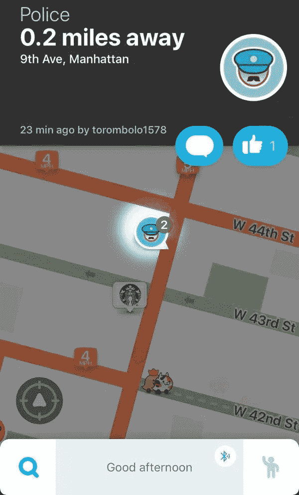

# 与人工智能接口

> 原文：<https://medium.datadriveninvestor.com/interfacing-with-ai-71aa0c7b4ba0?source=collection_archive---------14----------------------->

Waze screengrab

我想了很多关于我们如何与人工智能解决方案的不同方面进行交互的问题。归根结底，我们是否信任提供给我们的信息，以及我们如何回应。

当 Waze 带我在一条路线上经过三个左转时，我突然想到了这一点。如果我缩小视野，看到更大的画面，我会发现我可以在同一条路线上右转两次。Waze 优化似乎没有考虑到转弯时需要检查两个方向交通的精神疲劳。实际上，这是我对 Waze 的不满之一。在没有红绿灯的情况下，它可以毫无问题地让我穿过 4+条车道，这样它就能给我找到最短的路线。

 [## 人工智能预测能力的神话|数据驱动的投资者

### AI(人工智能)最有前途的优势之一似乎是它预测未来的能力…

www.datadriveninvestor.com](https://www.datadriveninvestor.com/2019/03/01/the-myth-of-ais-predictive-power/) 

信任是随着时间建立起来的。我使用 Waze 的时间已经够长了，我知道当它向我显示正常通勤的不同之处时，一定有什么事情正在发生。这种信任不是对 app 本身，而是对路由。

对我来说，少质疑这个系统，我要么需要随着时间的推移看到它，要么它需要持续地返回显著的结果。它需要比替代品好一个数量级。如果不是，那么它需要给出一些理由来解释为什么要给出它的结论(例如，显示替代路线估计要长 2 分钟)。

我们互动的东西不会把自己表达成“AI”，它们只会是推荐。语法上，Boomerang，Google Smart Compose 都是电子邮件的例子。我们将在我们的银行应用、物联网应用中看到这一点……提供一些建议。

我们信任他们吗？在我们被烧伤后多久，我们愿意再试一次？我们怎么知道他们是否在工作？设计师可能想提前回答这些问题，以便更快地采纳或坚持推荐。