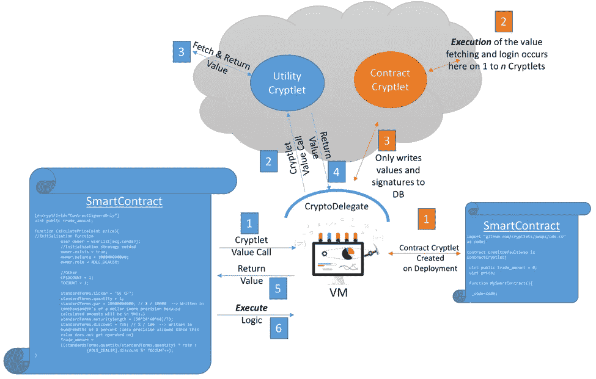
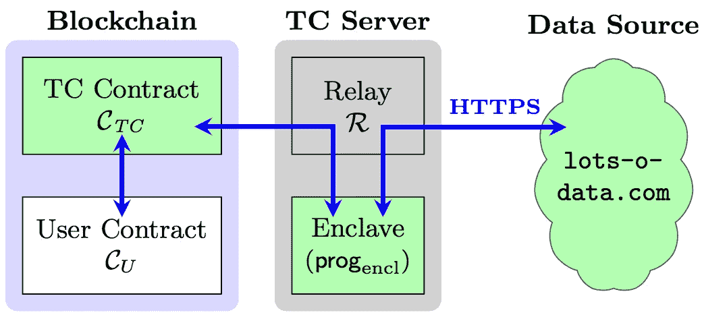
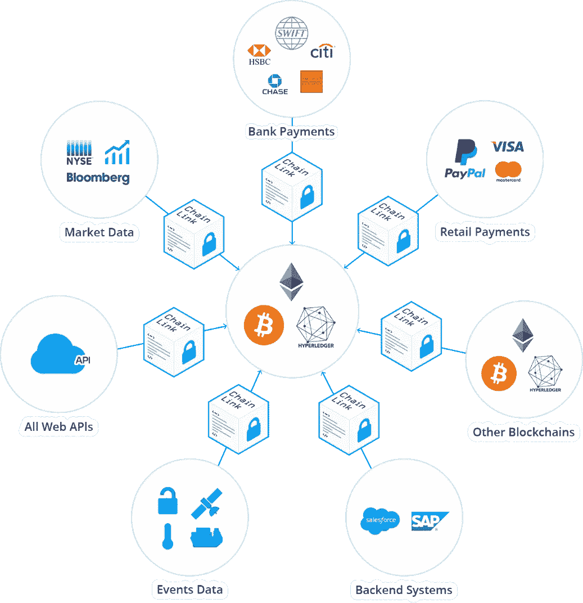
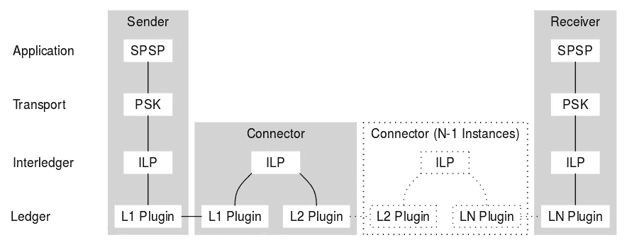

# 在区块链实施交易

> 原文：<https://medium.datadriveninvestor.com/interledger-implementing-transactions-across-blockchains-46558a013148?source=collection_archive---------3----------------------->

今天，存在着许多不同的区块链，将来会有更多。一个供应链交易，从开始到结束，可能涉及从多个区块链写入或读取数据。此外，不难预见，在区块链全国范围内，对信息交流和交易执行的需求将会越来越大。

如果基于时间或市场条件的外部数据或事件需要与区块链交互，则需要“oracle”。没有安全地提供“oracle”数据的标准方法，这在多方 SmartContracts 中很快会成为一个问题。

一般来说，调用 SmartContract 或区块链之外的代码或数据会打破信任壁垒，威胁到相关交易的真实性。Cryptlets 提供了这种功能。

**Cryptlets** 是用任何语言编写的链外代码组件，在安全、可信的容器中执行，并使用安全通道进行通信。有两种基本类型的洞穴；效用和契约。**实用程序密码器**构成了区块链结构的主体，提供加密、时间和日期事件、外部数据访问和认证服务等横向服务。每个实用程序小密码都有自己的标识和认证签名，这些标识和签名被注册用于云中。开发人员可以发现 Cryptlets 并将其加入到他们的智能合约中，以创建更加健壮和可信的交易。

**契约密码器**是完整的委托引擎，充当链外的智能契约代理。这些 Cryptlets 提供所有的执行逻辑，并将数据安全地存储在 SmartContract 中。当智能合同被部署到区块链时，合同 Cryptlets 被绑定到它们的智能合同并被动态创建。因为契约密码程序不在虚拟机中执行，它们不在区块链的所有节点上运行，所以它们可以并行运行，并在垂直扩展的系统上执行，以获得更高的性能。

契约加密程序可以充当自主代理或机器人，与链外的世界进行交互，同时保持区块链和智能契约本身的完整性。你可以在微软 Cryplets 阅读更多内容。[https://github . com/Azure/Azure-区块链-projects/blob/master/bletch ley/cryptletsdeepdive . MD](https://github.com/Azure/azure-blockchain-projects/blob/master/bletchley/CryptletsDeepDive.md)

**Town Crier** 是智能合约的认证数据馈送，也称为“甲骨文”它是由区块链世界领先的学术研究机构 IC3 的学生和教师创建的。
尽管 TC 不像其他现存的“神谕”。由于使用了 SGX，TC 为数据提供了异常强大的身份验证，还可以为智能合约查询和操作提供强大的保密性。
你可以去 http://www.town-crier.org/[的](http://www.town-crier.org/)看看《小镇预言家》

ChainLink 是区块链中间件，允许智能合约访问关键的链外资源，如数据馈送、各种 web APIs 和传统的银行账户支付。

通过提供对这些关键资源的智能合同安全访问，ChainLink 允许他们模仿真实世界的协议，这些协议需要外部履约证明，并需要以广泛可用的支付方式(如银行支付)进行支付。

LINK 网络是第一个去中心化的 oracle 网络；允许任何人安全地提供智能合同，以访问关键的外部数据、链外支付和任何其他 API 功能。你可以在这里了解更多信息[https://www.smartcontract.com/](https://www.smartcontract.com/)

如前所述，区块链可以引用区块链以外的数据。这包括其他区块链以及非区块链系统中的数据。区块链系统中可能出现的外部数据引用有两大类:链接数据和跨区块链事务。

链接数据使用哈希，也可能使用数字标识符和公钥加密(只要它在整个区块链得到一致使用，并且无论链接数据存储在哪个系统上)。这意味着公钥加密的使用越标准化，链接数据就越容易，成本就越低——定义数据的语义也是如此。

外部区块链引用(也称为锚)可用于证明所指向的数据的存在或未改变的性质。这不同于互联网上的超链接或统一资源定位符(URL ),在互联网上，某个地址的信息可能会根据其被访问的时间而改变。例如，如果你点击电视新闻网站上的一个链接，该链接会随着更新而定期改变，那么你明天发现的可能与今天发现的不同。对于区块链锚数据链路，区块链中的信息是被指向的数据没有被改变的保证(存在的证明)。

除了链接两个区块链系统之间的数据(交叉链引用)和指向智能合同可能使用的数据(例如测试证书)之外，链接数据还可用于将链外大数据整合到空间有限的区块链系统中。补充数据可以位于公共/开放的分布式数据系统中，如 Inter Planetary File System (IPFS，一种使用标准互联网协议的开放的内容可寻址存储器)，也可以引用私有数据库中的数据，这些数据有选择地提供给有权限的分类帐用户。对于私有的离链或跨链引用，网络运营商可能知道一些数据的存在，但是通过额外的控制来限制他们的访问。从隐私的角度来看，这是非常有趣的，因为有可能访问数据以便知道，例如，某人是否超过 21 岁而不给出他们的年龄，或者他们是否住在伦敦而不给出他们的地址。

分类账间(区块链跨度)交易在两个区块链上使用以协调方式互动的跨链参考和组件(如智能合同)。这是一个新兴领域，但是已经存在并正在使用一些机制。这些主要集中在总账之间的价值交换(数字资产)，例如 Ripple interledger 和 Lightning Network。

[https://interledger.org/rfcs/0001-interledger-architecture/](https://interledger.org/rfcs/0001-interledger-architecture/)

【https://youtu.be/zaqWdL25caU? list = pli R1 fi 1 vegehgjetgo h8 cpkxxuhuxj 5 lm