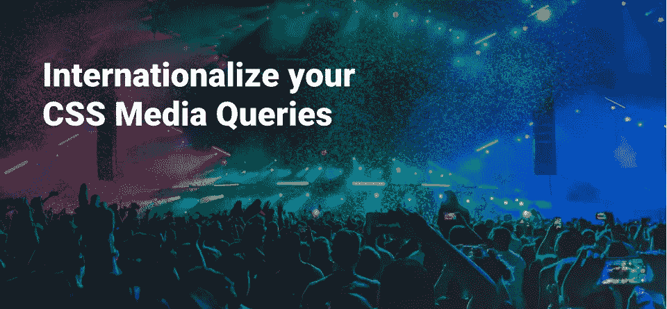

# 国际化您的 CSS 媒体查询

> 原文：<https://medium.datadriveninvestor.com/internationalize-your-css-media-queries-64c749eb00c?source=collection_archive---------8----------------------->

> 我新的很酷的设计模式，本地化的媒体查询，通过内容优先的策略来提高响应能力。



Illustration by me. Made with the awesome Figma design tool.

今天我发现了一个超级提示。很酷的一个。🍬这一切都是从一个非常基本的试错过程开始的。

在开发这个产品的时候，我发现在一些较小的分辨率下，菜单栏会让人觉得不自然，但只是在德语环境下。

我决定研究一下这个问题，发现有些语言中的单词很长。

我突然想到了以下的想法。🔥

找到了我一直在寻找的一个技巧。

这个技巧允许我以不同的方式处理布局响应，无论用户来自法国还是德国。

这样我们就可以真正做到“内容第一”——真正的。

# 追根溯源。

> CSS2 来拯救。介绍被遗忘的古老时代。

技术几乎完全依赖于这个选择器。它得到了很好的支持，可以在 IE8 [1]以下的所有浏览器上运行。

**下面是重要的片段:**

```
@media only screen and (max-width: 650px) {
  /* German lang, 650px. */
  :lang(de) .menubar {
    background-color: yellow;
  }
}@media only screen and (max-width: 600px) {
  /* French lang, 600px. */
  :lang(fr) .menubar {
    background-color: black;
  }
}
```

让我们来分解一下:

1.  我们在德语中基于我们的测量来定义第一媒体查询。我们看到菜单在 **650px** 处断裂。所以让我们利用这一点。
2.  在媒体查询中，我们使用了`:lang(locale)`选择器，并要求它仅在位于`de`地区时应用。
3.  我们将目标放在我们的`menubar` div 上，这样我们就可以针对特定的语言环境对它进一步应用样式。
4.  我们对法语也做了同样的事情，在它崩溃之前，我们测量了 600px 的 T3。

然而，我们需要一个非常小的额外步骤来实现这一点。

将`lang`属性添加到我们的`<html>`元素将让 CSS 为我们应用规则。

我很确定你已经在你的网站上用过了。你不想吗？👌

```
<!DOCTYPE html>
<html lang="fr"> <!-- Lang -->
  <!--
    The content goes here.
  -->
</html>
```

## 加分

*   在运行时将 lang 标记绑定到内部框架 i18n 语言。

# 结论

现在，无论用户使用什么语言，布局都是根据用户的语言定制的。

这可能看起来没用，但至少让我有一个感觉更好的布局，因为考虑到了用户的上下文。

这些天来，我们在互联网上制作越来越多的网站和内容，如果网站都能够对语言做出反应，这可能会是一件很酷的事情。

# 感谢阅读！

感谢您的阅读，我有时会发布一些小博文和技巧。

在 Medium 上关注我，在您的订阅源中接收我的下一篇文章。

如果你想在未来听到更多我的消息，请随时在 Twitter 上关注我！🐦