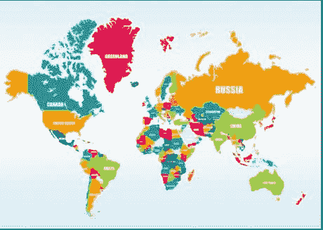
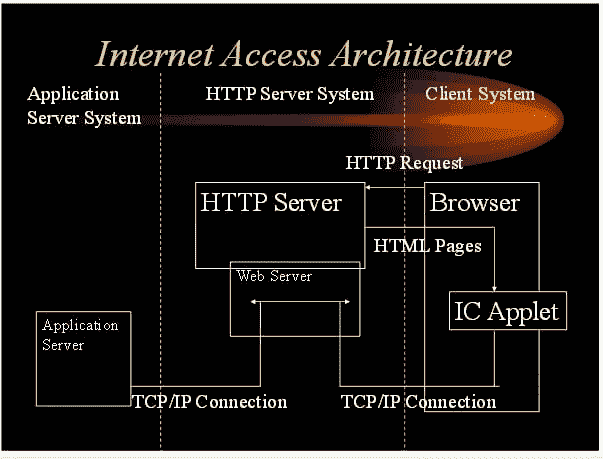
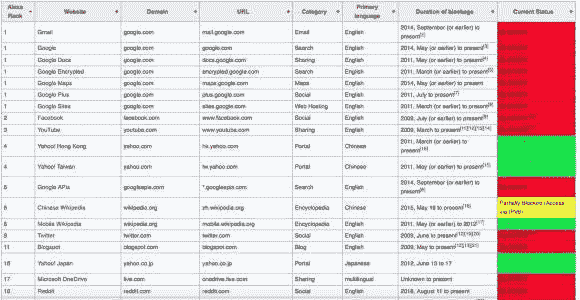

# 互联网将人们聚集在一起，但并不总是最好的

> 原文：<https://medium.datadriveninvestor.com/internet-brings-people-together-but-not-always-for-the-best-bc2055ade4?source=collection_archive---------29----------------------->

本周早些时候，我想我应该写一篇简洁的文章，围绕美国国家安全顾问约翰·博尔顿的傲慢，在他谴责国际刑事法院“侵犯美国主权”后，他威胁要撤回美国对该机构的所有支持。

我虚构了一个故事，描述国务卿博尔顿是一个如此穴居的人，因为他如此关注由“物理边界”描述的“主权”，就像上面描述联合国(UN)承认的 196 个民族国家的图表中所示的那样。

我想我会如此敏锐地将国务卿博尔顿的民族国家世界观与围绕“ [***【互联网接入架构***](https://www.managementstudyguide.com/users-interface-and-management-erp.htm) ”的更“前卫”的观点进行对比，在这种观点中，人们通过共享常见信息而成为“T8”世界公民，如图左下角的“应用服务器”所示。

[https://www.managementstudyguide.com/users-interface-and-management-erp.htm](https://www.managementstudyguide.com/users-interface-and-management-erp.htm)

然而，我很快发现我的评论变得多么愚蠢，因为不管人们可能分享的“共同信息”，这并不意味着世界各地的人们以共同的方式“解释”共同的信息。事实上，我在联合国工作的经历告诉我完全相反的事情。

当我在联合国驻埃塞俄比亚的非洲办事处工作时，我和身为尼日利亚公民的站长一起参加了一个社交活动。当时，阿布杜萨拉姆·阿布巴卡尔将军是尼日利亚的领导人，许多(如果不是大多数的话)非洲国家都处于像阿布巴卡尔将军这样的“强人”统治之下。他们都不重视个人自由或任何形式的自由，如果这意味着将他们所有强大的控制和统治置于危险之中的话。

在与站长交谈时，我错误地使用了“个人尊严”这个词。他对我嗤之以鼻，好像“个人或人类尊严”的概念是全世界都懂的。尽管他为联合国工作，但他发现“个人尊严”是一个特别西方的词语，在非洲国家没有什么意义，在非洲国家，对群体或部落及其统治者的忠诚对日常生存至关重要，比任何个性概念都重要。

当我回想起那次经历时，我仍然能感觉到自己在站长的世界里是如此的格格不入。我还意识到，尽管我们都说英语，但我们对特定的单词和短语有着完全不同的理解。实际上，我们用不同的方式“解释”了同样的单词和短语，主要是因为我们来自非常不同的文化。因此，即使现在互联网让全世界的人们都可以获得相同的信息，但这些信息的解释却绝不相同。这些解释更多的是关于文化和语境，而不是语言和语义。

把地球分成 196 个国家一点也不“自然”。它们是人类在几个世纪的互动中创造出来的，很多互动都是冲突，这些冲突定义了国家领土的起点和终点。

在 1648 年的《威斯特伐利亚条约》【T2 条约】【T3 条约】之前，全球主要由这样或那样的君主政体、君主国和王国组成。学者们认为威斯特伐利亚是现代国际体系的开端，其基础是民族国家的概念和后来被称为威斯特伐利亚主权的东西，这体现在 Gerard ter Borch 的名画《1648 年 5 月 15 日批准明斯特条约》中

威斯特伐利亚和约实际上是 1648 年 5 月至 10 月在威斯特伐利亚的奥斯纳布吕克和明斯特签署的一系列和平条约，在很大程度上结束了欧洲的宗教战争。

宗教战争发生在新教改革(1517 年)之后，这场改革扰乱了欧洲天主教国家的宗教秩序。然而，宗教并不是战争的唯一原因，战争还包括叛乱、领土野心和大国冲突。三十年战争(1618-1648)结束时，信奉天主教的法国与新教国家联合起来反对信奉天主教的哈布斯堡王朝。《威斯特伐利亚和约》(1648 年)建立了一种新的政治秩序，即博尔顿大使提到的现在被称为 [**威斯特伐利亚主权**](https://en.wikipedia.org/wiki/Westphalian_sovereignty) 的秩序。民族国家没有什么神圣不可侵犯的。他们很可能会消失，就像他们出现时一样，但是无论发生什么，都是人为的。

不去深究量子物理学的深奥之处，我们生活中唯一“真实”的东西是居住在地球上的 76 亿人以及围绕这些人的动物、矿物和植物，其中 55%的人现在使用互联网通过搜索引擎找到彼此，并通过电子邮件分享信息。然而，更根本的是互联网接入架构，如上所述。这种体系结构支持所有这些搜索引擎，并通过访问公共信息来继续增进世界各地人们之间的关系。

互联网审查是指监管机构或主动对互联网上可以访问、发布或查看的内容进行控制或压制。个人和组织可能出于道德、宗教或商业原因进行自我审查，以符合社会规范，这是由于受到恐吓，或者出于对法律或其他后果的恐惧。

这张图表展示了一小部分中国政府为了限制中国公民获取信息而干预的网站。

居住在地球上的 76 亿人口中，近 20%是中国人，他们使用与其他 80%相同的互联网接入架构。中国用户和其他国家用户使用的互联网接入架构的最大区别在于，中国用户不能无限制地访问应用服务器。十几个中国政府机构审查和执行与中国境内、流入和流出的信息流动有关的法律。最强大的监控机构是****中共中央宣传部，它与新闻出版总署和国家广播电影电视总局协调，以确保内容宣传共产党的学说。限制和监控所有这些“内容”的原因正是因为对内容的解释可能与中国的 CPD 截然不同。****

****截至 2018 年 9 月，根据该国的互联网审查政策，mainland China 约有 10，000 个域名被封锁，该政策阻止用户从该国访问被禁网站。****

****美国的互联网审查是对在美国互联网上发布或浏览的信息的压制。美国保护言论和表达自由不受联邦、州和地方政府的审查；这项权利受到美国宪法第一修正案的保护。这些保护延伸到互联网；然而，美国政府过去也审查过网站。****

****经过 20 多年关于内容监管的持续争论，美国仍然远远没有就言论自由的可接受限度以及保护未成年人和监管互联网非法活动的最佳手段达成政治共识。赌博、网络安全和经常访问社交网站的儿童面临的危险是正在进行的重要辩论。公众对提议的内容限制政策的强烈抵制阻止了在其他一些国家使用的更极端的措施在美国扎根****

****人类有很多理由将自己与他人归为一组，而不管他们共享的共同信息。文化、习俗、宗教和邻近性都对所有人的生活方式和对他们分享的信息的解释产生持久的影响。虽然所有这些原因都会影响我们创造和分享的信息，但它们对博尔顿大使关于主权的关切的影响也比分享信息大得多，分享信息的意义有时可能非常短暂。****

****___________________________________________________________________****

******备注:******

1.  ****[https://en . Wikipedia . org/wiki/Websites _ blocked _ in _ continental _ China # Table _ of _ high-ranking _ Websites _ blocked _ in _ continental _ China](https://en.wikipedia.org/wiki/Websites_blocked_in_mainland_China#Table_of_high-ranking_websites_blocked_in_mainland_China)****

*****原载于 2018 年 10 月 3 日*[*neutec.wordpress.com*](https://neutec.wordpress.com/2018/10/03/internet-brings-people-together-but-not-always-for-the-best)*。*****