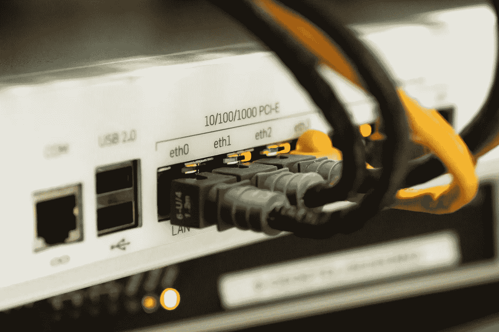

# 为您的创业办公室提供互联网连接和 WiFi

> 原文：<https://medium.datadriveninvestor.com/internet-connection-and-wifi-for-your-startup-office-9ea40f515d0?source=collection_archive---------4----------------------->

经常有其他创始人或首席技术官来找我，询问我在他们的创业办公室使用互联网和 WiFi 连接的经验。大约一年前，我花时间为 [#buildersnetwork](http://buildersnetwork.co/) 的成员写了一个小教程，这是一个主要由柏林企业家组成的松散团体。现在是时候向其他人提供这些信息了。

我推荐的所有东西都是基于我自己过去 10 年的经验，或者基于与其他初创公司 CTO 的讨论。

# **要考虑的因素**

## 用户群和使用模式

*   你的用户数量是多少？
*   你是否大量使用 Google Drive / Dropbox / …并拥有庞大的用户群？
    *这意味着你需要更多的上行带宽*
*   要连接的设备数量(笔记本电脑、手机、打印机、本地服务器)？
    *大量设备需要更强大的路由器(FritzBox 最多支持 40–50 台设备)*
*   远程/出差员工必须通过 VPN 连接才能访问本地文件吗？
    *需要更多的上行带宽，一个合适的路由器，可能还需要一个固定的 IP 地址。*

## 需要固定 IP 地址吗？

通常没有必要，除了我上面描述的情况。

## 停机和故障转移

当互联网连接出现故障时会发生什么？你需要另一个连接吗？当你的路由器出现故障时会发生什么？你多快能得到一个新的？

如果你认为你的公司是一家科技或网络公司，互联网连接中断通常意味着你的员工无法工作，这是投资一些钱购买可靠的硬件和两个互联网连接而不是一个的有力论据。

# 互联网连接选项

该零件专门针对**德国**甚至**柏林**。

## 家用互联网连接(VDSL，有线)

终端消费者互联网连接通常伴随着大量的下游，但(非常)有限的上游。可能存在导致带宽限制的音量限制。我们也没有 SLA 来定义停机时间方面的反应时间，这对于公司来说可能是至关重要的。

*   VDSL (Telekom):下行 50 兆位/秒，上行 10 兆位/秒，最高可达 200 / 40
*   Kabel Deutschland(现沃达丰):100 / 20，最高 400 / 25 都有可能。
*   注意:每天 10GB 后，您的带宽可能会受到限制，这可能会在 25 人以上的办公室中几分钟后发生。

## 专业/商业光纤连接

这些类型的连接或 ISP(互联网服务提供商)通常只在办公楼中可用，它们要昂贵得多，但提供适当的 SLA 和对称的上游和下游，如果您使用许多云服务来存储和共享您的文件，这将很有帮助。

**柏林优惠**

*   我听说 50 / 50 光纤连接的起价为每月 700 欧元，100 / 100 光纤连接的起价约为 1000 欧元(当你读到这些时，价格可能已经过时了)。
*   SysEleven [高速互联网接入](https://www.syseleven.de/produkte-services/carrier/)是一款非常个性化的产品，价格诱人，具有对等功能，或许值得一试。它们提供 100 兆比特/秒到 10 千兆比特/秒的连接
*   Telekom:价格是 Colt 的 1.5 到 2 倍，服务水平相似
*   1&1 现在提供[有竞争力的商业资费](https://dsl.1und1.de/glasfaser#tarife)500 mbit/s 甚至 1GBit/s，我听说他们需要相当长的时间来设置。如果有人读了这篇文章，并对这个提议有所体会，请在评论中分享你的想法。

最好的选择是查看哪家 ISP 已经在您的办公大楼中安装了光纤终端，并使用它，这样可以节省通常很高的安装成本。在柏林的许多办公楼里，至少有一两家这样的供应商

# **我基于公司规模的建议**

## **最多 10 名员工**

*   电信公司的 VDSL
*   故障转移连接可选，我会选择 FritzBox，并在断电时手动故障转移到另一个提供商(也就是将另一根电缆插入 Fritzbox)

## **10-50 名员工**

*   根据您的使用情况，最多 50 人或更少的云服务
*   获得一个合适的路由器(见下面的选项)可以处理更多的客户端和自动故障转移，Fritzbox 可能适用于 50 个，但也可能不适用。
*   可选的 WiFi 接入点
*   电信公司的 VDSL
*   通过德国 Kabel 沃达丰进行故障转移

## **50 多名员工**

*   通过光纤获得企业互联网连接(例如 Colt)
*   用于故障转移的 VDSL
*   获得一个合适的路由器(见下面的选项),它可以处理更多的客户端和自动故障转移

## **500 多名员工**

*   买个“真”专业的设置，不要看博文！
*   以下推荐的 pfSense 路由器也适用于 500 人以上的企业设置。根据您生态系统的其他部分，您购买的 WiFi 和网络设备的供应商可能会提供与其他组件更好集成的产品。

# 路由器/硬件选项

对于小公司来说，终端消费类硬件很好(最多 30-40 台设备)。较大的公司应该使用能够自动进行故障转移的合适路由器，这通常是企业路由器(价格昂贵)。pfSense 是一个很好的替代产品，它功能强大，甚至可能比大多数“企业”路由器更好，它是一个开源路由软件。现在有供应商提供预构建的 pfsense 设备。我在办公室、仓库和远程办公室使用它们多年，从未出现过任何问题，250 多人是很容易做到的，您还可以拥有第二个设备，以便在硬件出现故障时自动进行故障转移。

## **一些例子**

*   【https://www.netgate.com/solutions/pfsense/xg-7100-1u.html 号
*   【https://www.netgate.com/solutions/pfsense/xg-1537-1u.html 
*   其他供应商也在使用 pfSense 软件，在德国很容易买到

# **WiFi 选项**

对于小型“2 室”设置，Fritzbox 等终端消费硬件是不错的选择。一般来说，越少越好，接入点越多并不意味着连接越好，因为您的设备可能无法在接入点之间正常漫游。

## “物有所值”-中型到大型公司的选择

UAP-AC-PRO

Ubiquiti Networks 的 Unifi 产品线是一个物超所值的选择，我在世界各地的技术会议和办公大楼中看到过有数百个接入点的设置。

## “闭嘴，拿走我的钱”选项

在这个领域有如此多的选择，非常常见的是供应商，如[思科](https://www.cisco.com/c/en/us/products/wireless/access-points/index.html)或[阿鲁巴网络](https://www.arubanetworks.com/)(惠普的一部分)。价格通常是其他选项的 4-5 倍，甚至需要特定的 POE 交换机或硬件控制器，但它们更强大。如果你考虑投资那笔钱，找一个专业人士为你安排。

**感谢阅读。如果你喜欢这篇文章，请随意点击那个按钮👏帮助其他人找到它。**

# **免责声明&版权**

如果你不知道这些东西意味着什么，不要自己做——请专家为你设置。此外，ISP 和供应商可能会定期改变他们的产品线、定价等等。如果你在这里发现了一些过时的信息，请在评论中告诉我，我很乐意让那个帖子保持最新。

**图片:**

1: [Martinelle on Pixabay](https://pixabay.com/en/users/Martinelle-495565/) ，许可: [CC0 知识共享](https://pixabay.com/en/service/terms/#usage)
2:[Ubiquiti Networks](https://www.ubnt.com/marketing/#unifi)