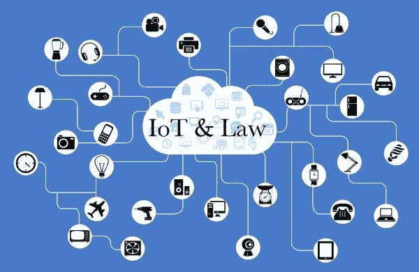

# 物联网和即将出台的法规

> 原文：<https://medium.datadriveninvestor.com/internet-of-things-and-upcoming-regulations-4e21ac5f3b99?source=collection_archive---------13----------------------->

我们处于持续的“连接”中；我们的每一个行动、决定，甚至对我们的欲望、需求的每一个预测，都被不断地监控着。这种持续和无限的数据流的作者是新技术、社交媒体和电子商务平台。我们用自己的个人数据换取了一点安慰，在一个持续狂热的时代赢得了时间。语音助手，在一个“好”的广告背后，以新宠物的身份出现，宠物，实际上捕捉和记录了我们私生活的每一个细节。这一前提旨在将物联网引入物联网，物联网是一个配备了识别技术的对象网络，它们相互连接，能够进行通信，构建一个巨大的物联网，其中每个对象都是可追溯和可识别的。第一个监管这种联网对象网络的是加利福尼亚州，去年通过了一项法案，该法案适用于“任何能够直接或间接连接到互联网的设备或其他物理对象，并为其分配了 IP 或蓝牙地址”。该法规将于 2020 年 1 月生效，要求制造商(“在加州代表他人生产、销售或提供销售的连接设备的制造商或与他人签订合同的制造商”)实施“合理”、“适合”设备性质的安全系统，但最重要的是能够保护其中包含的信息免受未经授权的访问、破坏、使用、修改或披露；这样，作为初始访问的必要条件，法律要求每个设备配备有密码或者由所有者预设或生成。加利福尼亚州已将 HIPAA、健康保险便携性和责任法案所涵盖的实体和业务伙伴以及“其功能受联邦法律安全要求约束的任何联网设备”纳入豁免范围。(由于这是你进入医疗设备的微妙领域的地方，如无线起搏器、连接和重要设备，网络安全受到威胁的威胁仍然如此真实，以至于美国食品药品管理局(FDA)等政府机构开始解决这个问题，对植入式设备糟糕的网络安全措施处以罚款)。
同样自 2020 年 1 月起，俄勒冈州颁布了一项物联网法律，但略有不同:虽然联网设备的定义几乎相同，但这里有一个例外，即“主要用于个人、家庭或家庭目的”的设备。
此外，这里我们给出了“合理的安全特征”的更有限的定义，既指用于局域网外部认证的任何手段，也就是:
——对每个连接的设备唯一的预编程密码；
-要求用户在首次访问连接的设备之前生成新的认证方式；
遵守联邦法律，以避免黑客攻击或网络攻击，以及“唯一的预编程密码或要求设备的新用户在首次使用设备之前生成新的身份验证方法，确保智能设备不具有与所有其他设备相同的默认密码”。
俄勒冈州的法律对“制造商”也有不同的定义，这里的“制造商”是指“在本州生产联网设备并出售或要约出售联网设备的人”。
2015 年，美国联邦贸易委员会联邦贸易委员会(FTC)颁布了一份报告，要求制造商采取积极措施保护消费者隐私并确保其数据安全，严格适用服务条款(ToS)，并向此类设备的任何购买者明确说明，如果这些条款包含免责声明或仲裁条款，以防止因产品缺陷或侵犯隐私而可能提起的集体诉讼，这两个州是首批对联网设备适用第一部法规的州。
这肯定会引发许多问题，要么是因为在各种 ToS 条件下预先定义了一组选择框，要么是因为消费者甚至没有检查一个选择框并证明不接受任何 ToS 条款，从而产生所购设备可执行性的客观问题！

 [## 理解物联网|数据驱动的投资者

### 一个系统越开放，它就越有利于创新和产生信任。然而，当谈到开放系统时…

www.datadriveninvestor.com](https://www.datadriveninvestor.com/2019/09/28/making-sense-of-iot/) 

此外，互联设备的网络正在扩大，甚至在卫生领域也是如此，随之而来的风险也在增加:如果这种相同的连接将允许卫生专业人员提供更具响应性和个性化的援助，那么它也将使数据或设备容易受到黑客的攻击。因此，有必要在原则上纳入安全概念，确保在多因素认证的每个阶段都有加密技术。公司将尽可能设计安全和冗余的设备，以保护它们免受勒索软件和其他攻击；他们需要监控患者数据保留的时间长度，以确保立即删除或完全匿名；他们需要让这些患者充分了解他们拥有的数据以及他们将如何使用这些数据。

Raffaella Aghemo，律师，版权所有