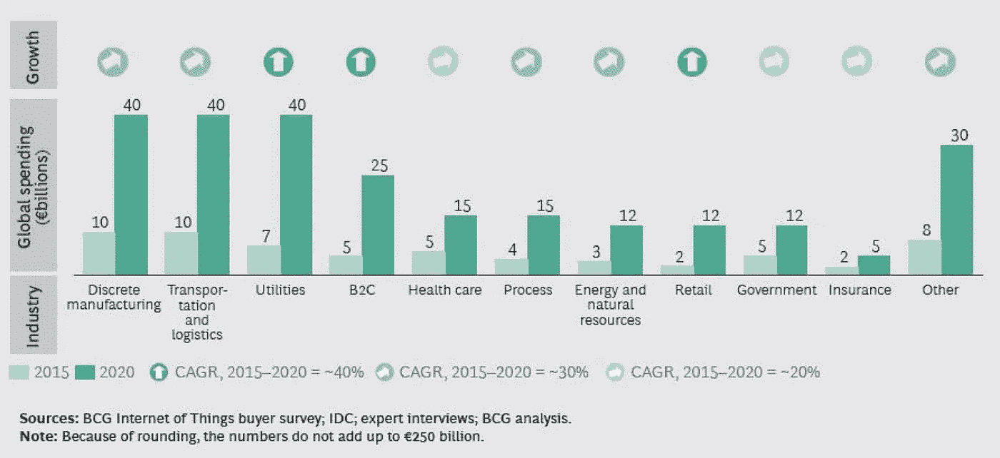
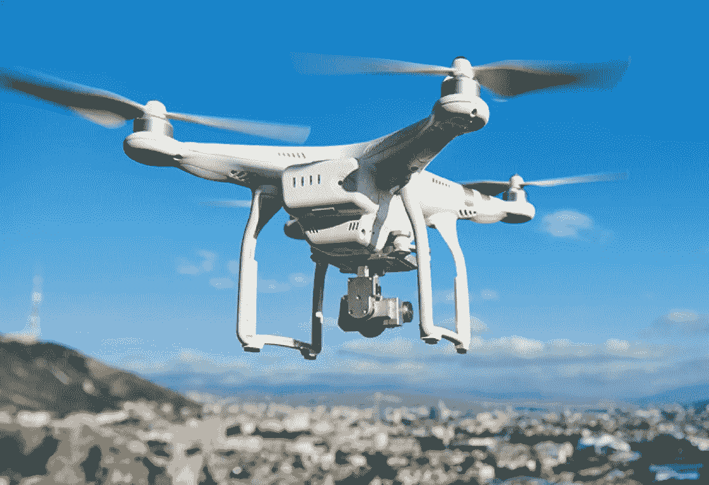
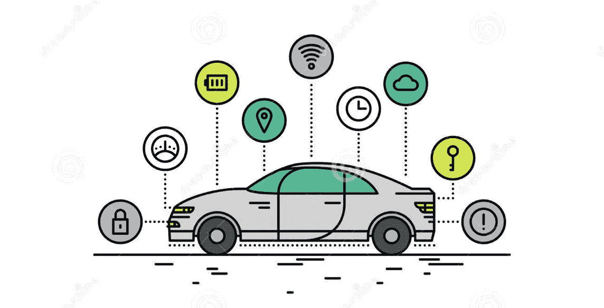
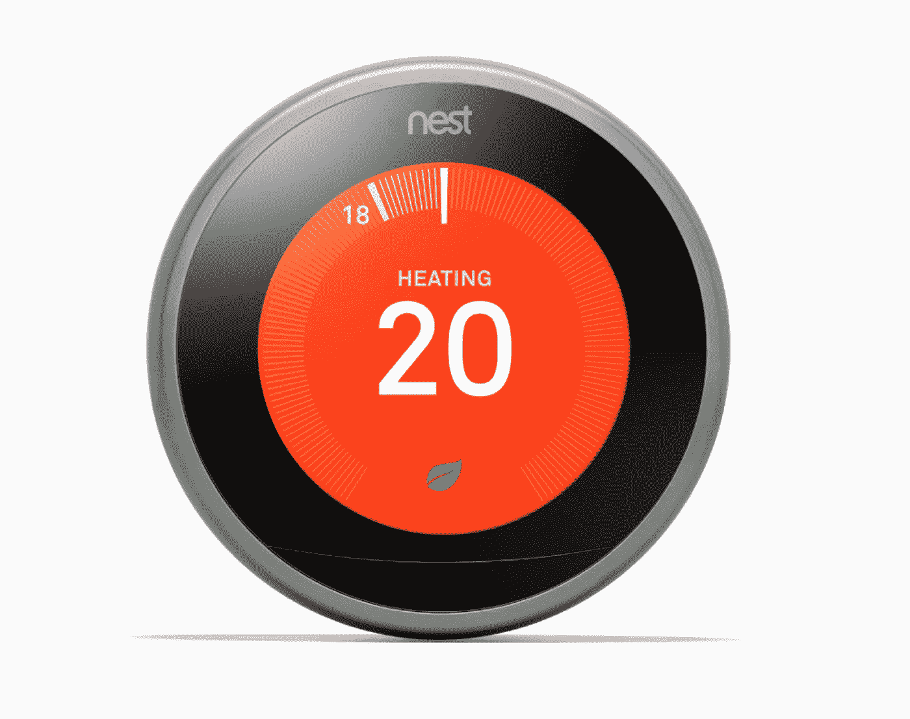
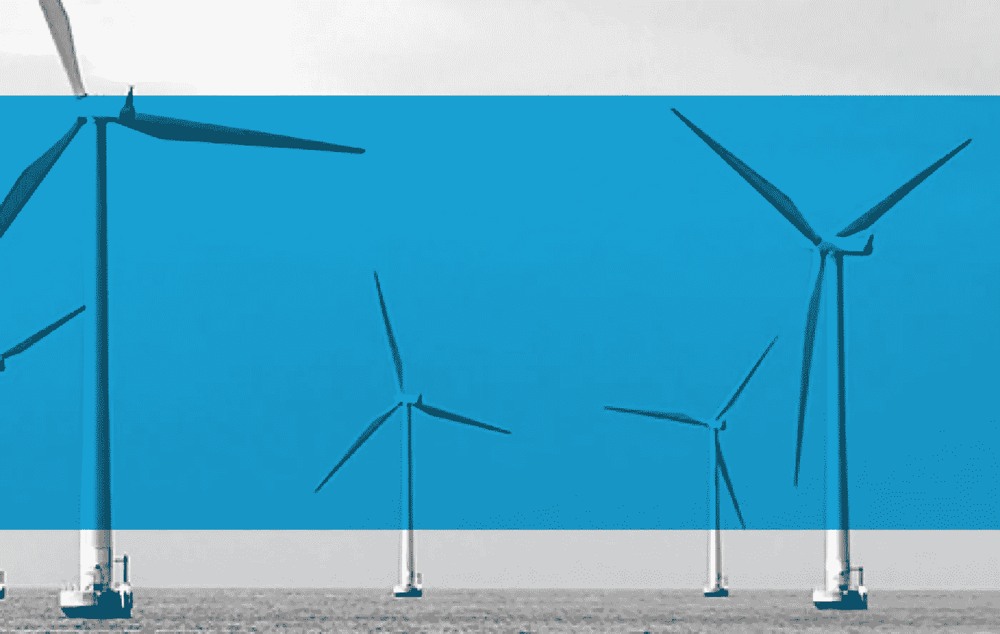
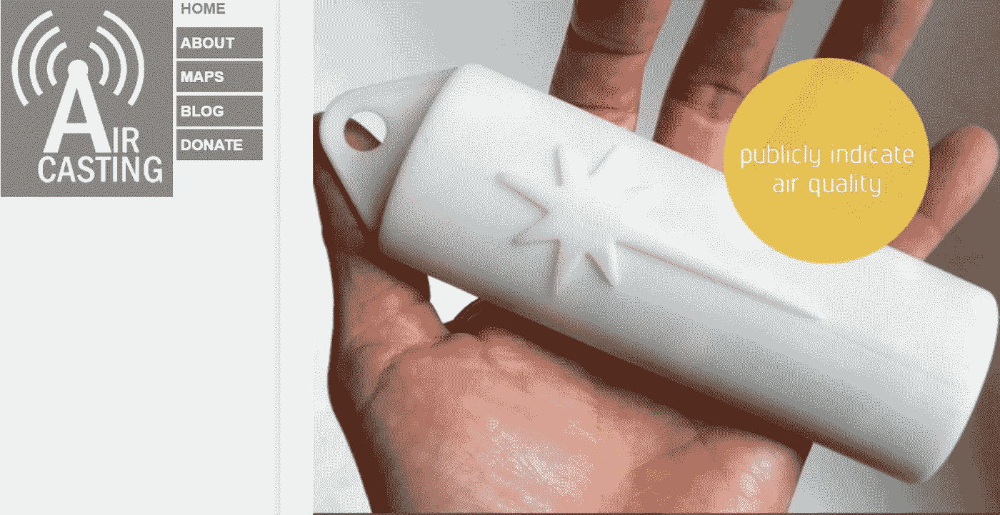

# 物联网使用案例概述:他们改变的 15 个领域

> 原文：<https://medium.datadriveninvestor.com/internet-of-things-use-cases-overview-15-spheres-they-changed-a58b691fdfd2?source=collection_archive---------5----------------------->

正在使用的物联网技术…等等，它们已经被使用了吗？

哦，是的。这很有趣:虽然观察家们仍在讨论物联网技术在现实生活中的应用前景，但市场已经展示了物联网的成功用例。实际上，一旦尝试过，物联网在使用中不会出现问题。

正因为如此，物联网使用案例的确切数量是巨大的。无人机、人造器官、智能照明、传感器——这些以及其他正在使用的美好物联网例子要求我们在其中仔细选择最好的。

因此，我们在这里不是为了证明物联网技术的好处，而是为了解释真正的物联网用例的成功之处！

**使用物联网技术的例子:解释选择标准**

为了说明物联网技术在促进当代生活方面取得的成就，我们按照应用领域对物联网中的用例进行了分组。事实上，这种方法可以展示应用行业的数量有多大。但事实上，物联网利用每个物联网中的各种问题来获得灵感，这一点肯定会被取消。

这是一种牺牲，但它使物联网用例的概述充满了所有必要的线索，可以用于进一步的研究。

**物联网用例方案:精选行业——具体实例**

那么，它们是什么，今天使用的物联网的例子？让我们仔细看看 15 个不同领域的 15 个物联网使用案例。

**#1 医疗保健物联网——Proteus 药丸**

在医疗保健中使用物联网的案例数不胜数，每一个都展示了采用该技术改善人类生活的巨大潜力。作为医疗保健中物联网的具体实例，我们选择了 Proteus 药丸。这项创新令人难以置信:它跟踪每一粒药丸的影响(具体来说，是时间、内容和身体反应)。因此，它拓宽了物联网在医疗保健中的应用范围——因为医生将确切知道哪些药物对病人不好。并且结合医疗保健中物联网的其他用例(指各种可穿戴设备、提醒、监护仪)，最终可以在医院获得个性化的精准治疗！

**#2 物联网区块链— PETRAS P2P — IoET**

在区块链物联网领域，有多种激励措施将两种前景趋势结合到一个框架中。作为这里物联网用例最突出的例子，PETRAS P2P — IoET 公司专门通过智能合同和物联网生产设备将能源供应商与其消费者联系起来。事实上，将便利的金融操作和成本效益结合起来以增加信任和安全的能力是突出的。正因为如此，物联网区块链作为一个有前景的并购出现，稳步进入所有行业。

**#3 物流物联网— DHL**

出于各种原因，DHL 处理新奇事物的方式是物流中[物联网](https://www.logistics.dhl/global-en/home/insights-and-innovation/thought-leadership/trend-reports/internet-of-things-in-logistics.html)的一个突出例子。事实上，该公司利用这一创新来跟踪和监控他们的交付。为此，它尽可能广泛地采用物联网技术。引领物联网在物流领域的应用，通过使用传感器来跟踪运输集装箱、保护集装箱并收集工人和所用工具的数据。作为回报，该公司获得了准确性和费用减少。

**#4 制造业物联网—思科**

至于[物联网在制造业](https://www.cisco.com/c/en/us/solutions/internet-of-things/manufacturing-digital-transformation.html)中的能力，存在各种值得关注的用例。在这里，我们解释一下当今 IT 界的顶级公司思科在建设互联工厂方面取得的成就。在 it 部门，该品牌实现了管理生产流程和远程访问设备的雄心，现在更容易、更快地解决了该领域的大多数问题。这个例子揭示了在制造业中使用物联网的前景。

**#5 交通物联网——维珍航空**

在交通运输中使用物联网的众多能力中，管理跨大陆航班似乎是最复杂和最具挑战性的案例。就此事，维珍航空公司(Virgin Atlantic)在其波音 787 飞机上推出了物联网连接，以预测可能的健康和设备问题，提高飞行安全。这一成就极大地促进了物联网在交通领域的应用。

**#6 商业物联网——智能货架**

事实上，商业中的物联网是一个有前景的领域——选择一个也是唯一的智能货架案例很难。但它的成功是合理的:这个案例改变了管理销售流程，提高了客户参与度，优化了生产和销售，并为零售公司节省了大量资金。如此有利可图，这使得物联网在商业中的应用非常诱人。

**#7 农业物联网——无人机**

在农业物联网的各种存在形式中，无人机显示出自己是最多功能和最可靠的物联网技术。特别是，它们能够拍摄大片和遥远地区的照片，分析它们的土壤成分和灌溉问题，甚至检测植物中的疾病。正因为如此，在农业中使用物联网的进一步增长已经势不可挡。

**#8 教育物联网——智能学习**

令人惊讶的是，教育中的物联网是一个值得一提的独立领域。在这里，智能学习的结果令人印象深刻。从调整大学校园内的空间到创建个性化的学习计划，物联网与人工智能和机器学习的结合极大地改变了学习的满意度。这些成就让人们对物联网教育寄予厚望。

**#9 汽车行业物联网——无人驾驶汽车**

说到汽车行业的物联网，无人驾驶汽车的持续阐述是无法回避的。它有望成为制造汽车的新方法，可以极大地改变人们的生活。特别是，这里的物联网技术使得通过扫描环境移动的汽车成为可能——而且不需要人手！听起来像是幻想，哈？随着时间的推移，物联网在汽车行业能够创造更多的奇迹。

**#10 家庭物联网— Nest 学习恒温器**

在所有物联网用例中，家庭物联网是最复杂的一个。这么多惊人的例子！作为最佳选择之一，观察家们评价 Nest Learning 恒温器可以远程控制智能家居中的温度。但这只是家庭领域物联网设备海洋中的沧海一粟！

**#11 车内物联网— Cobra 代码**

考虑到当代汽车物联网市场的设备，Cobra Code 是一个很好的例子。准确地说，它提供了对车辆的远程管理和观察。它不会把你的汽车变成一辆自动驾驶的汽车，但会让它变得更加智能，更加互联。而且像这样的外观，车内物联网这几天真的很流行。

**#12 能源控制物联网—智能电网**

就能源消耗控制而言，智能电网的概念确实令人印象深刻。特别是，它允许自动收集数据，并与供应商和客户分享见解。因此，优化使用和预测暴行的机会变得可以实现。

**#13 通信物联网—广播**

在加强社区内的联系方面，广播是健康数据收集和共享的有趣结合。具体来说，这款智能手机应用程序可以记录、绘制和交换所选环境中的噪音水平、温度、湿度和气体浓度信息。在它的帮助下，很容易避开有害的环境，在安全的地方开会。

**#14 野生动物保护物联网——狮子卫士**

在环境保护方面，狮卫士的案例是突出的。特别是，这种物联网技术是一种开源的野生动物跟踪项圈系统，专为拯救濒临灭绝的动物而设计。在肯尼亚南部使用，它可以拯救该地区剩下的 2000 头狮子——通过跟踪它们的位置，并在需要援助的情况下通过短信向协调员发送通知。

**#15 智慧城市物联网—巴塞罗那**

尽管智能城市仍相当虚幻，但巴塞罗那的经验表明，这一想法非常实用且富有成效。事实上，这个西班牙大都市采用了各种物联网技术——500 公里的光纤网络、街道照明中的 Wi-Fi 路由、空气质量监测和水消耗传感器、智能停车和废物管理方法。所有这些物联网用例都在一个地方，生活变得更加舒适和划算。总的来说，物联网的概念在更大范围内变得更受欢迎。