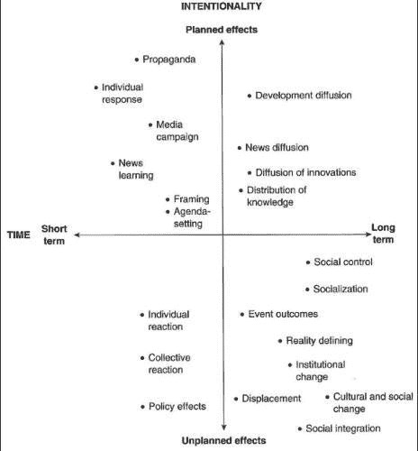
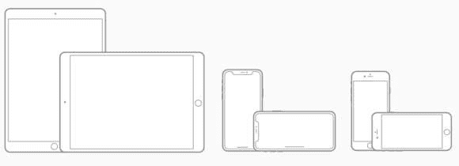

# 互联网挂毯

> 原文：<https://medium.datadriveninvestor.com/internet-tapestry-5f9050b5e180?source=collection_archive---------64----------------------->

社会的特点是共享独特文化和制度的个人之间的关系模式。一个给定的社会可以被描述为其成员之间关系的总和。互联网正在将人际关系编织成一幅巨大的社会织锦中的 [**纬线和**](https://en.wikipedia.org/wiki/Warp_and_weft) 经线。

社会学家 [**格哈德·伦斯克** i](https://en.wikipedia.org/wiki/Gerhard_Lenski) 根据技术、通讯和经济所创造的关系来区分社会。随着技术、通信模式和经济的不断变化，连斯基将社会分为以下七种类型:

1.  猎人和采集者
2.  园艺的
3.  农业或耕地
4.  产业的
5.  钓鱼；捕鱼
6.  放牧
7.  海事协会

虽然我承认“*信息社会*”这个术语被过度使用，以至于它几乎成了背景中的白噪音，但在 20 世纪 90 年代中期确实发生了一些事情，极大地改变了全世界个人之间的关系。事实上，简单地将这些变化称为“信息”是对它们的错误描述，以至于它会导致我们以有时是有害的方式做出反应，因为关系会导致行为。

媒体影响力是一个信息所施加的实际力量，它导致受众或个人信念的改变或强化。媒体效应是可以衡量的，是由信息的影响而产生的。该媒体信息是否对其任何受众成员有影响取决于许多因素，包括受众人口统计和心理特征。这些影响可能是积极的或消极的，突然的或逐渐的，短期的或长期的。并不是所有的影响都会导致改变:一些媒体信息强化了一个现存的信念。

这是丹尼斯·麦克奎尔的****类型学，根据信息的效果来组织信息:****

*   ******意向性**(计划内或计划外)和****
*   ******持续时间**(短期或长期)。****

****根据麦克奎尔的观点，这两个特征的交集告诉了我们很多关于信息效果的信息。例如，一个“*个体反应*”会在短期内产生意想不到的影响。而“*创新扩散*”是一个长期发生的计划效应。****

****据估计，现在世界上有 54%的人口使用互联网。这是一个长期发生的有计划的效果。由于互联网的扩散，我们所认为的关系现在是通过个人对寻找志同道合者的反应形成的，这一过程将网络空间和本地空间中的在线和离线互动结合起来。****

****有各种类型的报告表明，过度使用互联网会增加被孤立、疏远和从社会中退出的风险，但现有的证据表明，互联网既不会孤立人们，也不会降低他们的社交能力；在所有文化中，它实际上增加了社交、公民参与以及家庭和友谊关系的强度。****

****正是在 20 世纪 90 年代，当互联网被私有化并脱离美国商务部的控制时，它以非凡的速度在世界各地传播。1996 年的第一次互联网用户调查显示大约有 4000 万人；2013 年超过 25 亿。****

****此外，随着 21 世纪初无线通信的爆炸式发展(1991 年，世界上约有 1，600 万无线设备用户，2013 年，在一个拥有 77 亿人口的星球上，这一数字接近 70 亿)，我们可以说，人类现在几乎完全连接在一起，尽管在带宽以及互联网服务的效率和价格方面存在很大程度的不平等。****

****根据南加州大学的曼纽尔·卡斯特而教授的说法，“互联网从 20 世纪 90 年代中期开始的扩张是三个主要因素共同作用的结果:****

1.  ****蒂姆·伯纳斯·李对**万维网**的技术发现，以及他愿意通过全球用户社区的开源贡献来分发源代码以改进它，****
2.  ****互联网管理的制度变革，使其处于全球互联网群体的松散管理之下****
3.  ****社会结构、文化和社会行为的重大变化:网络化成为一种普遍的组织形式；**以个人主义为主要取向的社会行为******

****这三个因素直接影响了此处描述的“互联网接入架构”,并通过访问通用信息和获取该信息的技术增强了世界各地人们之间的关系。****

********

****[http://forum.daffodilvarsity.edu.bd/index.php?topic=7897.0](http://forum.daffodilvarsity.edu.bd/index.php?topic=7897.0)****

******超文本传输协议(HTTP)** 服务器安全机制用于提供对**超文本标记语言(HTML)** 页面的安全访问，该页面包含一个 [**【小程序】**](https://en.wikipedia.org/wiki/Applet) **。******

****在计算中，applet 是任何执行一个特定任务的小应用程序，它在一个专用的小部件引擎或一个更大的程序的范围内运行，通常作为一个插件。这个术语经常被用来指 Java applet，一种用 Java 编程语言编写的程序，它被设计成放置在网页上。小程序是短暂和辅助应用程序的典型例子，它们不会独占用户的注意力。小应用程序不是全功能的应用程序，旨在实现对更复杂服务的简单访问。****

****Java Applet 是从 HTML 启动并在 web 浏览器中运行的 Java 程序。它可以为 web 应用程序提供 HTML 无法提供的交互功能。由于 Java 的字节码是独立于平台的，Java 小程序可以由运行在许多操作系统上的浏览器执行，包括 Windows、Unix、macOS 和 Linux。当支持 Java 技术的 web 浏览器处理包含 applet 的页面时，applet 的代码被传输到客户机系统，并由浏览器的 Java 虚拟机(JVM)执行。然后一个 HTML 页面引用这个 applet。****

****基于 Web 的小程序的示例包括:****

*   ****QuickTime 影片****
*   ****Flash 电影****
*   ****Windows Media Player 小程序，用于在 Internet Explorer(以及其他支持该插件的浏览器)中显示嵌入的视频文件****
*   ****3D 建模显示小程序，用于旋转和缩放模型****
*   ****基于 applet 的浏览器游戏，尽管有些开发成了需要安装的全功能应用程序。****

****根据 comScore 的数据，2007 年，超过 210 万台个人电脑、智能手机、掌上电脑和其他移动设备使用美国宽带蜂窝连接上网。预计最终宽带蜂窝连接将成为互联网接入的主要形式，使 Wi-Fi 热点变得无关紧要[来源:PC World]。****

********

****例如，苹果公司制造了如上所示的各种屏幕尺寸的设备，所有这些设备都可以在纵向或横向方向上使用，但是不管设备的设计如何，它们都包含并依赖小程序来访问“应用”所要求的网络服务和应用服务。应用服务的范围从诸如存储管理和客户关系管理(CRM)等主要服务到诸如提供股票报价和检查拍卖项目的出价等更有限的服务。****

****根据互联网用户的百分比，十大最受欢迎的**互联网应用**是:****

1.  ****发送/接收电子邮件— 92%****
2.  ****搜索引擎— 89%****
3.  ****驾驶方向。— 86%****
4.  ****爱好信息— 83%****
5.  ****研究产品— 81%****
6.  ****检查天气— 80%****
7.  ****健康信息。— 75%****
8.  ****旅游信息— 73%****
9.  ****新闻— 73%****
10.  ****购买产品——71%****

****运行最流行的电子邮件和搜索小程序的十大最流行的**电子邮件客户端**是:****

1.  ****苹果 iPhone****
2.  ****谷歌邮箱****
3.  ****雅虎邮箱****
4.  ****苹果 iPad****
5.  ****MS Outlook****
6.  ****苹果邮件****
7.  ****Outlook.com****
8.  ****三星邮件****
9.  ****谷歌安卓****
10.  ****Windows Live Mail****

****虽然苹果麦金塔电脑(Mac)被设置为显示购买时所在国家的语言，但它允许从不同的语言中进行选择。例如，如果您在美国购买了 Mac，但您主要使用法语工作，您可以将 Mac 设定为使用法语。如上所述，互联网接入体系结构的基本功能对全世界的人来说都是一样的。****

****因此，“寻找志同道合的人”已经成为一个全球性的追求，创造了世界范围的关系和世界范围的社会。从马达加斯加到雅加达，从努克到蓬塔阿雷纳斯，人们似乎主要依赖这样或那样的搜索和电子邮件工具。这似乎与人们在真实的物理世界中进行的活动没有太大的不同，在那里，他们寻找与他们有共同兴趣的人，然后以最方便的方式与这些人交流。****

****互联网世界最大的不同在于，如果人们想减少搜索和与他人交流的工作量，他们必须精通使用搜索和电子邮件工具。这就是为什么人们通常喜欢使用大多数人使用的搜索和电子邮件工具。通过这样做，他们确保了自己有一大群其他人可以与他们分享经验并提高他们的工具熟练程度。****

****根据[**Erman Misirlisoy**](https://medium.com/@ermanmisirlisoy)*的说法，地球从未见证过比互联网更无缝的知识共享工具。*“这是因为，正如艾米莉·狄金森所写；****

> *****“大脑——比天还宽——
> 因为——把它们并排放在一起——
> 一个接一个地包含
> ——而你——在——*旁边****
> 
> *****“大脑比大海更深——
> 因为——拿着它们——蓝色到蓝色——
> 一个会被另一个吸收——
> 就像海绵——水桶——做——*****
> 
> *****大脑只是上帝的重量——
> 为他们称重——一磅一磅——
> 他们会有所不同——如果他们有所不同——
> 作为声音的音节——“*****

****通过互联网提供的正确的搜索和信息传递工具，人类可以找到无限量的信息，并与无限数量的人分享这些信息，从而建立几十年前无法想象的关系。借助互联网，人脑确实可以容纳天空以及它能想象的一切，并在最宏伟的社交挂毯中分享这些内容。___________________________________________________________________****

****注意事项:****

****1[https://internetworldstats.com/stats.htm](https://internetworldstats.com/stats.htm)UTM _ source = views&UTM _ medium = article 07&UTM _ content = Internet-society****

****8[https://www . info please . com/science-health/internet-statistics-and-resources/most-popular-internet-activities](https://www.infoplease.com/science-health/internet-statistics-and-resources/most-popular-internet-activities)****

****9[https://emailclientmarketshare.com](https://emailclientmarketshare.com/)****

*****原载于 2018 年 9 月 24 日 neutec.wordpress.com***。******