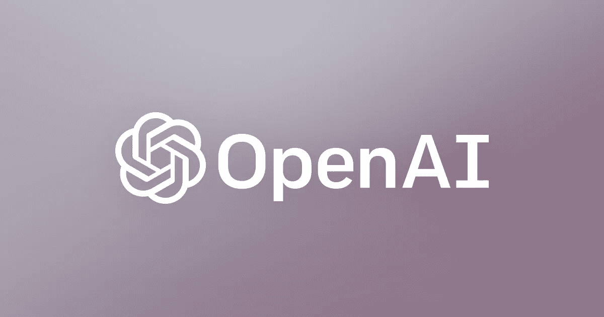

# 网络巨魔变得越来越强大——open AI 有问题的人工智能模型

> 原文：<https://medium.datadriveninvestor.com/internet-trolls-just-got-exponentially-more-powerful-openais-problematic-ai-model-e2d04e8489ae?source=collection_archive---------28----------------------->

这里的想法是什么？

如果你还没有听说，OpenAI 发布了一个[机器学习模型](https://blog.openai.com/better-language-models/)，它能够产生与人类散文难以区分的连贯写作。如果被坏人利用，这种模式可能会让假新闻和垃圾邮件充斥互联网——想象一下一个巨魔能够在一秒钟内在数千个论坛上发帖。

考虑到这些问题，OpenAI 选择只发布一个更小的(175m 参数)模型，该模型的性能明显比他们博客帖子中使用的 1.5b 参数模型差。OpenAI 为计算机科学界开创了一个危险的保密先例，它使政府和企业等能够接触到大量数据的人能够使用该模型，同时有效地否认了普通大众对他们的开发。

我们是否正在进入一个科学将被一群拥有自己道德指南针版本的研究人员所阻碍的时代？这是一个我不喜欢的未来。

OpenAI 已经开始就发布有可能改变我们所知的世界的技术进行发人深省的讨论。就我而言，我提倡透明。这些模型最终将被发布，给科学界足够的时间来做出反应对于打击有害行为者至关重要。

我邀请每个人下载并运行自己的[模型](https://github.com/openai/gpt-2)。