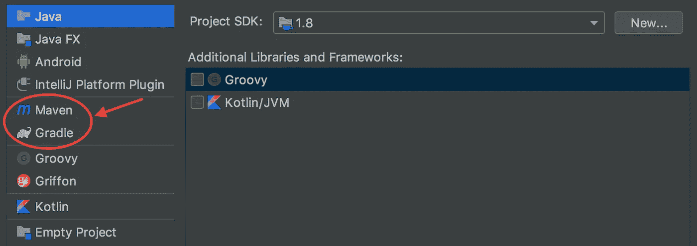

# 解释编程语言与编译编程语言

> 原文：<https://medium.datadriveninvestor.com/interpreted-vs-compiled-programming-languages-f6beb75d18c3?source=collection_archive---------6----------------------->

在花了一些时间用 Ruby 编程之后，我最近开始学习 Java。在我编写一行代码之前，为了开始一个 Java 项目，需要采取各种设置步骤。一个是安装一个 IDE——一个集成开发环境——来帮助软件的开发，允许开发人员在一个应用程序中访问工具和功能。IDE 通常由代码编辑器、调试器和编译器/解释器组成。

另一步是用构建自动化工具设置我的 Java 项目。什么是构建自动化工具，为什么我在用 Java 而不是 Ruby 编程时需要它？

构建自动化工具自动将您编写的代码(源代码)翻译成可以在计算机上运行的可执行代码(或二进制代码)。我需要构建自动化工具的原因是因为 Ruby 是一种解释型语言，而 Java 是一种编译型语言。

一般来说，语言分为两类——编译语言或解释语言。为了使代码可执行或可用，需要对其进行编译或解释。Ruby 是一种解释型语言，这意味着代码是动态解释的。这意味着您的原始源代码是逐行解释的，在移动到下一行之前执行这一行。没有必要为了执行而编译代码。

另一方面，Java 是一种编译语言，因此你的整个应用程序源代码需要编译(或翻译)成二进制代码，然后任何计算机才能执行它。因此，为了执行我的 Java 代码，我需要一个能够编译我的源代码的构建自动化工具。输入 [Gradle](https://gradle.org/) 和 [Maven](https://maven.apache.org/) ，它们是自动构建我的源代码的工具(包括编译我的代码，以便它可以被执行)。在 [IntelliJ](https://www.jetbrains.com/idea/) (一个 Java IDE)中建立一个项目时，通过选择其中一个，它会以一种可以编译的方式配置你的 Java 项目。

IntelliJ — Setting up a new project

编译语言和解释语言的区别在于执行的步骤。两者各有什么利弊？

与逐行执行代码相比，使用编译语言的优点是执行速度更快。然而，在开发代码时，编译代码是一个额外的步骤。每次您想要运行应用程序时，都需要编译代码——这在处理大型代码库时会非常耗时。尽管解释语言由于其实时的逐行翻译而执行起来较慢，但它更容易看到变化和调试，因为您不需要在每次想要检查代码时都进行额外的编译。