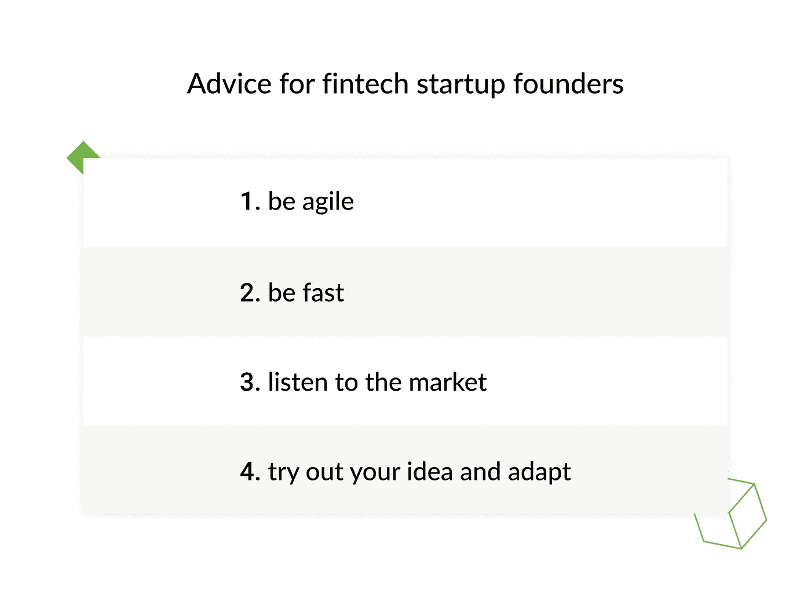
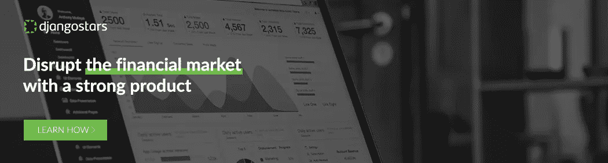

# 采访清晰头脑的帕特里克汉森:如何建立一个投资平台，并成功挑战几个世纪的传统

> 原文：<https://medium.datadriveninvestor.com/interview-with-clear-minds-patrik-hansson-how-to-build-an-investment-platform-and-successfully-64e03d52c595?source=collection_archive---------9----------------------->

*这次对 Patrik Hansson 关于* [*如何打造投资平台*](https://djangostars.com/blog/clear-minds-patrik-hansson-on-how-to-build-an-investment-platform-and-successfully-challenge-centuries-of-tradition/?utm_source=medium&utm_medium=medium.com%2Fdatadriveninvestor%2F&utm_campaign=interview%20with%20patrik%20hansson&utm_content=interview%20was%20taken%20by) *的采访是由****Anastasiia Marushevska****—****Django Stars****的通讯主管拍摄的。*

如何才能让你的想法成为一项金融科技业务，在一个由几个世纪的传统、根深蒂固的习惯和超级保守的客户群支撑的成熟世界级行业的核心竞争？人们怎么会认为有机会从瑞士的金融市场中分一杯羹呢？但是有些人只看到不可战胜的挑战，其他人却发现了机会。

我们与 Clear Minds 的 Patrik Hansson 进行了交谈，我们帮助他将一个原型变成了一个数字投资咨询平台，彻底改变了传统、缓慢、昂贵的投资服务行业。在这次采访中，Patrik 分享了他对不断变化的世界如何影响客户行为的想法，这些见解如何为他帮助建立的新一代投资者塑造了创新的数字平台，并为寻求为其金融科技挑战者初创公司获得牵引力的创始人提供了建议。

 [## 分散金融的出现|数据驱动的投资者

### 当前的全球金融体系为拥有资源、知识和财富的人创造了巨大的财富

www.datadriveninvestor.com](https://www.datadriveninvestor.com/2019/03/14/the-emergence-of-decentralized-finance/) 

**什么是明心？**

Clear Minds 是一个现代化的咨询平台，投资者可以在线控制自己的投资，同时始终得到专家的支持。

 [## 清晰思维案例研究-投资平台网络开发

### Clear Minds 是一个数字化的瑞士投资平台，处理咨询和投资流程。它侧重于…

djangostars.com](https://djangostars.com/case-studies/clear-minds/?utm_source=medium&utm_medium=medium.com%2Fdatadriveninvestor%2F&utm_campaign=interview%20with%20patrik%20hansson&utm_content=case%20study) 

我们提供了一个平台，投资者可以来投资他们真正关心和喜欢的基金。我们独特的卖点是，我们的平台给了投资者控制权。我们接管了以前银行的控制权，告诉投资者在哪里投资，然后把控制权还给投资者自己，这样他们就可以跟踪并投资到他们真正喜欢的领域。

对您来说，为什么在线投资咨询如此重要？你能详细说明在线服务提供了什么好处，谁是他们的接收者吗？

将数字化服务引入金融市场并使金融服务数字化对客户有两大好处。第一个是可及性。以前，金融服务通常是少数人的事情。数字服务把这个给了大众。第二点是成本。通过使流程更加精简和高效，你可以降低客户的成本。

为什么有人会选择数字顾问，而不是像私人顾问那样选择传统服务？

这些都说明了为什么数字服务很重要，主要的好处是成本。与传统的私人顾问相比，你坐下来，你有一个关系，你可以得到更低的成本。

成本——很多人不知道——是产生稳定、长期财务回报的最重要因素之一。因为你一直知道的是，成本总是会来的；另一方面，财务回报每年都在波动。但是成本总是会对你的回报产生负面影响。

**谁是你的目标受众，为什么？**

头脑清晰的目标受众是真正了解数字服务好处的投资者，他们也了解传统服务目前存在的问题，以及希望控制自己投资的人。这是不分性别或年龄的，这是跨越国界的。

**新一代(也称为千禧一代)被认为是几十年来最负责任的一代。你是否注意到了新一代投资方式的不同，他们是否更渴望投资？影响瑞士和瑞士投资者的具体动态是什么？**

新一代人和老一代人的财富转移将对金融业产生巨大影响。如果新一代人更渴望投资，这是我们将要看到的，但我们知道的是，他们对自己投资的东西更加关心。这意味着你必须谈论负责任的投资，可持续的投资，你可以看到你投资的东西不仅对你个人的福祉(就你产生的财务回报而言)而且对整个世界都有良好的影响。

我们生活在一个政治和经济不断波动的世界，这些波动会影响金融市场。美国新的贸易关税，贸易战，英国退出欧盟，选举周期造成的不确定性。技术减少了这些漏洞吗？它们能够帮助降低这些风险吗？

目前，世界看起来非常不稳定。关于政治风险——随着它们在中国、美国、欧洲和其他地方突然出现——我们说，你应该后退一步，不要用短期眼光看待你的投资，而要用长期眼光看待。突然，从长远来看，短期风险变得不那么可怕了。

你个人对金融市场的未来有什么看法？

我认为金融服务和金融市场将在未来几年发生巨大变化。

如果我们考虑金融服务，我认为我们已经看到了很多正在发生的变化。我们变得数字化，成本变得更低。

大银行和大玩家也在改变和适应市场。对于金融市场本身，我认为区块链将会产生重大影响。

几年后，我们投资证券和基金的方式将会大不相同。

**从一个已经成功创业的人的角度来看，你愿意与金融科技初创公司的创始人分享哪些建议？**

对于那些刚刚开始构建自己的金融科技的人，我能给的最好建议是保持敏捷；要快；倾听市场；有你的想法，但不要太执着于它:尝试并适应它。如果你真的想为市场创造一个好的解决方案，这是关键点。

**你相信什么而别人不相信？**

我真正相信的是——实际上我认为现在很多人都相信这一点——我们可以创造一个金融包容性的世界，我们可以分享，我们可以让每个人都有机会，我们可以让人们真正投资于对世界有益的事情。

你希望你的企业如何被人们记住？你解决了哪些问题，你是如何以不同的方式解决的？

头脑清晰是一个现代的咨询解决方案。这意味着我们提供了一个平台，投资者可以来这里投资基金，获得适合他们需求的定制投资组合。Clear Minds 提供的非常独特的东西是，我们提供了一个平台，投资者可以在非常有经验的专家的支持下进行控制。我们提供数字解决方案，将控制权交还给投资者，同时提供他们始终需要的支持。

观看 Patrik 谈论清晰思维的视频，或在 Django Stars [case stud](https://djangostars.com/case-studies/clear-minds/?utm_source=medium&utm_medium=medium.com%2Fdatadriveninvestor%2F&utm_campaign=interview%20with%20patrik%20hansson&utm_content=case%20study) y 中深入了解 Patrik 构建清晰思维投资平台的历程。

> 这篇关于 [**如何搭建投资平台**](https://djangostars.com/blog/clear-minds-patrik-hansson-on-how-to-build-an-investment-platform-and-successfully-challenge-centuries-of-tradition/?utm_source=medium&utm_medium=medium.com%2Fdatadriveninvestor%2F&utm_campaign=interview%20with%20patrik%20hansson&utm_content=originally%20posted) 的采访最初发表在 **Django Stars 博客上。**

