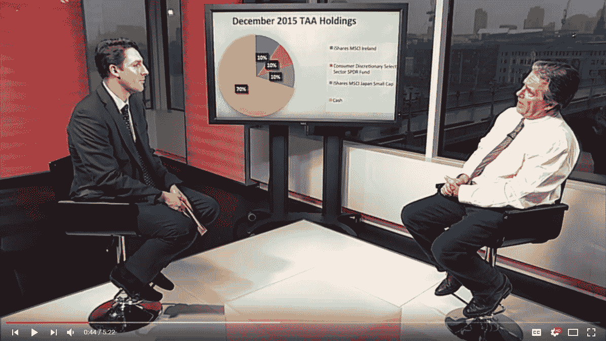

# 投资者纪事报采访

> 原文：<https://medium.datadriveninvestor.com/interview-with-investors-chronicle-2fbf411010e0?source=collection_archive---------32----------------------->

我在 2016 年 1 月 16 日接受了《投资者纪事报》的采访，此后我一直没有改变对投资的看法。投资极其简单。这种复杂性源于一大群被迷惑的“专业人士”，他们试图假装自己有更好的东西。

*原载于 2018 年 11 月 23 日*[*【http://zenothestoic.com】*](https://zenothestoic.com/2018/11/23/interview-with-investors-chronicle/)*。*