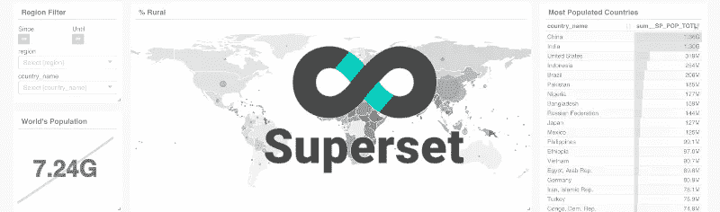
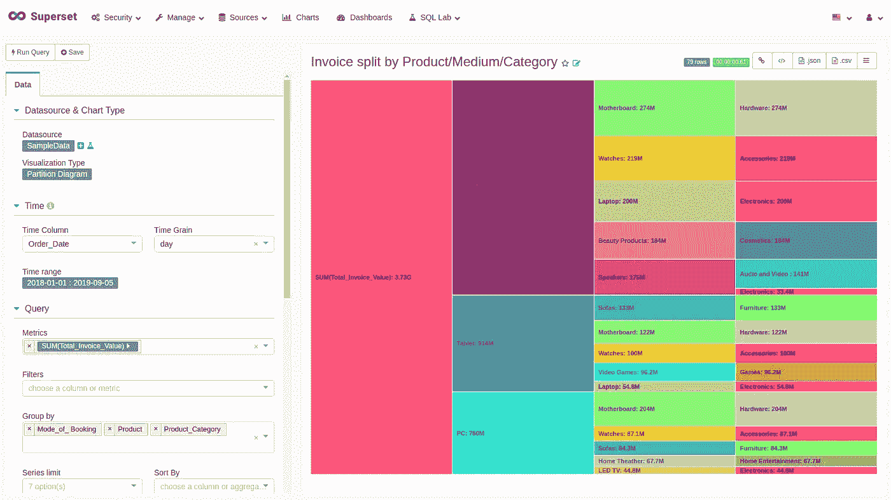
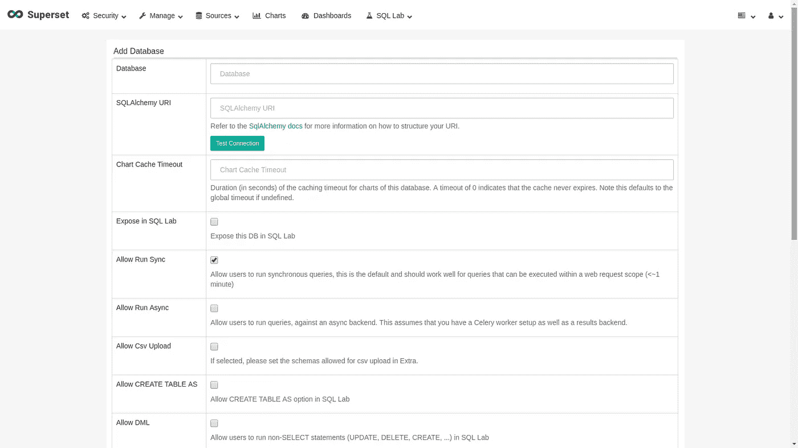
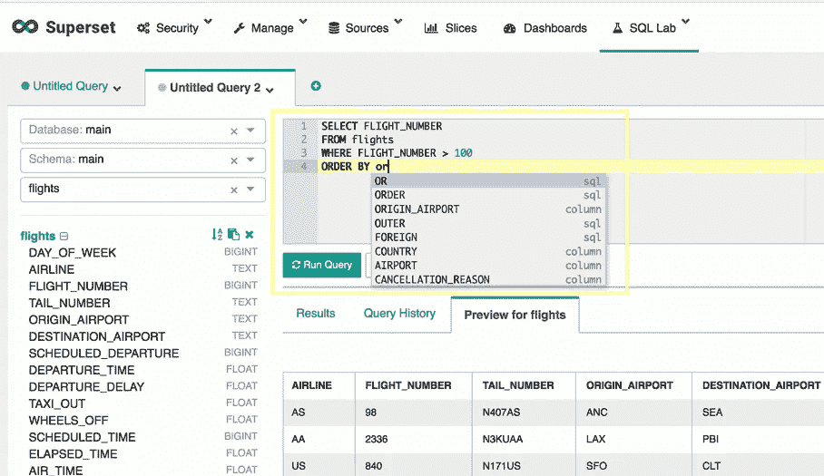
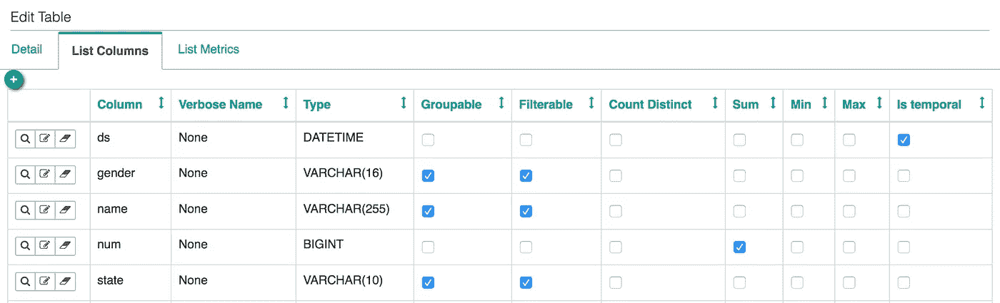
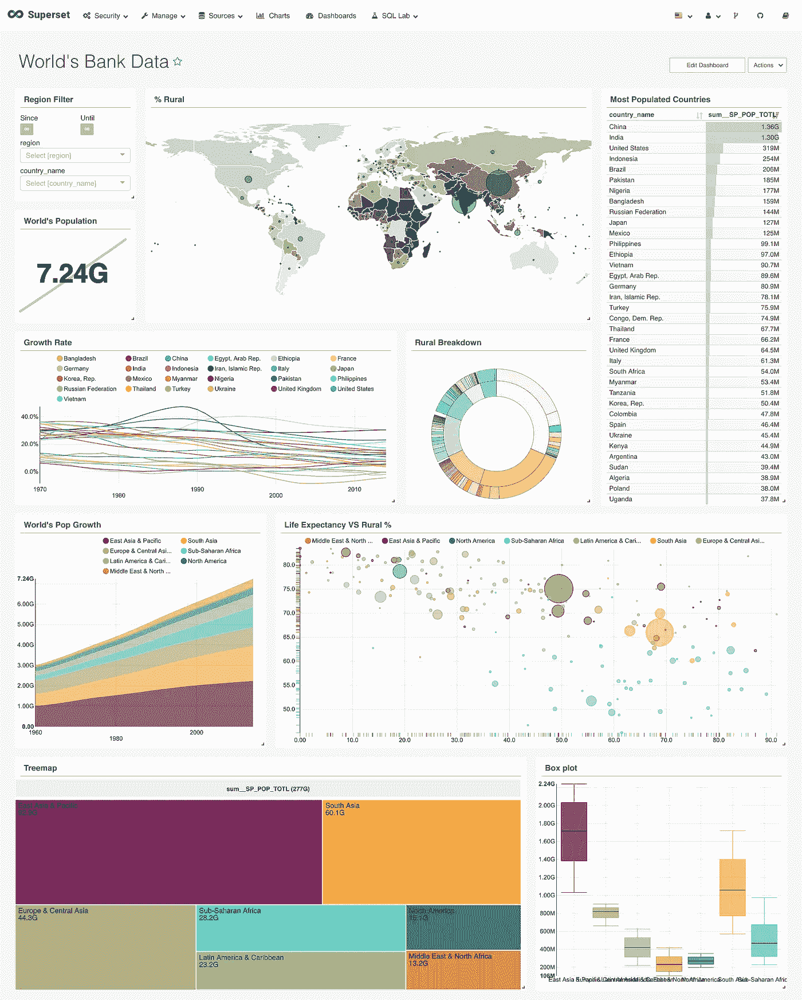

# Apache 超集介绍——一个开源数据可视化工具

> 原文：<https://medium.datadriveninvestor.com/intoducing-apache-superset-an-open-source-data-visualizaton-tool-4684627014fd?source=collection_archive---------1----------------------->

什么是 Apache 超集，它与其他 B.I 工具有何不同

# 简介:

在商业智能(B.I)领域，有许多数据可视化工具可以帮助数据分析师对数据行为执行多种操作。数据可视化最重要的部分是以一种非技术专业人员可以容易理解和交互的方式呈现数据。有多种工具和技术可以帮助用户处理、设计和呈现数据，从而帮助个人、企业和组织做出更好的决策。每当我们谈论商业智能工具时，微软的 Power B.I 和 T2 的 Qlickview 都名列前茅。这些工具在其功能和各种操作方面非常有效。然而，有一些被忽视的商业智能工具，我发现在多种用例中非常有效，这就是 **Apache 超集**出现的地方。Apache Superset 是一个优秀的 B.I 工具，它具有多种分析特性，这使它不同于其他 B.I 工具。所以在这篇博客中，我将展示 Apache 超集的不同特性，以及它与其他 B.I 工具的不同之处。

# Apache 超集:

## **简介:**

Apache Superset(孵化)是一个现代的、企业就绪的商业智能 web 应用程序。请注意，超集是 Apache 软件基金会(ASF)正在酝酿的一项工作，由 ApacheIncubator 赞助。Superset 是一个现代化的 BI 应用程序，具有简单的界面，在视图方面功能丰富，允许用户创建和共享仪表板。这个应用程序很简单，不需要编程，允许用户探索、过滤和组织数据。最棒的是…它是开源的！这有助于用户根据他/她的需要修改应用程序。

超集提供了一组惊人的特性，帮助用户有效地处理数据的各个方面。

## Apache 超集提供了什么？

超集提供:

*   一个直观的界面，用于浏览和可视化数据集，并创建交互式仪表板。
*   一系列美丽的可视化展示您的数据。
*   轻松、无代码的用户流，可对暴露的仪表板底层的数据进行深入挖掘和切分。仪表板和图表是更深入分析的起点。
*   一个最先进的 SQL 编辑器/IDE，提供了丰富的元数据浏览器，以及一个简单的工作流来创建任何结果集的可视化。
*   一个可扩展的高粒度安全模型，允许对谁可以访问哪些产品功能和数据集制定复杂的规则。与主要认证后端(数据库、OpenID、LDAP、OAuth、REMOTE_USER 等)集成
*   轻量级语义层，允许通过定义维度和度量来控制数据源如何向用户公开
*   对大多数 SQL 语言数据库的现成支持
*   与 Apache Druid 的深度集成允许 Superset 在切割大型实时数据集时保持极快的速度
*   通过可配置的缓存快速加载仪表板

# 独特的功能:

**组织仪表板的每个图形:**Apache Superset 真正吸引人的地方在于，您可以以复杂的方式探索每个仪表板。超集允许您关注每个图表/指标，并轻松过滤和组织。(如下图所示)

**SQL 编辑器:**超集的另一个吸引人的特性是带有交互式查询的 SQL/IDE 编辑器。您可以对正在处理的数据运行查询，或者通过 SQL 查询获取所需的列。

**对仪表板的权限和控制:**关于安全性，Superset 允许您定义一个用户列表和一个默认功能列表(与用户组相关联)，并允许您查看用户统计数据，为您提供全面的控制。您可以建立基线权限，以及授予对某些视图或菜单的访问权限。Superset 还提供了一个动作日志，这样你就可以跟踪应用程序中的动作。

**对于懂 SQL 的人来说更具交互性:**视觉上，Superset 有一个极简且组织良好的界面。尽管它不像 Tableau 那样容易使用，但超集可以作为创建仪表板或对 SQL 有所了解的人的替代方法。

## 数据库支持:

超集通过使用 Python ORM (SQL Alchemy)支持大多数 SQL 数据库，它允许您访问 MySQL、Postgres、Oracle、MS SQL Server、MariaDB、Sybase、Redshift 等。

当前支持的 SQL 数据库列表可以在 [**这里**](https://superset.incubator.apache.org/#databases) 找到。

您可以将数据导入超集，也可以将所需的数据库连接到超集，以便直接从数据库导入表。

## SQL 实验室:

这个功能绝对是加分项。SQL-Lab 允许您选择一个数据库、模式和表(以前上传的)并进行交互式查询、预览数据以及保存查询历史(如下所示)。

语义层允许您定义字段和指标(例如，比率或任何由 SQL 表达的内容):

# 安全性:

超集集成了主要的身份验证后端(数据库、OpenID、LDAP、OAuth、REMOTE_USE 等等)。

关于权限，如上所述，这个应用程序提供了默认角色，如 Admin(完全访问)、Alpha Gamma、Sql_lab 和 Public。

可以为每个用户建立权限，限制对数据源子集、菜单、视图、特定指标和其他标准的访问。因此，定义向每个人授予哪种类型的许可和/或对数据的访问相对容易。

# 使用超集的人:

根据 GitHub 的说法，Superset 目前正在被 Airbnb、Twitter、GfK 数据实验室、Yahoo！、Udemy 等。

值得注意的是,“超集是在拥有数百名用户的大型环境中测试的。Airbnb 的生产环境与 Kubernetes 和 600 多名活跃用户一起运行，这些用户每天查看超过 10 万张图表”。

# 仪表板:

超集仪表板的可视化表示。

我希望您理解超集的主要特性和优点，尽管我已经讨论了其中的一些。在超集中还有很多东西要探索，最好在您的机器上配置它。

要配置超集，你可以查看我在另一个博客上写的程序 [**这里写的**](https://medium.com/@syedjunaid.h47/configure-apache-superset-on-linux-d9fa9c718bab) 。