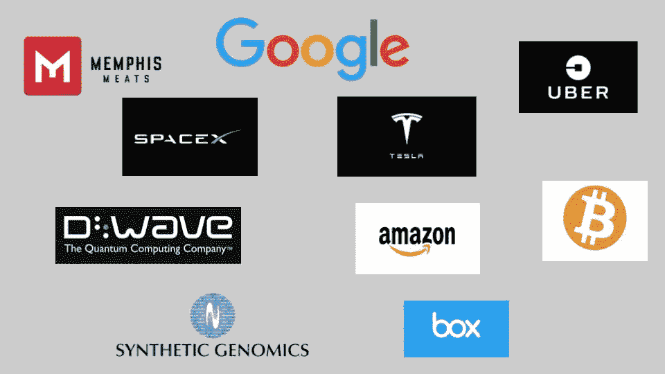

# 简介:科技初创企业独角兽

> 原文：<https://medium.datadriveninvestor.com/intro-tech-startup-unicorns-be40ed9ff9c9?source=collection_archive---------11----------------------->

目标:我想研究成功的雄心勃勃的科技初创企业。这个系列是对在理解巨型科技独角兽如何形成中发挥作用的不同因素(以维度表示)的观察。

**免责声明:**本系列基于一系列不同的框架、著作和理论:亚历克斯·丹科的突现层、克莱顿·克里斯滕森的颠覆理论、保罗·格拉厄姆的创业随笔、纳森·塔勒布的黑天鹅理论、埃弗雷特·罗杰的创新扩散理论、罗夫·海德曼的 Blitzscaling、蒂姆·厄本的埃隆·马斯克公式和斯科特·亚当斯的运气分布。

在我开始之前，我想定义一下我所说的科技独角兽是什么意思。

**但是等等！什么是技术？**

技术是将劳动力、资本、材料和信息转化为更有价值的产品和服务的过程。

 [## 金融科技初创公司正在扰乱世界各地的银行业-数据驱动的投资者

### 传统的实体银行从未真正从金融危机后遭受的重大挫折中恢复过来…

www.datadriveninvestor.com](https://www.datadriveninvestor.com/2018/10/20/fintech-startups-are-disrupting-the-banking-industry-around-the-world/) 

这里引用保罗·格拉厄姆的话，
“技术是一种技巧。这是我们做事的方式。当你发现一种新的做事方式时，所有使用它的人都会成倍地增加它的价值。”

世界已经见证了经济逐渐从农业经济(存在了一千多年)向工业经济(存在了几个世纪)以及现在的信息革命(持续了几十年)转变。技术在加速这些经济发展中发挥了关键作用。从根本上说，这些经济体的增长速度是由技术创新进步的速度决定的。

**科技创业独角兽**

那么，我所说的科技初创企业独角兽是什么意思呢？通过消除摩擦，颠覆整个行业并在现有或新市场创造巨大价值的科技初创企业，即获取稀缺的服务或产品，并使其变得丰富。特斯拉用电动汽车，苹果用智能手机。

价值创造不仅限于财务回报，还包括推进技术或推动社会前进。

从历史上看，高速增长的科技巨头是如何繁荣发展的？

尺寸如下:

[维度 1——宏观层面的价值创造机会](https://medium.com/datadriveninvestor/dimension-1-value-creation-opportunity-at-macro-level-b205a8f05561)
[维度 2——微观层面的颠覆机会和成长](https://medium.com/datadriveninvestor/dimension-2-disruption-opportunity-at-micro-level-and-growth-e37f078544eb)
[维度 3——外部因素的作用](https://medium.com/datadriveninvestor/3-1-dimension-3-luck-and-timing-2240c222bed6)
[维度 4——科技生态系统的作用(创始人/孵化器/投资者)](https://medium.com/datadriveninvestor/dimension-4-role-of-tech-startup-ecosystems-6ee1c632718c)

[**维度 1:**](https://medium.com/datadriveninvestor/dimension-1-value-creation-opportunity-at-macro-level-b205a8f05561)

我们将探讨自信息革命开始以来，技术如何通过提取稀缺资源来帮助不同行业创造价值。我们将尝试深入不同的行业，从颠覆性的角度理解高价值公司是在哪里创建的。

我试图在水平层面上扩展亚历克斯·丹可(Alex Danco)的惊人涌现层框架，以理解不同行业中技术颠覆在哪里以及如何发生。

[**维度 2:**](https://medium.com/datadriveninvestor/dimension-2-disruption-opportunity-at-micro-level-and-growth-e37f078544eb)

我们将看看创新，无论是持续创新还是颠覆性创新，如何为科技公司创造一个新市场。我们还将看看公司如何利用创造的空间来实现市场主导地位。我们还将了解为什么某些公司会在竞争对手中成为市场的主导者。

[**维度 3**](https://medium.com/@arvindvairavan/3-1-dimension-3-luck-and-timing-2240c222bed6) **:**

我们将试着理解以下因素如何在建立价值巨大的公司中发挥作用:
[运气和时机](https://medium.com/datadriveninvestor/3-1-dimension-3-luck-and-timing-2240c222bed6)
[安国法则](https://medium.com/datadriveninvestor/3-2-dimension-3-amaras-law-556288c7e887)
[不确定性](https://medium.com/@arvindvairavan/3-3-dimension-3-black-swan-dd3b8eabd96c)

[**尺寸 4**](https://medium.com/@arvindvairavan/dimension-4-role-of-tech-startup-ecosystems-6ee1c632718c) **:**

最后，我们将看看创业生态系统如何帮助资助/建立这些高增长技术公司，包括但不限于帮助找到产品与市场的匹配，开发创意和扩大产品规模。我们将挑选三个我最喜欢的生态系统，它们要么已经建立了雄心勃勃的公司，要么可能在未来建立系统:
[埃隆·马斯克](https://medium.com/@arvindvairavan/4-1-dimension-4-elon-musk-cd749da806b4)
[社会资本](https://medium.com/@arvindvairavan/4-2-dimension-4-social-capital-f8c80a46991e)
[企业家第一](https://medium.com/@arvindvairavan/4-3-dimension-4-entrepreneur-first-7a5f1717f43f)

**叙事谬误:**

很难预测未来，事实上，创建一个十亿美元的公司是很难的，但建立一个框架肯定有助于尝试创建有价值的公司。

当回顾历史时，我们倾向于构建一个适合美好故事的解释，而实际发生的事情很可能更加随机和无计划。我们希望相信有一个很好的清晰的进展，并且它是可预测的，但实际上不是。

“避免叙事谬误弊病的方法是支持实验而不是讲故事，支持经验而不是历史，支持临床知识而不是理论。不要寻找精确和局部，不要狭隘，不要试图预测，只要朝着正确的方向前进。”

-纳西姆·塔勒布

虽然我们永远无法预测未来，但黑天鹅事件的概念对技术和商业非常重要，原因有很多。人类历史上一些最重大的事件都要归功于技术的发展，从轮子一直到万维网。如果我们能更好地理解这些发展是如何发生的，那么我们就能更好地抓住它们的潜力。黑天鹅事件标志着大规模的破坏。无论是区块链、人工智能还是电动汽车革命，如果科技教会了我们一件事，那就是期待意想不到的事情。

*这项研究旨在了解科技独角兽如何在不确定性面前站稳脚跟。*

***下一篇:*** 你可以找到下一篇关于价值创造机会的帖子(表示为[维度 1](https://medium.com/datadriveninvestor/dimension-1-value-creation-opportunity-at-macro-level-b205a8f05561) )。)