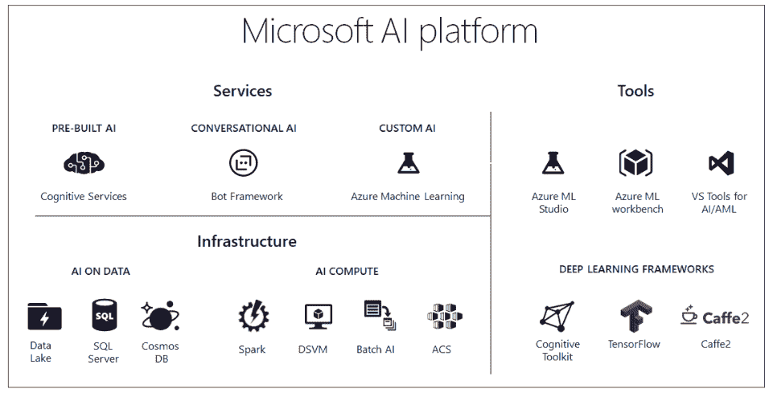
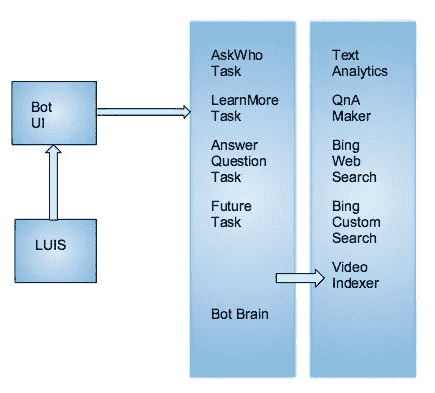

# Azure 聊天机器人开发简介

> 原文：<https://medium.datadriveninvestor.com/intro-to-developing-chatbots-in-azure-4ccb3c2c5847?source=collection_archive---------9----------------------->

人工智能的发展可能会让一些人感到害怕。有人担心，有态度的机器人很快会嘲笑他们“咬我闪亮的金属屁股！”那是多么无知。这些不是我们要找的机器人。事实是，他们很容易被最基本的[把戏](https://www.kaspersky.com/blog/ai-fails/18318/)误导。上个月，我分析了微软 Zo，并冒险发现她是否能被视为真正的[女孩](https://medium.com/datadriveninvestor/playing-doctor-turing-with-microsoft-zo-47b18e3a89b3)。虽然她很肤浅，但我想这里也有人想建造自己的机器人。

“我会做我自己的聊天机器人，但是要用 21 点和 h..!"

你可以用一个 [Azure](https://azure.microsoft.com/en-us/free/search/?&OCID=AID719825_SEM_r7FTJy8w&lnkd=Google_Azure_Brand&gclid=CjwKCAjw5ZPcBRBkEiwA-avvk28TWksL7hO8ZzO9MRpFt5S5Z3m8wS_WU96utH0YAqhrjp2gsIDwoRoCS9IQAvD_BwE&dclid=CNuwqoOMkd0CFU3fwAodapwP6A) 账号免费开始，有三个 bot 框架可供选择。第一个选项是一个预建的 AI，但你也可以选择编码一个自定义单元或训练一个对话式 AI。

Azure AI Homepage

预建的机器人几乎是完整的机器，只需几行代码就可以插入到网站或应用程序中。你不能选择训练或设计他们的行为。

你的下一个选择是对话式人工智能。这是一个完整的算法，完全有能力与脸书，Slack，Cortana 和其他服务接口。训练机器人还是要靠你。

最后是自定义人工智能。使用定制服务，您可以在桌面上开发模型，在云中测试它们，并在各种机器上执行它们。你可以选择在深度学习虚拟机、Spark 集群和 Azure Batch AI 服务上运行机器人。

然而，所有这些架构都有一个共同的核心，它们都是为自然语言处理(NLP)而设计的。这当然是非常具有挑战性的，因为人类的语言是一堆混乱的意思。

人们用当地方言说话- *差点死掉第一年我来学校给他们吃山核桃*

单词可以有双重含义或同音异义- *你知道你的权利，现在向右转。*

人们使用修辞格- *我可以永远这样做。*

对机器人工程师来说幸运的是，几十年来，你一直以信息系统和社交网络的形式为他们提供丰富的数据。工程师们利用这些海量数据作为基础，训练机器将人类语言转换成机器可读语言。语言的关键要素是:

*实体*是名词，可以表示人、地点、事物。搜索引擎的广泛使用使得这种分析变得容易。

*关系*用于连接名词。它们可以是像小事情一样的描述。

*概念*都是建立在前者之上的。他们可能会说“他擅长运动”

*情绪*指定谈话的积极或消极程度。掌握情感是客服聊天机器人的一个基本特征。

情绪是概念的一种特殊形式。它们是语言中非常微小的元素，也是最具挑战性的分析形式。

*关键词*是自然语言处理的关键元素。它是通过索引和搜索特定的单词和短语来执行的。

*类别*是分析的顶点。它的工作是对谈话的类型进行分类。这与您需要推荐内容或组织消息的应用程序非常相关。

微软使用自己的语言理解服务(LUIS)来帮助开发者提取聊天的意思。该应用程序旨在提取许多前面提到的输入

意图是任何谈话的最终目标。它们也可以被视为类似“图书飞行”的命令。

*对话框*是意图的进化形式。可以是一句“订一张去悉尼的机票”。

*实体*是前面提到的同一个东西。最后一句应该是西德妮。

你现在已经准备好构建你的第一个机器人了。

你将首先需要建立一个(路易斯)帐户开始。这可以在 LUIS [主页](https://www.luis.ai/home)上完成。系统为你的机器人对话建立设置查询的协议。首先，您必须在 LUIS 中启动您的应用程序 bot。验证身份后，您可以选择向机器人询问支持的问题类型。内置的 QnA 工具旨在返回有效的问题，并用于快速开发。你也可以选择用 Bing 搜索 API 和文本分析 API 来训练机器人，但是你应该期待更长的开发时间。

Bing 搜索旨在将语音转换为文本，并针对语音触发的移动应用进行了优化。

文本分析 API 要严格得多，如前所述，它主要用于情感分析。

此外，这将我们带到语音识别的非常重要的*置信度得分*。这就是聊天机器人训练的症结所在。所有的语音识别基本上都是数据挖掘练习，如果你不相信我的话，可以试着用另一种语言来阅读。

{

“查询”:“嘿，伙计”，

" topScoringIntent" : {

“意图”:“问候”，

【得分】:0.9887

这是根对话框。LUIS 解释每个查询的意图，并返回其对意图的置信度。置信度越高，对意图的理解就越好。每个对话框也可以被看作是独立的，因为它的意图是调用特定的功能。然后将响应传递给下一个函数，并重复该过程。这项任务被称为*瀑布* *对话框*，它允许开发者划分出机器人的具体功能。

**Bot 架构**

机器人本身由一系列函数构成，每个函数执行一个特定的任务。

Chatbot Brain

在这个演示中，机器人充当应用程序的 UI 界面，它可以接受来自电子邮件、Skype 和其他服务的所有输入。可以在聊天机器人的配置中设置可接受的输入。

机器人大脑由一系列功能控制，每个功能负责处理特定的意图。

在一个典型的机器人任务是问谁，了解更多，回答问题。每个任务都独立运行，可以单独调试。随着 bot 技术的发展，这些任务也可以删除或升级。

例如,“向谁提问”任务使用 Bing 网络搜索和 Bing 图像搜索算法。

了解更多任务调用 Bing 自定义算法。

所有这些任务都单独存在于 Microsoft 基础结构中。

执行这些功能的代码既有趣又复杂，但这超出了本文的范围。我将在下一章进一步探索执行这些功能的代码。幸运的是，只有定制聊天机器人才需要编码。你已经有了必要的抒情框架来训练一个机器人，并将其插入到你的网站。也可以说，这项调查揭示了机器人必应搜索的精神深度。

这引发了一个问题。💭人工智能中的智能是什么？智力仅仅是你检索信息的能力吗？