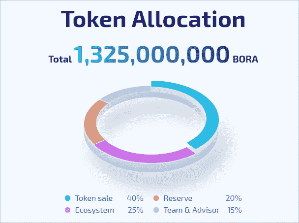

# 介绍 BORA 生态系统，内容和娱乐行业的解决方案

> 原文：<https://medium.datadriveninvestor.com/introducing-bora-ecosystem-the-solution-for-the-content-and-entertainment-industry-aa2bbae84d3e?source=collection_archive---------23----------------------->

在过去的几年里，媒体已经发布了无数公司遭受黑客攻击或安全漏洞，导致用户数据被恶意行为者窃取的故事。黑客在如何转移服务器和侵入系统方面显然变得越来越有创造力。甚至像 T2、雅虎、T4、易趣、领英这样的大公司也成为了黑客的受害者。似乎没有人是安全的；除了那些绝对不会腐败的系统。

> *就像 Don 和 Alex Tapscott 在他们 2016 年的书《区块链革命:比特币背后的技术如何改变金钱、商业和世界》中所说的那样*:“区块链是一个不可磨灭的经济交易数字账本，可以通过编程记录不仅是金融交易，而且几乎所有有价值的东西。”

区块链是一个廉洁、防篡改、安全、保密、透明的系统。通过在各种项目中实施该技术，可以逐步消除漏洞。一个项目的重点是创造一个基于区块链的生态系统，这就是博拉生态系统。

# **博拉生态系统**

BORA 生态系统旨在为内容发布创建一个基于区块链的生态系统，同时奖励贡献者的投入。通过实施双链系统，BORA 将实现高吞吐量，以保证大容量 dApps 在其网络上充分发挥作用。为了解决以太坊区块链的可扩展性问题，但仍然从以太坊区块链的有益功能(如 ERC20 标准令牌)中获利，BORA 将创建自己的区块链，方便地称为 BORA 链。

宝来链将作为一个侧链运行平行于其主链，这是以太坊区块链。BORA 侧链将不限于只有一条链。它可以有多个链，允许公司创建自己的分散项目，可以在 BORA 侧链上运行。

# **博拉代币**

双令牌是 BORA 生态系统引入的另一个特性。该网络提供的两种令牌是:基于 ERC20(以太坊)的 BORA 主令牌和 BORA 点令牌。以太坊区块链上官方 BORA token 的合约地址可以在[这里](https://etherscan.io/token/0x26fb86579e371c7aedc461b2ddef0a8628c93d3b)找到。如您所见，BORA(主代币)的总发行量为 1，325，000，000，其中 40%将在众筹中出售。私人销售已经结束，但没有迹象表明已经筹集了多少资金。宝来积分代币将仅用于平台内部互动。

# **博拉建筑**

BORA 的生态系统由三层组成，即:核心层、服务层和应用层。在核心层，内部 BORA 链与 BORA 令牌管理器位于一起，后者是一个内部系统，处理用户将 BORA (ERC20)转换为 BORA 点令牌或相反的请求。博拉区块链通过侧链技术实现了高通量。它还允许项目加入生态系统，因为它是模块化的，易于适应。第二层是留给开发者在 BORA 链上构建的。服务层是用 API、SDK 等开发工具布局的。在顶层(应用层)，项目可以通过基于 web 的或移动的接口实现它们的 dApps。

Architecture of the BORA ecosystem

今年晚些时候，根据他们的官方[媒体博客](https://medium.com/@BORA_Ecosystem/way2bit-to-release-public-beta-of-the-bora-ecosystem-later-this-year-c87014b3989d)，BORA 的母公司 [Way2Bit](http://way2bit.com/) 将发布 BORA 生态系统的公共测试版。

# **结束语**

乍一看，博拉生态系统项目可能是一个有趣的项目。然而，在撰写本报告之日，可获得的信息并不多。如果团队能够为社区提供额外的信息，那就太好了，这样我们就可以更彻底地了解 BORA 生态系统的来龙去脉。尤其是在社交媒体上，他们可以更加活跃。到目前为止，他们已经在官方推特和脸书页面上失踪了一段时间。在他们的网站上，我注意到他们已经有了不同的合作伙伴和投资者，他们正在为平台开发前两个 dApps。就像 a 说的，BORA 生态系统可能是一个有趣的项目，我期待着团队的更新。随着更多的信息浮出水面，我将在不久的将来发布关于这个项目的新文章。

# **官方渠道**

有关 BORA 的更多信息:

网址:[https://www.boraecosystem.com/](https://www.boraecosystem.com/)

电报:【https://t.me/boraofficial 

推特:【https://twitter.com/bora_ecosystem 

中:[https://medium.com/@BORA_Ecosystem](https://medium.com/@BORA_Ecosystem)

https://www.facebook.com/BoraEcosystem/脸书

***免责声明*** *:本文不作为投资建议。这只是我个人对博拉生态系统的看法。你应该总是做自己的研究#DYOR。博拉生态系统激励我写这篇文章，并鼓励我表达自己的观点*。

订阅我的频道: [Medium](https://medium.com/@cultcrypto) 、 [Twitter](https://twitter.com/CryptoShowdown) 和 [Steemit](https://steemit.com/@cryptoshowdown) 如果你喜欢我的文章并想了解区块链、加密货币和新闻。也可以看我在 [LinkedIn](https://www.linkedin.com/in/donjohanson/) 上的文章。

如果你对这篇文章有任何问题，请在下面的评论区评论。掌声也欢迎，谢谢！

**隐晦摊牌**