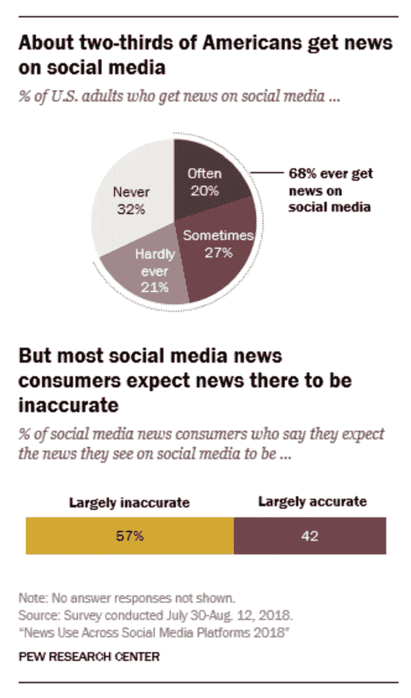
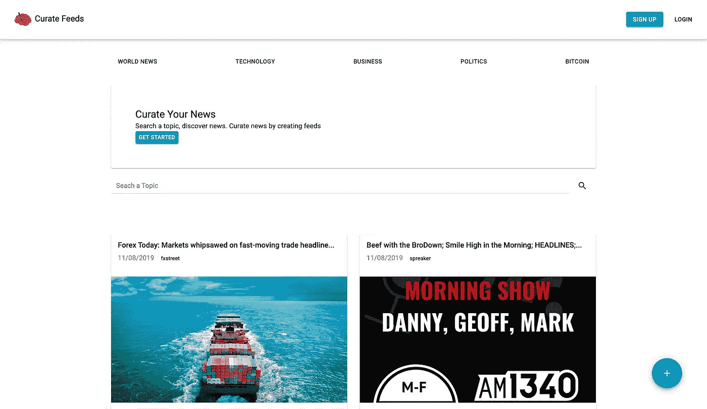

# 介绍策展订阅——一个真正的新闻平台

> 原文：<https://medium.datadriveninvestor.com/introducing-curate-feeds-a-real-news-platform-3b474918a4f9?source=collection_archive---------9----------------------->

不要再被网上的消息冲昏头脑和愚弄了。当你想知道世界上发生了什么，你首先会去哪里？

对于越来越多的人来说，答案往往是社交媒体。像脸书和推特这样的社交媒体网站能够让任何地方的任何人都参与到向大量受众传播信息的活动中。新闻的传播不再被少数新闻/媒体机构和公司所控制。人们有能力从几乎无限的选项中选择他们喜欢的新闻渠道。

然而，俗话说“权力越大，责任越大”。

让这些平台上的信息访问变得如此不可思议的原因，也是让它变得危险的原因。任何地方的任何人都可以撰写包含虚假信息的文章，将偏见作为事实，修改图像，编辑视频，然后将其传播给可能有数亿人的受众。许多人于是变得容易做出匆忙和错误的决定，否则他们可能不会基于他们看到和相信的错误信息。

 [## 数据科学和软件工程哪个更有前途？数据驱动的投资者

### 大约一个月前，当我坐在咖啡馆里为一个客户开发网站时，我发现了这个女人…

www.datadriveninvestor.com](https://www.datadriveninvestor.com/2019/01/23/which-is-more-promising-data-science-or-software-engineering/) 

人们传播假新闻有各种各样的原因，但大多数是适得其反的。它们包括冲击价值反应、注意力转移、利润、政治议程、暴乱、诽谤、中伤等。

假新闻并不是一个新现象，自从有文字记载以来就一直存在。假新闻在今天更具破坏性，因为病毒式的内容允许它像野火一样传播，而无需任何事实核查。人们意识到假新闻在社交媒体上如此普遍，但有时很难区分什么是真实的，什么是虚假的。在皮尤研究中心进行的一项名为“2018 年社交媒体平台新闻使用”的研究中，68%的美国人主要从社交媒体获取新闻，然而 57%的人表示他们预计他们发现的新闻是不准确的。

甚至像美国有线电视新闻网和纽约时报这样的主要知名媒体和出版物也出版和播出了被认为是假新闻的内容。其原因可能是偶然的，因为缺乏彻底的调查，或者是有目的的，以便影响某一议程。

# 这些问题

因此，问题变成了，今天的数字时代的人们如何筛选疯狂的、过剩的新闻故事、文章等，以确定什么实际上被认为是事实？

一旦人们知道他们正在查看的文章和帖子确实是真实的，他们如何过滤掉这些噪音来显示什么真正适用于他们，或者什么让他们感兴趣？

不同的人对他们想看的新闻有不同的期望(方式、主题和时间)

# 答案

策展供稿是一个数字平台，向个人提供互联网上合法的新闻和文章。用户可以相信他们正在阅读的内容是可信的。它允许个人访问新闻文章，否则他们可能不会接触到任何可以想到的主题。

平台根据搜索到的话题，向用户推荐用户可能感兴趣的相似话题。可选地，用户可以允许应用程序了解用户的兴趣并向他们提出建议。

用户还可以根据他们感兴趣的话题来策划或组织新闻，以创建个性化的订阅源。从提要中，用户可以很容易地了解关于任何主题的最新消息。当用户发现一篇非常有趣的文章时，他们可以把它加入书签，并随时返回。有趣的文章也可以分享到用户参与的社交媒体平台，以帮助传播真相。

# 但是在哪里？

如果你能理解这些，或者只是想尝试一下这个平台——[**，试试在这里**](http://curatefeeds.com) **注册这个平台吧。**

该产品目前处于早期阶段。我们知道，可能有一些错误，我们将需要消除和功能，如学习用户兴趣目前从应用程序中缺失。这些功能中的许多功能以及更多功能将很快推出。

如果你喜欢读这篇文章，别忘了为它鼓掌👏。这个平台叫做策展供稿，你可以在这里找到它——[**http://curatefeeds.com**](http://looksideway.com/)**。**我们希望听到您的**想法、反馈和想法**。我们来讨论一下—[info@trapcode.co](mailto:info@trapcode.co)