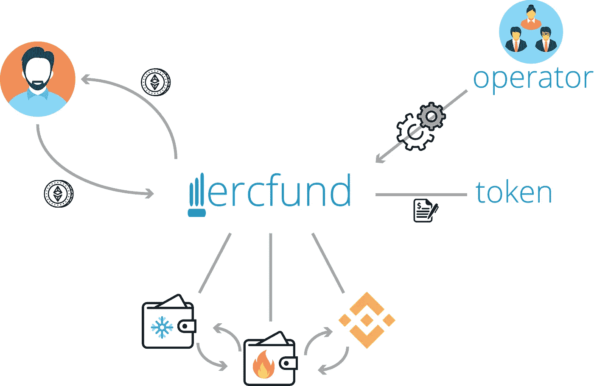

# 介绍 ERC fund——一只纯粹建立在区块链上的投资基金

> 原文：<https://medium.datadriveninvestor.com/introducing-ercfund-an-investment-fund-built-purely-on-the-blockchain-5e790b1821fd?source=collection_archive---------9----------------------->

ERCFund 可在 Github 上获得，如果您能查看并告诉我您的想法，我将不胜感激:[https://github.com/ScJa/ercfund](https://github.com/ScJa/ercfund)

# 什么是 ERCFund？

ERCFund 通过引入一种**按需铸造和烧制的代币作为基金股票**的媒介，使投资积极管理的 ERC20 代币和以太币投资组合成为可能。与其他一些封闭式基金(如 TaaS.fund、Token Fund)相比，你可以在任何时候**购买股票/代币**，只需向基金发送以太网即可。这些股票/代币也可以在任何时候通过调用基金的提取功能来出售，该功能将相应的以太值发送回指定的钱包。

**基金经理可以用这些代币自由交易**并获利。根据所管理的资产，一个令牌的价格应该不断更新。ERCFund 附带了一个基金运营商契约的多签名实现。这个实现是专门为管理基金而设计的。它提供了**冷钱包支持**和一组定义好的不同信任级别的可信钱包。此外，通过将签名交易移出链外，多签名运营商比传统的多签名钱包具有**低得多的气体成本。**

# 视力

目前投资一系列不同的加密货币需要大量的技术知识。这催生了对简便投资方式的需求，同时降低了准入门槛。市场上有多个著名的成功方案，如 Crypto20、ICONOMI、Melon、gray 等。

然而，对于较小的独立投资者来说，加密货币投资领域很难进入，这些投资者拥有市场知识，在传统领域经验丰富，但缺乏提供加密货币领域产品的技术知识。

ERCFund 致力于为 ERC20 代币提供安全、可扩展的投资基金实施方案。安全和信任对于不太知名的玩家来说非常重要。由于这个原因，基金的所有部分都经过严格测试，并重用来自 OpenZeppelin 的社区审计代码。此外，它提供了将外部信托方加入管理团队的可能性，这可以通过防止基金经理错误处理他们的资金而使潜在投资者感到安全。

# 体系结构

在上图中，您可以大致了解一下实施情况。整个基金结构可以用四个可靠性等级来设置:

*   FundOperator.sol
*   基金. sol
*   FundToken.sol
*   基金钱包. sol

## 基金

基金是所有阶层之间的纽带。它实现了投资基金的核心功能。该基金可以管理任意数量的钱包，并可以从这些钱包发送以太网或 ERC20 兼容的令牌。

此外，该基金允许感兴趣的个人以 FundToken 的形式买卖基金的“股份”。这些代币是基于基金的当前价格和基金的费用动态创建和燃烧的。该价格应由基金运营商不断更新。

## FundToken

基金代币是标准的、可燃烧的和可铸造的 ERC20 代币。代币本身不实现基金的任何直接功能。然而，它不同于普通的可燃烧代币，因为只有所有者(基金)可以燃烧代币。

## 基金经营者

FundOperator 类是在 fund 类之上的多重签名契约，目的是引入一个安全层。它在几个方面与其他多签名钱包(如 Gnosis 多签名钱包)不同。

基金经营者的所有者分为两个不同的群体:基金经理和信托方。根据 FundOperator 类中调用的操作，要么只需要基金经理的签名，要么需要两个组的签名。信任方团体的成员可以是例如外部审计公司、重要投资者团体或普遍信任的人物。

尽管如此，信任方组是完全可选的！

这种信托结构背后的思想是，基金经理通常可以在规定的信托区域(例如，内部钱包和交易所)内交易和管理基金。如果他们想引入一个新的钱包或发送到一个不可信的钱包，他们必须获得额外的签名。这防止了任何管理基金的人恶意移动乙醚或代币。

此外，FundOperator 类实现了向基金添加冷钱包，这是从未连接到互联网的特别安全的钱包。这是可能的，因为为基金签署动作发生在链外而不是链上(像 Gnosis 多签名钱包)。链上签名有利也有弊，主要的好处是，它更容易使用，因为你不需要一个特殊的应用程序来签署你的交易链外。缺点是交易成本更高，因为你需要发送一个来自密钥持有者的确认，而且如果做得正确，离线签名可以说更安全。一个积极管理的基金可能需要每天进行数百笔交易，签署链外交易可以显著降低交易成本。

# 贡献的

我真的很感谢任何关于该项目的贡献和反馈。跳到 Github 上提出问题或帮助我改进。

[https://github.com/ScJa/ercfund](https://github.com/ScJa/ercfund)

**上图中使用的图标由 www.flaticon.com***的 Smashicons、Freepik、Vectors Market、EpicCoders 和 Gregor Cresnar 制作。**