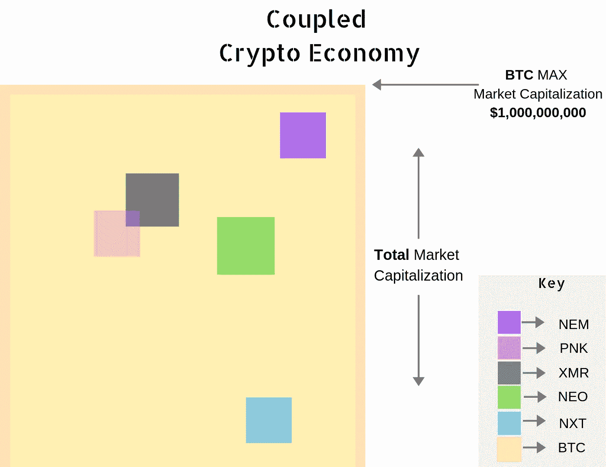
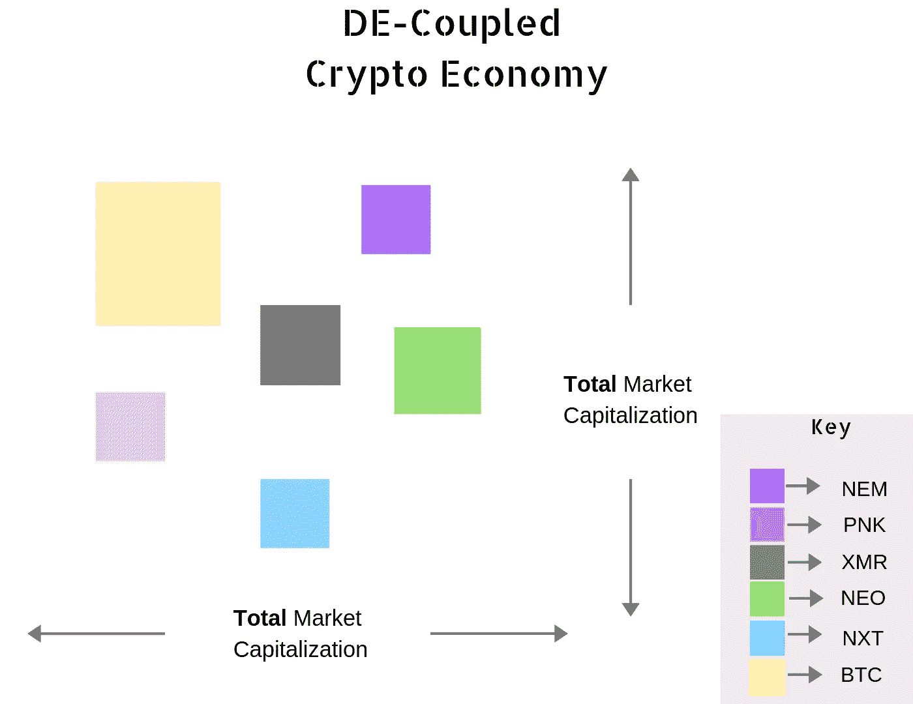

# -伟大的加密解耦-

> 原文：<https://medium.datadriveninvestor.com/introducing-the-great-crypto-decoupling-1eb96dea7726?source=collection_archive---------7----------------------->

## 重新引入互联数字经济的闸门

***TL；*博士**

> 这是为那些至少对隐文略有所知的读者准备的。
> 
> 如果你真的为数字经济做好了准备，这些信息将
> 
> 一如既往，请自行研究

所以只要记忆犹新，加密市场就一直与“祖父级”比特币挂钩。比特币走到哪里，市场就跟到哪里。替代加密资产的价值总是主观的；加密技术只能在比特币存在的范围内存在和发展。数字经济中不存在主权。

这就是所谓的伟大的 ***密码耦合*** 。这意味着市场容量及其组成参与者(密码的不同变体)由市场挂钩的框架和容量决定。

***比特币市值=加密市场增长的最大容量***

COUPLED CRYPTO Economy

在上面:

因为 BTC 市场的作用(橙色方块)说明了市场普遍存在的“生存能力”;其中其他密码的相关大小取决于比特币:

*   如果比特币缩水，替代密码也会按比例缩水。
*   由于替代密码必须通过第二层访问/只能通过比特币访问……如果比特币增长，替代密码决不会增长——人们的兴趣可以只停留在 BTC 本土。

这不是数字金融主权…

现在，如果我们重新设计加密经济，让市场与比特币脱钩:

De-Coupled Cypto Economy

我们移除了边界，为价值创造创造了一条跑道:

*   因为每个密码就其存在的可行性而言现在是独立的；每个独立加密的实际增长潜力没有限制！
*   因为一个密码的健康不受任何其他密码的主观影响，所以可能会出现激进的价格差异——这对于数字经济的前景来说当然是一件非常健康的事情。*-{激进的价格背离允许真正的&健康的价格发现发生}-*
*   在黑天鹅事件的情况下(如比特币不复存在)，加密可以继续…

这是真正的分权🎯

## 大约在 2015 年 7 月 30 日

> **大众遇见以太坊——下一个钉住**

以太坊拥有先发优势，并有望成为即将到来的数字革命的中坚力量，因此成为加密社区的“甜心”。

 [## 总部设在瑞士的 ETP 进入加密交易市场-数据驱动的投资者

### 虽然金融市场几乎没有沉闷的时刻，特别是在引入…

www.datadriveninvestor.com](https://www.datadriveninvestor.com/2019/03/10/swiss-based-etp-enters-the-crypto-trading-market/) 

以太哲学的金融主权和数字经济学推动了人才关注的全面改革。工程师、开发人员和爱好者现在可以构建 dl crypto 2.0。创造一个替代方案，将会有一个新的标准，人们通过这个标准进入密码诗；通过一种叫做 ETH 的东西。这种新的密码提供了一个将物理世界和数字世界结合起来的机会。承载高级编程逻辑的内在能力，诞生了真正的混合经济的第一个含义。你好，ERC-20…这个协议给了密码社区一个真正的生存机会！成千上万的项目开始启动，一个接一个(全部建立在以太坊之上并由以太坊资助)。仿佛几百年的理想化和创造突然被压缩到短短的几个月里。但是在任何人意识到之前，这种采用超过了市场的发展…

💥🤯📈

然后就发生了。

它来了。

你知道……

“发呆”。

👨‍🚀🌑👨‍🚀

登上火箭！3 年的看涨努力终于有了回报。每个人都在跳！美国有线电视新闻网不能停止谈论它！我奶奶刚买了一些！..

aaannddd…噗…

甚至不到一个月后，在公众的眼中，加密就成了一个邪恶的禁忌话题。

市场的很大一部分被击败并吓跑了…

休斯顿，我们有一个问题…

## 大约:2019 年 3 月-稳定的流量

Crypto 成功标记了其最长的熊市。

感谢上帝；这意味着这是**最长的时间** + **最大的资金**被用于增强加密经济的基础设施。利用机会增强，利用机会重新奠定基础并弥合价值差距。拥有一支更强、教育程度更高的员工队伍，有机会开发知识产权。探索设计和控制论架构的机会。为即将到来的开发者、设计师和企业家浪潮进行规划和准备的机会…

只有这一次，数字基础设施将**托管、发展*和*支撑**快速逼近的全球数字经济。🤓

*右*？

鉴于现在世界不仅意识到了加密货币，而且越来越喜欢它们，我们该问下一个问题了:

从现在开始，我们将如何体验隐密体的成长？什么会在加密领域引发难以置信的价值增长？

如果有一种工具可以缓解恶性通货膨胀并简化采用流程就好了…

考虑到这样一个事实，即以前的参与者只能通过购买一层密码(如比特币或以太坊)才能进入密码市场{这当然会导致供需指标不平衡，并产生恶性通货膨胀和投机}；答案在于稳定。

> 稳定的硬币将是驱动大密码解耦的催化剂。

如果我们只是看看加密货币的当前状态，我们会很快意识到，大量涌入的项目已经出现，提供了解决通货膨胀的方案！我们可以更进一步，看到这些项目*已经*在大多数交易所可用，并提供以前被称为“替代货币”(其存在与比特币的存在挂钩的货币)的交易

跳到 CoinMarketCap，查找 ***和*** 的交易对，比如 USDT、帕克斯、USDC 等等。嘿，看，你不再被迫持有高度不稳定的加密货币来参与市场！

稳定硬币配对现在提供了安心进入和参与加密市场的可能性(在加密允许的范围内🙈)保证您的宝贵资产不会受到加密市场波动的影响。

把数字经济想象成一座建筑。

数字生态系统架构中的稳定核心相当于建筑中的强化碳梁。这些新梁可以在需要时更容易地进行内部维修，最重要的是，可以加快建造速度。建筑更大。建造了更长的时间。