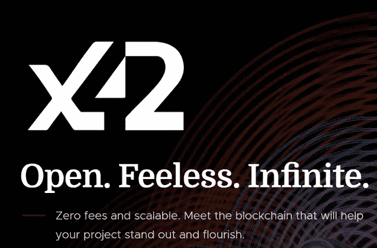
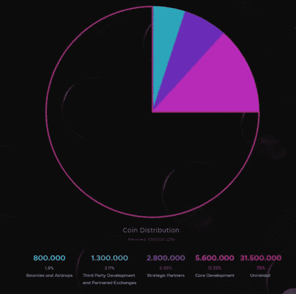

# 介绍 x42——一种股权加密货币的协议、平台和证明

> 原文：<https://medium.datadriveninvestor.com/introducing-x42-a-protocol-platform-and-proof-of-stake-cryptocurrency-c1365f898fa2?source=collection_archive---------0----------------------->

最近，我们已经被许多带来创新的加密货币所引入，并且几乎总是比其前身带来新的东西。

x42 设法为当今面临的加密问题提供了所有的解决方案。

x42 协议允许用户以接近零的成本启动需要大出版商主持和启动任何类型项目的应用程序，并且之后没有任何交易费用。

x42 协议将允许签署、执行和维护私人交易和合同。

x42 背后的主要思想是成为一个可扩展的链上解决方案，适用于任何希望以最小的初始投资、零交易费用和近乎无限的可扩展性发布游戏和应用程序的开发人员。该协议围绕一个主区块链工作，它托管所有 x42 硬币和三种类型的节点。

**x42 主要特性**

-使用一枚 x42 硬币或更少的硬币发布您想要的任何内容，启动游戏或其他类型的应用程序。

x42 协议旨在供每个人使用，因此主区块链完全免除任何交易费用，所有块奖励将使用股份证明作为块验证方法来签署和允许新的交易。

-任何拥有至少 1000 个 x42 单位的用户都可以托管一个 masternode，这将为整个区块链提供种子，并有助于网络本身的发展，同时根据他们持有的硬币与网络其余部分相比的百分比，以新生成的 x42 硬币的形式获得报酬。

-任何选择使用 x42 协议的开发人员都能够创建一个独特的端区块链，它可以根据开发人员的需要进行伸缩，端区块链可以由任何甚至所有主节点所有者托管。

-在撰写本文时，与比特币相比，x42 主区块链已经支持超过十倍的交易数量。

-x42 让开发者几乎不需要投资就可以发布。副区块链可以在主区块链上以单个 x42 单位的成本随意生成，因此即使对于最小的开发人员来说，创建副区块链也不是问题

-Masternode 所有者可以选择在任何非私有方区块链上启动项目时托管项目

-浏览商店用户将能够下载、运行和托管发布在网络上的各种应用程序和智能合同，并对它们进行一到五星评级。

-智能合同是自动执行的区块链合同，遵循双方或多方之间先前协议的条款。x42 智能合约使用 C#使它们易于开发、测试和调试。

*   x42 协议的所有用户将能够通过使用 Breeze Wallet 协议享受私人交易，这将使任何交易不仅在 x42 的主区块链上是私人的和不可追踪的，而且在选择在其代码中启用私人交易选项的所有区块链端上也是如此

x42 体系结构有三个主要级别:

1.Stratis 比特币全节点负责与接口和基础设施层以及节点策略层进行交互。所有的 API 和用户界面都通过 x42 比特币全节点处理。

2.LibConsensus 这是比特币的核心版本，负责决定什么被视为有效区块。

3.NBitcoin 它完成剩余的工作，填补共识层功能之间的空白，同时还处理网络层节点之间的消息

x42 使用 PoS(股份证明)作为硬币生成方法，并对新生成的块进行验证，这有利于运行网络的组织的利益，并保护网络免受攻击。

块奖励将是每块 20 个硬币，直到块号 550.000，之后所有块将只产生 5 个硬币，直到达到 42.000.000 x42 的最大供应量。

x42 masternodes 的所有者将能够下注他们的硬币，以生成与他们当前下注的金额相关的新硬币，直到总供应量被创建。

x42 协议上有三种类型的节点，其中两种允许用户下注:

1.  客户端节点—未下载区块链的 wallet 未锁定
2.  全节点-钱包在线，整个区块链已保存-赌注
3.  Masternode —锁定在钱包中的硬币产生奖励和赌注

x42 协议中集成的隐私功能支持兼容、私密和无信任的交易，这将为那些寻求真正私密的区块链的人提供额外的选择。

x42 协议规范的主要区块链如下:

-在主区块链上每秒约 60 个事务

- 1 兆字节块大小(平均每个块 2500 个事务)

-每 60 秒生成一个新块(一分钟块时间)

*   通过十年期的赌注验证方法，总共可获得 4200 万枚硬币(难度调整将在网络中激活)

X42 拥有非常有经验和敬业的团队，您可以在这里见到他们:

邮件:[联系@x42.tech](mailto:contact@x42.tech)

https://www.facebook.com/x42protocol/[脸书](https://www.facebook.com/x42protocol/)

推特:【https://twitter.com/x42protocol 

https://www.reddit.com/r/x42/

不和:[https://discordapp.com/invite/tdN4ue6](https://discordapp.com/invite/tdN4ue6)