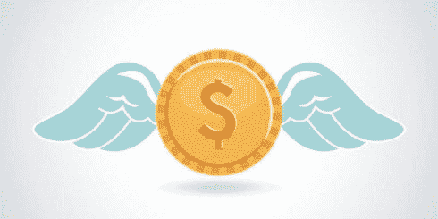
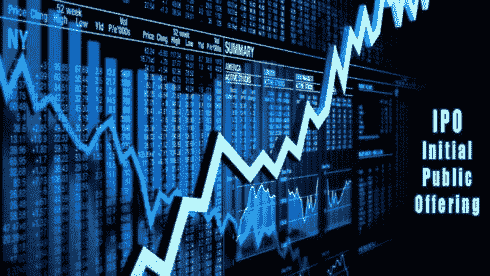

# 初创企业融资之旅简介

> 原文：<https://medium.datadriveninvestor.com/introduction-to-a-startups-funding-journey-1852e4ed311e?source=collection_archive---------4----------------------->

创业世界肯定在增长，企业家的数量每个季度都在增加，如果不是每个月的话。这最终会导致资本投资需求的增加。

但是什么是资本呢？

**资本** —企业的累积资产，可用于为企业创收。

但问题总是存在，为什么有人会不顾风险投资一家初创公司？**办理退货**。句号。

任何投资的回报总是与所冒的风险成正比。没有低风险高回报的投资。

每个创业公司都根据行业和创业者的情况采取最适合他们的方式——自筹资金，贷款，甚至从任何地方获得任何资金。启动投资的不同阶段如下。

**开机**

一个企业家用完他的储蓄或从公司的营业收入中收集尽可能多的资金，而不依赖外部资源的情况。这通常涉及公司很少或没有资产。一个囊中羞涩的公司可以决定接受未来的投资来加速增长。

**种子前期资本**

这通常涉及到创业者仍在构思想法并依靠朋友、家人或直接关系网的慷慨而生存的阶段。在大多数情况下，这一阶段的收入几乎为零。

**种子资金**

种子资本是初创企业成长的燃料。这可能会大规模取代种子前资本，或来自 Y Combinator 这样的创业加速器——申请人获得种子资本以开发他们的产品，并获得向投资者推介的机会——或 EntrepreneurFirst 这样的公司创始人——企业家根据业绩被选中，然后组建团队，在 3-6 个月的时间里建立想法并验证想法，同时获得种子资本，最终获得向投资者推介的机会。种子资本通常是为了帮助企业家维持他们自己和他们的员工，直到他们建立一个 MVP，资金从 1.5 万€到 50 万€不等。

**天使投资人**

正如“天使”一词所描述的，天使投资人通常包括高净值个人，他们发现这个想法有很大的潜力，以及在初创企业的早期阶段将自己的资金投入初创企业的成长，并提供指导和进入初创企业可以利用的网络的机会。这一阶段的投资通常少于 100 万€。

**风险投资**

通常由一家包括投资者、董事会成员和其他推动者(提供网络和资金的人)的公司支持，这一阶段涉及初创公司开始盈利时的高水平投资，不一定是利润，但有巨大的增长潜力。初创企业的产品通常在这个阶段仍然有效，当初创企业最终通过被出售给更大的公司或上市而退出时，风险资本家的目标仍然是最大化他们的回报。获得一笔风投交易通常需要风投公司进行数月的研究和讨论。风险资本的投资不少于 100 万€，上限主要取决于增长潜力。

风险投资基金有两个主要合伙人:与单个公司合作的“普通合伙人”和仅限于投资的“有限合伙人”。

风险资本投资也可以分为一系列的融资级别，涉及多个投资者或公司，同时为企业家提供机会来推销他们的 MVP 和他们的增长记录以及潜力。

这些融资轮为外部投资者提供了向成长中的公司投资现金的机会，以换取该公司的股权或部分所有权。但所有这些都涉及到评估一家公司的价值，这会影响到可能参与其中的投资者类型。每一轮融资都由一家主要投资者/公司牵头，并得到其他几家公司的支持。

**首轮融资:**

这个阶段让企业家在建立了一个跟踪记录后扩展他们的产品，跟踪记录可能包括一些性能指标，如强大的用户基础、稳定的销售或可持续的收入模式。这一阶段的扩展通常包括接收基础设施的资金，以开发产品并对其进行验证。A 阶段投资通常在初创公司估值为 1500 万€时进行，投资范围为 200 万至 500 万€。

**B 轮融资:**

B 系列涉及将产品从开发阶段推向市场，即从产品开发到业务开发，如增加营销以增加销售和收入，获得顶尖的技术人才和支持。正是在这个阶段，企业从初创发展成为公司。该阶段的公司估价在 2500 万到 5000 万欧元之间，投资在 500 万到 1000 万€之间。

**C 轮融资:**

进入这一阶段的公司已经相当成功，根据创始人、当前投资者和董事会成员的愿景，公司通过被收购退出，如果有更大的市场潜力则继续增长，或者收购另一家公司以扩大规模，甚至可能减少竞争。这一阶段通常包括尽快扩大规模和增长，以获得尽可能高的回报。这一阶段涉及的风险通常较小，因此它会邀请对冲基金、投资银行和私募股权基金进行进一步投资。这个阶段的公司估值在 1 亿欧元左右。

如果该公司不打算上市，它可能会进入 D 轮或 E 轮融资，以获得进一步的资金，从而实现全球规模。

**IPO**

一家公司首次进入股票市场在主流投资界被称为首次公开募股或首次公开募股。这里的公众是指公司现在将从普通公众(而不是天使投资人或风险投资家)那里筹集资金。这要求会计工作高度透明，公司为此准备了数月。谷歌、亚马逊、特斯拉上市。

**ICO**

首次公开募股(ICO)是最近的流行词，相当于首次公开募股，但在区块链领域。当一家公司希望创造一种依赖或独立于区块链应用程序的新硬币、应用程序或服务时，ico 充当筹款人。包括公众在内的感兴趣的投资者购买该产品，通常使用现有的数字令牌，如以太网，并收到一个新的加密货币令牌。这种加密货币可以交易回来，比如说，在未来，有希望以更高的价值交易。持有 ICO 的公司将投资者资金作为进一步发展、推出产品或启动数字货币的手段。在初创公司看来，ico 可以绕过严格和受监管的融资流程，降低资本投资者对决策的影响。在过去的两年里，公司融资超过了初创公司的风险融资。

为了更好地理解金融基本面，我推荐阅读 Balaji Vishwanathan 在 Quora 上发表的这篇文章。

[earn.com/dnivrav](https://earn.com/dnivrav)

*image credits*:[BizFundingClub](https://www.bizfundingclub.com/post/a-startups-funding-journey-from-bootstrapping-to-vc)， [Guidant Financial](https://www.guidantfinancial.com/small-business-funding-guide/self-funded-options/) ， [VCCircle](https://www.vccircle.com/hindustan-petroleum-invests-pre-seed-capital-in-ai-startup-tranzmeo/) ， [CS-Investments](http://www.cs-investments.com/csinvestmentsseedcapital.aspx) ，[企业家](https://www.entrepreneur.com/article/238931)，[日本时报](https://www.japantimes.co.jp/news/2017/06/15/business/cool-japan-bets-10-million-u-s-fund-attract-foreign-venture-capital/)， [RobotReport](https://www.therobotreport.com/two-robotic-stock-ipos-coming-to-market/) ， [Hackernoon](http://ICO fundraising surpassing venture fundraising for early stage companies)