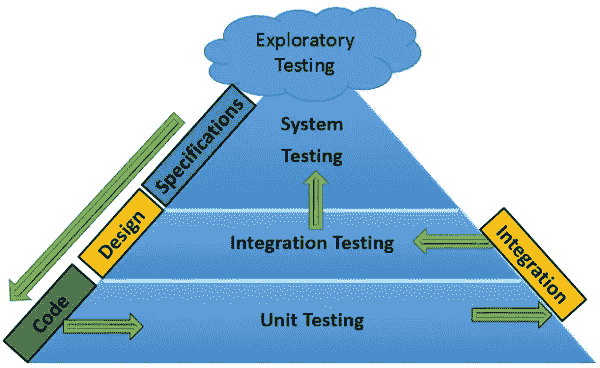
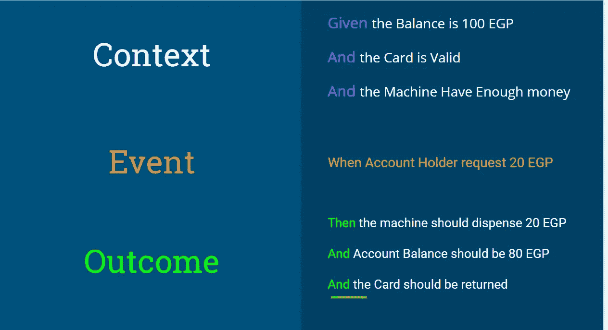

# BDD 和集成测试简介

> 原文：<https://medium.datadriveninvestor.com/introduction-to-bdd-and-integration-test-b536625d17dd?source=collection_archive---------5----------------------->

在我们开始之前，让我们讨论一下我需要做什么来测试任何系统。因此，我们需要运行一些测试，以确保我们的系统运行良好，表现正常。

1.  **单元测试**，这种测试旨在测试开发人员编写的代码。
2.  **集成测试**，该测试旨在一起测试系统组件，并确保系统如我们预期的那样运行。

还有其他种类的测试，如**系统测试**和**验收测试。**但是在这篇文章中，我们将集中讨论前两个，你可以通过[链接](https://www.quora.com/What-are-the-types-of-system-testing)查看更多类型的系统测试。



[https://www.tutorialspoint.com/behavior_driven_development/behavior_test_driven_development.htm](https://www.tutorialspoint.com/behavior_driven_development/behavior_test_driven_development.htm)

所以在**单元测试中，**我们可以测试我的代码是正确的。例如:

```
def Sum(x, y):
  return 5
```

如果我要为上述函数编写一个单元测试，我将测试该函数是否接受两个参数并返回 5，测试将通过，尽管该函数的目的是将 X 与 y 相加，在实际场景中，单元测试确保每个服务都单独工作。

这里**集成测试**的作用来自**，**它将确保你的系统完全按照你想要的那样运行。因此，如果您有一个将电话号码存储在 DB 中的函数，集成测试将确保它确实将号码存储在 DB 中，并测试实际的响应。

# **这是集成测试，但什么是 BDD …？**

**BDD(行为驱动开发)，**是测试优先软件开发的方法论和哲学，就像[](https://technologyconversations.com/2013/12/20/test-driven-development-tdd-example-walkthrough/)****(测试驱动开发)。****

> **BDD 是客户可以从系统中期待的一系列行为。**

**在**传统开发过程中:****

1.  **利益相关者告诉产品负责人业务需要什么。**
2.  **产品负责人将撰写需求**
3.  **测试人员或开发人员将从产品所有者那里获取需求，并将其转化为代码**

**但是在 **BDD 开发过程中****

1.  **利益相关者&产品所有者谈论业务需要什么。**
2.  **产品负责人与团队交谈，开始解释他们在这里开发什么，并给出例子**
3.  **团队和产品负责人以“**形式编写场景，然后给出”****

****

**综上所述，集成测试是一种系统测试。但是 BDD 是一种将这种测试应用到您的系统的方法。**

**最后，每种方法都有其优点和缺点，您只需要选择适合您环境的方法。它们的目的都是让你的系统稳定并按照你的意愿运行。**

**谢谢**

## **如果你觉得这篇文章有用，别忘了分享它。并在下面的评论中告诉我你的反馈。**

**资源:**

1.  **[BDD——测试驱动开发](https://www.tutorialspoint.com/behavior_driven_development/behavior_test_driven_development.htm)**

**2.[BDD&集成测试之间有什么共同点和不同点？](https://www.quora.com/What-is-common-and-different-between-BDD-integration-testing)**

**3.[集成测试](http://softwaretestingfundamentals.com/integration-testing/)**

**4.[BDD 和集成测试简介](https://www.slideshare.net/mohamedmansor1/intro-to-bdd-and-integration-test)**