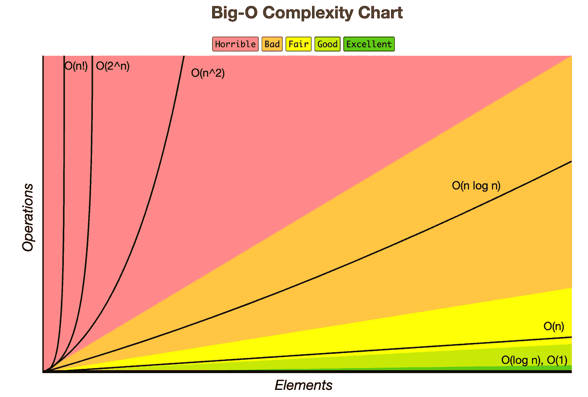

# 大 O 符号介绍

> 原文：<https://medium.datadriveninvestor.com/introduction-to-big-o-notation-421bf6a0a14a?source=collection_archive---------1----------------------->

大 O 符号是非计算机科学家觉得遥不可及的概念之一。特别是对于专注于数学和统计而不是创建生产就绪代码的数据科学家来说，大 O 符号可能是技术面试的一部分，你可能觉得没有准备好应对。

我把这篇介绍放在一起，是为了让我们这些没有获得计算机科学学位的人更容易理解和回答关于大 O 符号的问题。

[](https://www.datadriveninvestor.com/2019/03/22/the-seductive-business-logic-of-algorithms/) [## 算法诱人的商业逻辑|数据驱动的投资者

### 某些机器行为总是让我感到惊讶。我对他们从自己的成就中学习的能力感到惊讶…

www.datadriveninvestor.com](https://www.datadriveninvestor.com/2019/03/22/the-seductive-business-logic-of-algorithms/) 

# 为什么要用大 O 符号？

维基百科在计算机科学的背景下将大 O 定义为:

> “大 O 符号用于根据算法的运行时间或空间需求如何随着输入大小的增长而增长来对算法进行分类”——维基百科

现在，测量算法运行时间的方法不止一种。例如，您可以使用 Python 的 timeit 模块，并向它传递一个函数名，以确定它运行了多长时间:

```
timeit(func_name)
```

这种方法有什么问题？嗯，几个原因:

1.  **硬件差异** —运行时会因运行代码的硬件而异。
2.  **语言差异**——即使是相同的算法，执行代码所需的时间也取决于它所用的语言。
3.  **输入差异** —代码运行所需的时间根据输入的大小而不同。

因此，为了比较一个算法或一段代码的时间效率，我们使用大 O 符号。Big O 为我们提供了一种比较不同硬件和语言的时间效率的方法，也为我们提供了一种交流增加输入大小如何改变计算输出的时间的方法。

# 大 O 作为最坏情况的衡量标准

把大 O 想成我们的“最坏情况”虽然算法可以(平均来说确实)执行得更快，但它总是有机会需要访问每一个输入。

例如，让我们想想一个简单的搜索需要多长时间。如果我们在 Python 列表中寻找一个值，但不知道索引，我们可以逐个查看列表中的每个值。也就是说，顺序遍历列表并检查列表中的每个元素。这被称为“线性搜索”，可以用 Python 写成:

Example of a Linear Search

虽然我们要寻找的数字可能出现在列表的中间甚至第一位——从而导致我们提前退出函数——但这并不是 Big O 想要衡量的。Big O 正在考虑最坏的情况，在线性搜索的情况下，它必须查看列表中的每一项才能找到我们的号码。此外，我们正在研究当*输入达到无穷大*时，时间复杂度如何变化。这意味着线性搜索的符号为 O(n ),因为执行线性搜索所需的时间随着输入的增加而线性增加。

# 确定算法的大 O 的步骤

所以你需要确定你的算法的大 O。你是怎么做到的？

1.  写一个描述算法运行时间的等式
2.  去掉非主导术语
3.  放下常数

就是这样！哒哒！

我开玩笑地说，因为这并不像听起来那么容易。让我给你分析一下。

## 1.写一个等式来描述运行时间

第一步实际上是最困难的，所以我将在下一节详细讨论这一点。但是在线性搜索的情况下，如果我们的输入是 n，我们的等式将是 O(n ),因为我们只查看输入中的每个元素一次(在这种情况下，步骤 2 和 3 是多余的，但是请记住我的话)。

## 2.去掉不重要的术语

非主导项是当输入大小趋于无穷大时，方程中由其他项主导的任何项。也就是说，虽然非主导项也会随着输入的增加而增加，但它不会增加得那么快，因此不会真正影响计算时间。这类似于取一个极限为 n → ∞。

比如在 O(n + n)中，当 n → ∞时，n 项由 n 支配。因此，我们可以去掉 n，把它写成 O(n)。

## 3.放下常数

主导术语前面的常数可能看起来更精确，但是在大 O 符号中它们也是多余的。

例如，在 O(2n)中，常数 2 可以被丢弃。在适当的大 O 记法中，O(2n)写成 O(n)。其实 O(2n)和 O(3n)都可以简化为 O(n)。

# 如何得出描述运行时间的方程

这可能是在技术面试中正确回答大 O 符号问题最困难的部分。但是并不难，只需要熟悉就可以了。



How quickly your algorithm can venture into unmanageable territory. Image courtesy of [bigocheatsheet.com](https://www.bigocheatsheet.com/)

## 常数时间 O(1)

恒定时间是其时间复杂度不会随着输入的大小而改变的任何操作。例如，无论输入数组变得多大，下面的函数总是打印第一个元素:

Print the first element, regardless of array size

## 线性时间 O(n)

我们已经看到了线性时间的一个例子——线性搜索。一个好的经验法则是，如果您看到一个遍历整个输入的 for 循环，这将是 O(n)时间。

## 二次时间 O(n)

就时间复杂性而言，我们现在开始变得难以控制。O(n)是指在同一个列表中循环两次。例如:

Loop though the array twice, multiplying the inner term with the outer term. Return the sum.

对于数组中的每一个数字，它都会再次遍历整个数组。这就是为什么大 O 记数法是 O(n×n)或者 O(n)。

## O(2n) ≠O(n)

请注意，仅仅在代码中看到两个循环并不自动意味着您有 O(n)时间。例如:

Two for-loops O(2n) vs. an inner & outer Loop O(n²)

在第一个例子中，我们打印列表中的值两次。为此，我们使用了两个 for 循环。然而，由于它们不是嵌套的 for 循环，我们只是遍历输入数组两次。这给了我们 O(n + n)或 O(2n ),这只是简化为 O(n)。

当我们有嵌套循环时，我们需要乘而不是加 n，所以对于第二个函数(for_loop_n_squared)，我们的大 O 记法是 O(n)。如果我们有 3 个嵌套的 for 循环，我们的大 O 符号应该是 O(n)，依此类推。

## 对数时间 O(log(n))

对数时间有点难掌握，但本质上它是指你每次执行一个动作时输入减半的时间。

一个常用的例子是二分搜索法——当你有一个有序列表时，它是对线性搜索的一个改进。在二分搜索法，你看着中间的元素，判断你要找的数字是在当前元素的上面还是下面，然后扔掉另一半。重复，直到你找到你要找的号码:

Python example of binary search. This is the quintessential example of logarithmic time.

为什么这个是对数时间？因为我们每次都把输入除以 2。该算法运行的最大次数是 14 次，或者

```
np.log2(10000) = 13.287712379549449
```

## 线性时间 O(nlog(n))

线性时间或 O(nlog(n))时间是 O(n)过程和 O(log(n))过程的组合。一个值得注意的例子是 mergesort，这是一种排序算法，以最快的方式对所有元素进行排序。

在 mergesort 的情况下，数组被分割 log(n)次，每对元素被适当地比较和排序。然后，在下一个级别，这些对再次进行比较。


Gif of how mergesort works. From [wikipedia](https://en.wikipedia.org/wiki/Merge_sort).

## 指数时间

还有什么比二次或多项式时间更糟糕的呢？指数时间。

指数时间的一个例子是试图通过暴力猜测密码。如果密码仅由 0 到 9 的数字组成，并且密码长度为 n，则猜测每个组合都是 O(10^n).

如果可能，不惜一切代价避免。

# 概括起来

提高代码的时间效率要求您能够从理论上确定代码的效率，并识别更高效的模式。希望这篇快速介绍能给你足够的信息，让你开始批判性地思考你的代码。