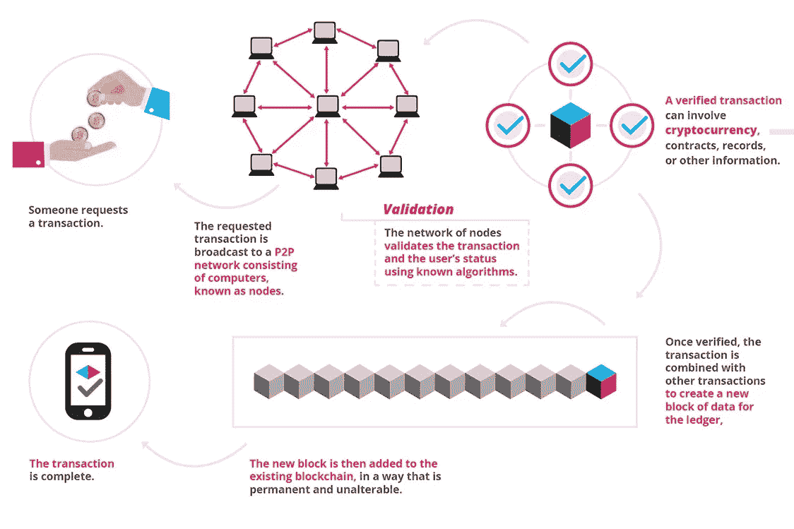

# 区块链技术简介:第 1 部分

> 原文：<https://medium.datadriveninvestor.com/introduction-to-blockchain-technology-part-1-dc8f827d8e30?source=collection_archive---------0----------------------->

在我之前的一篇关于区块链技术应用将彻底改变的[行业的文章](https://medium.com/@petrosleandros/5-industries-which-will-be-revolutionized-through-blockchain-technology-17b379adfcda)之后，我的一些好朋友解释说，他们不知道区块链技术到底是什么；他们知道所有的宣传，并预计未来其应用将对我们的日常生活方式产生重大影响，但是，他们无法从根本上理解这项技术提供了什么，以及它与现有技术有何不同。我确信，与我交谈的人并不是唯一对所有关于区块链的讨论感到困惑和不知所措的人，然而，他们无法用简单的日常语言理解区块链是什么。我已经决定写一系列文章，其中我将涵盖区块链技术的定义，现有技术产品的利弊，以及一系列现有的应用和区块链用例，希望能帮助一些人更多地了解这个主题。

让我们从基础开始。区块链技术到底是什么？

# 区块链技术 101

区块链是一个计算机网络，数据在其中存储并在所有计算机之间平等共享。它是一个分布式数据库，其中的数据是公开可用的并且容易跟踪，但是，它的性质确保了用户匿名，并且数据访问只能由拥有“私钥”(即密码)来访问他们所挖掘的节点(即网络的一部分)的用户获得(请阅读下面关于挖掘链块的过程的更多细节)。让我们用一个例子来说明上述情况:

想象一场竞赛(即区块链网络)正在伦敦举行。总共有 100 人(即网络成员)来参加比赛。个人创建一个用户帐户，用他们的名字注册，并选择一个用户名和一个唯一的密码(即“私人密钥”)来参加比赛。在用户注册之后，参加竞赛的 100 个人的用户名在竞赛板上显示给参加竞赛的所有成员(即，数据是公开可用的，并且在网络的所有成员之间共享)，然而，个人的名和姓不被显示(即，用户匿名)。个人用户可以使用只有他们自己知道的唯一密码登录他们的帐户，并更改他们的用户名，这将立即反映在白板上。*随着更多区块链技术概念的解释，我们将进一步构建这个例子。*

## 加密货币挖掘

为了挖掘加密货币，个人计算机首先必须加入特定的区块链(例如，比特币区块链、以太坊区块链等。).加入网络后，个人计算机将执行计算以解决问题。一旦这个问题被解决，链中的下一个块被解锁，解决该问题的节点(即计算机)将被授予加密货币。**上述过程，被称为加密货币挖掘**。一旦一个块被挖掘，它就被永久“密封”,并且已经挖掘该块的地址(即节点)的副本被整个网络共享。

以之前的竞赛为例，假设在 100 名参与者中进行知识测试。该测试有一个很大的问题列表，第一个答对所有问题的人将获得 1000 美元的奖励(这是为了表明，例如在比特币区块链中，大量的矿工竞争开采每个区块。成功解决手头区块问题的矿工将获得 12.5 个比特币，就比特币区块链而言)。他们每个人都试图解决它，并给出正确的答案。一旦 100 个人中有一个找到了知识测试的所有正确答案，他将获得 1000 美元的奖励，这将与他的用户名一起反映在排行榜上，并向所有参与者公开(即，当区块被挖掘时，成功挖掘区块并获得奖励的个人的钱包地址将在区块链中公开)。

## **区块链交易**

为了展示交易如何在区块链网络中进行，我们将使用下图，由[区块极客](https://blockgeeks.com/)提供:

如上图所示，区块链中执行交易(即发送/接收数据)的流程如下:

1.  有人请求交易，例如，将加密货币转移到另一个账户，激活智能合同，发送数据记录等。
2.  交易被发送到区块链网络以便被验证。通过运行算法来执行验证过程，以便验证交易并向网络的每个现有成员添加交易的副本。
3.  一旦事务被执行和验证，它就与其他事务一起被添加到现有区块链中的数据块中。一旦最后一个可用的数据块不再有容量，它就被添加到块链中，并且下一个可用的数据块将变得可用于数据输入。例如，比特币区块链的容量为每个区块 2 MB(兆字节)的数据。
4.  添加到区块链中的区块是永久的，不能被更改。如前所述，它们的内容(即交易信息)对网络的所有成员都是可用的。

## 区块链技术特点

在涵盖了区块链技术的定义、加密货币挖掘的过程以及在区块链上执行交易的过程之后，如果我们还涵盖了区块链技术的几个更具体的特征，那将是有价值的:

1.  每当在区块链网络中执行交易时，这在整个网络中同时更新。区块链网络每 10 分钟自动协调其网络所有成员的数据。
2.  区块链技术的关键特征之一，也是它提供的主要好处之一，是交易数据在整个网络中共享，而不是存储在单个位置。同样，为了让黑客破坏或破坏交易数据，攻击单个计算机(即网络中的节点)是没有意义的，但他们必须攻击区块链网络的所有成员。由于区块链网络通常涉及全球数千台计算机和超级计算机，黑客攻击区块链网络所需的处理能力是巨大的，因此，区块链网络比传统技术架构安全得多。
3.  区块链网络不受网络中任何成员的控制，数据在其所有成员之间平等共享。因此，网络是分散的，交易不受任何一方控制。去中心化是区块链革命性应用的另一个主要原因，因为它可以在没有银行参与的情况下进行支付，在没有政府干预的情况下进行货币创造(如采矿)等。

在本系列文章的未来部分，我们将涵盖更多具体的使用案例，在这些案例中，可以利用区块链来改善现有流程，并创造出对我们日常生活产生影响的新产品和服务。

每个人都必须至少对区块链技术有一个基本的了解。引用 Marc Andreesen(亿万富翁天使投资人、风险投资家和第一个互联网浏览器的发明者)*“比特币第一次为我们提供了一种方式，让一个互联网用户向另一个互联网用户转移一件独特的数字财产，这样转移就可以保证安全可靠，每个人都知道转移已经发生，没有人可以质疑转移的合法性。这一突破的后果很难被夸大。”*尽管具体的报价与比特币有关(我计划在另一篇文章中介绍)，但它适用于所有区块链技术应用。随着时间的推移，越来越多的区块链应用程序将被创建，我们离我们日常生活中使用的大多数技术应用程序都将建立在区块链上的日子不远了。

如果你喜欢我的文章，请在你的个人资料中或与朋友和家人分享。另外，我很高兴收到你的想法，无论是在评论区还是在脸书的留言中。