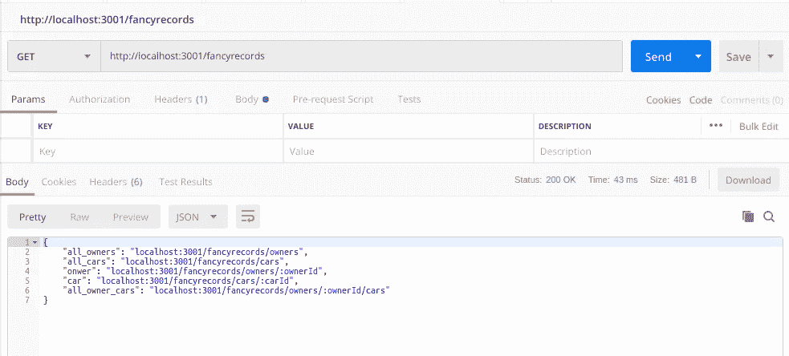
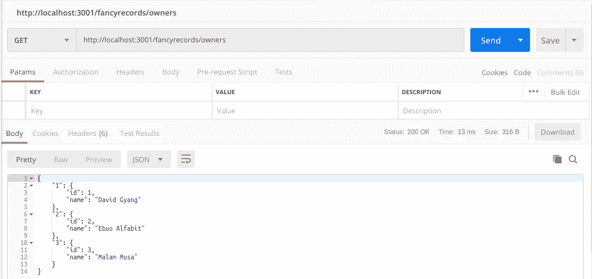
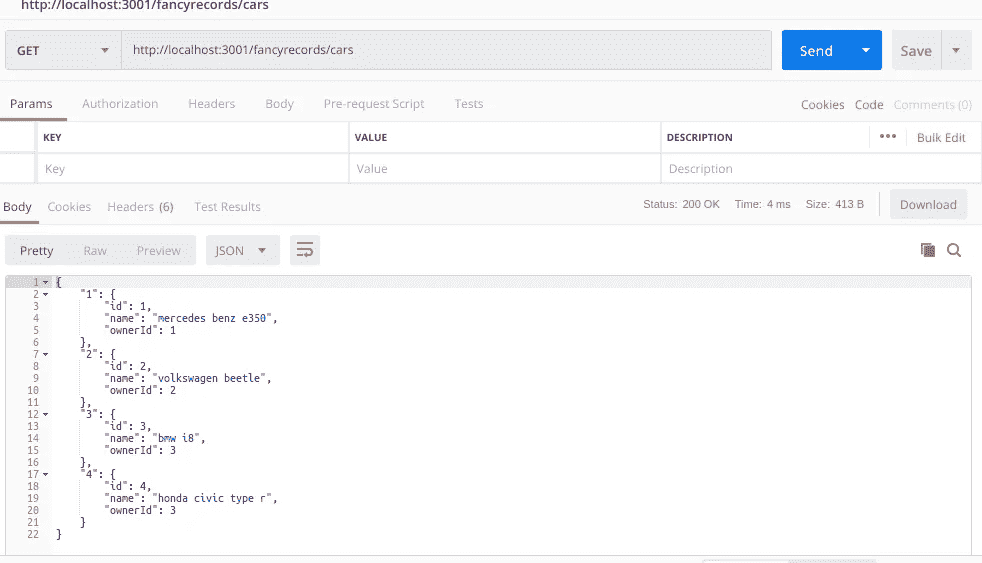
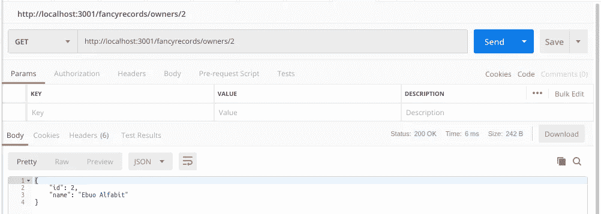
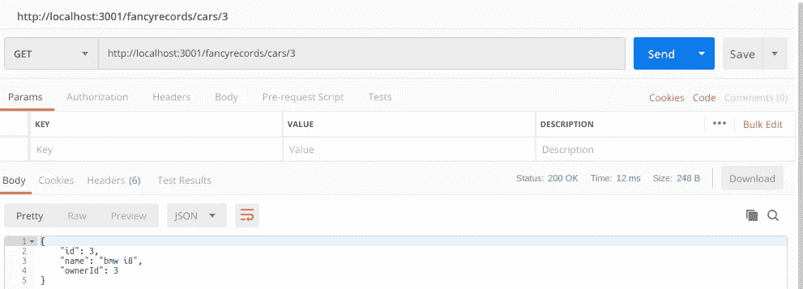
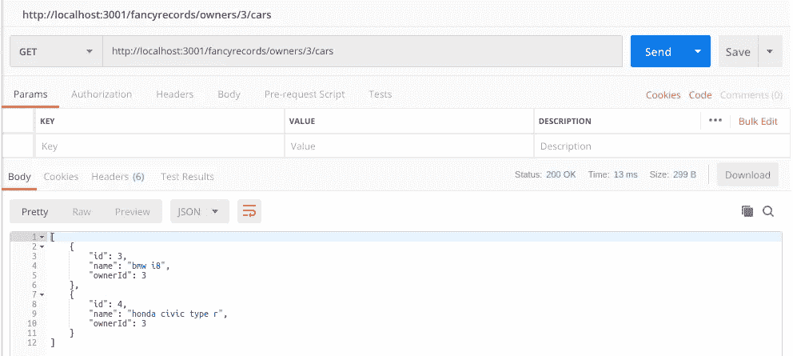
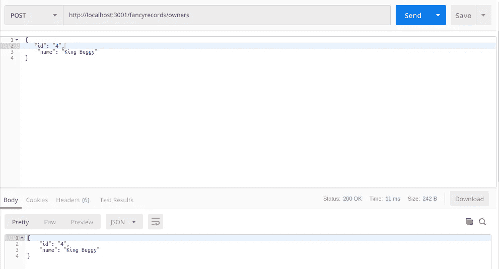
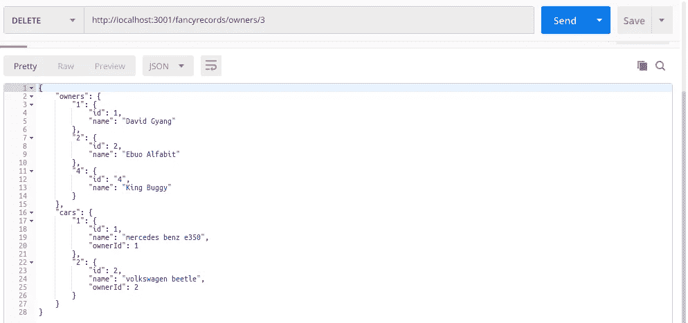
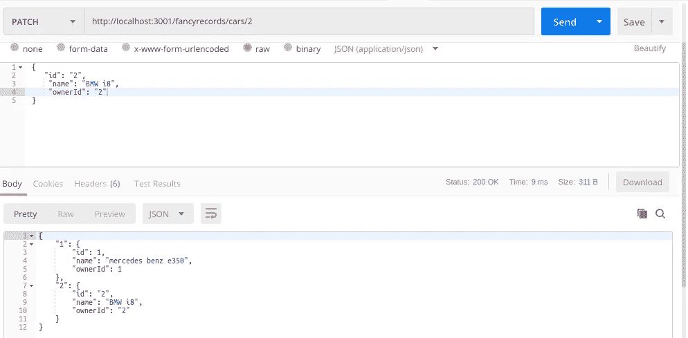

# 构建 REST APIs 简介

> 原文：<https://medium.datadriveninvestor.com/introduction-to-building-rest-apis-4b882cf76c74?source=collection_archive---------2----------------------->

REST 是一种客户端-服务器架构，它利用 HTTP 协议，REST 代表表示状态转移，它是分布式超媒体系统的一种架构风格。

为了让一个 API 被认为是 RESTful 的，它需要满足六个关键的标准

*   客户端-服务器
*   统一界面
*   可缓冲的
*   无国籍的
*   分层系统
*   按需编码(可选)

 [## 雅虎财经 API |数据驱动投资者的 6 种替代方案

### 雅虎财务 API 是新的财务 API 万岁！雅虎财务 API 长期以来一直是许多公司的可靠工具。

www.datadriveninvestor.com](https://www.datadriveninvestor.com/2019/02/25/6-alternatives-to-the-yahoo-finance-api/) 

REST API 的一个例子是 GitHub REST API v3，它完全是客户端到服务器的，也就是说，客户端与服务器是分离的，传统意义上的客户端通常被称为浏览器，但是对于 API 来说，客户端可以是发出 API 请求的任何东西，所以现在如果我决定调用 GitHub API，你很快就会看到，我的服务器就成为 GitHub 服务器的客户端。它有一个统一的界面，因为服务器会提前宣布可用的操作。无状态意味着每个 HTTP 请求都是完全隔离的，服务器不在请求之间传递状态，所以下一个请求完全独立于前一个请求。

# **调用 API**

这里我将使用[邮递员](https://www.getpostman.com/)与 Github API 交互

从返回的 JSON 数据中，我们看到可以用来访问其他资源的多个端点，基本上，这就是统一接口所需要的。

## 很高兴知道

1.  在构建 REST API 时，资源应该是名词而不是动词，所以不要像这样有端点

*/getallusers* 或 */createuser*

你应该有

*/用户*

利用 HTTP 请求方法作为动词，您将能够以正确的语义完成多个任务。

2.create, read, update, and delete

CRUD 只是使用 HTTP 动作动词的标准方式，它代表创建、读取、更新和删除。因此，创建操作使用 post 动词，读取操作使用 get 动词，更新操作使用 put 或 patch 动词，删除操作使用 delete 动词。

3.通常你应该提供不止一种内容类型，也就是说你的 API 应该能够返回 JSON、XML、text 等，但是为了简单起见，在本教程中，API 将只返回 JSON 数据。

# 构建自己的 REST API

在本教程中，我将使用 Nodejs 和 express 来创建我们的服务器。下面是使用 express 的节点 web 服务器的基本设置

出于本教程的目的，我将使用一个名为 fancyRecords 的模拟数据库，用 javascript 对象创建，来模拟车主和他们的汽车之间的关系，我知道这很蹩脚，但请坚持使用。想象一下，这是一个数据库，里面有你家附近有很好的车的酷小孩

## 我们的阅读终点

从第 1–11 行开始，我们的 API 基本上提供了客户端需要的所有可能的端点，基本上保持了统一的资源和无状态，尽管对于这个演示来说这是多余的，它对这两点的解释很少，但是你应该明白了。让你的客户生活轻松点。

## 获取路线的输出

**Get all routes available in the fancyRecords API**

现在，我们将检查所有路由并查看输出

**GET all the car owners (localhost:3001/fancyrecords/owners)**

**GET all the cars (**localhost:3001/fancyrecords/cars**)**

**GET a car owner (**localhost:3001/fancyrecords/owners/:ownerId**)**

**GET just one car (localhost:3001/fancyrecords/cars/:carId)**

**GET all cars of an individual owner (localhost:3001/fancyrecords/owners/:ownerId/cars)**

我们可以添加数据吗？如果我们的 API 是专门为 web 客户端构建的，我们可能需要通过它将数据发送到数据库，作为使用名词作为资源的需求的扩展，我们会看到路由没有改变，我们需要做的只是将 HTTP 请求方法从 Get 改为 Post，有一点逻辑，我们就没事了。

## 通过 API 发送数据

这个 API 只接收车主和汽车端点的数据，我们可以添加一个新用户和一辆新车。为了让一个 API 被认为是真正 RESTful 的，它应该接受不止一种内容类型，但是为了简单起见，我们将只使用 JSON 数据，通常 web 客户端会发送表单数据，所以请记住这一点。

**Post (localhost:3001/fancyrecords/owners)**

添加到数据库的内容被返回，这不是标准的，只是为了清楚。您通常希望根据结果返回成功或失败通知。

# 删除

原来 fancyRecords 数据库中的一个车主是个骗子，他并没有真正拥有两辆车，他在我们所有人面前耍花招。好的一面是，我们可以通过访问所有者的端点，用 HTTP delete 动词清除他的所有记录。localhost:3001/fancy records/owners/:ownerId

所以当一个车主被删除时我们想要删除所有相关的记录，在这种情况下，所有他拥有或声称拥有的汽车，LOL。

从返回的输出中，您可以看到该车主的所有记录都被删除了。

# **更新**

坚持 CRUD，我们应该能够更新记录，让我们这样做。

所以，事实证明大众甲壳虫实际上是一辆宝马 i8，没有人知道这个错误是怎么犯的，但谢天谢地我们可以更新它。

到目前为止，我们已经讨论了 CRUD

## 幂等性

对于一个幂等的 API，客户端可以对它进行相同的调用并接收相同的结果。幂等运算可能在服务器上产生相同的结果，但是响应本身可能不相同。Get、Put 和 Delete HTTP 操作通常被认为是等幂的。

# 结论

RESTful APIs 很棒，它们很容易交互，可能不容易构建，但我们应该始终以客户为中心设计 API。如果对客户来说足够简单，那么它就足够好。如果你想查看完整的代码，这里有一个[链接](https://gist.github.com/Oghenebrume50/36c0f3f6b62be57e3f2a9a694f6103c9)。

如果你觉得有什么不对，请留下评论，让我们一起来讨论。