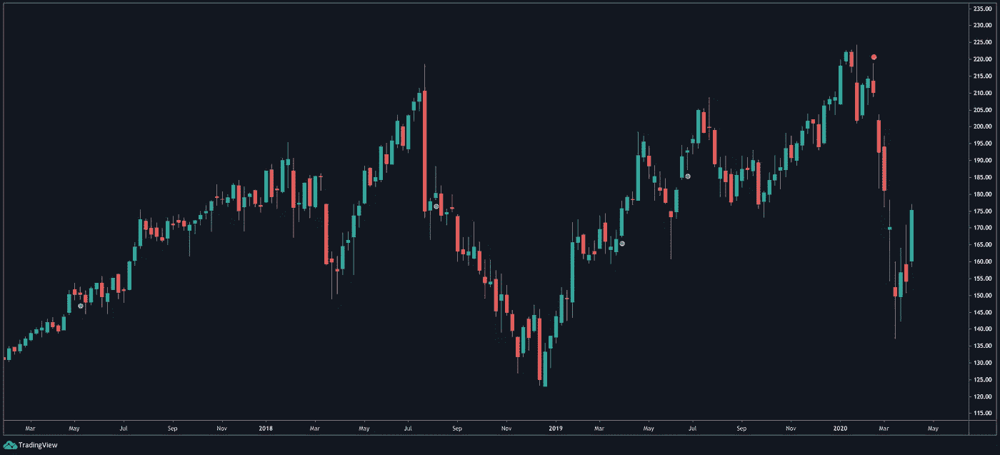
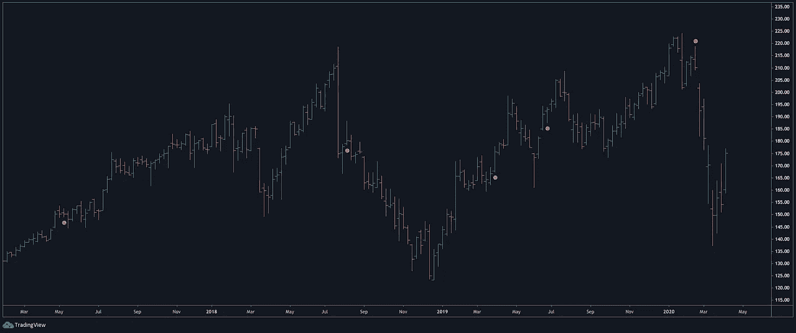
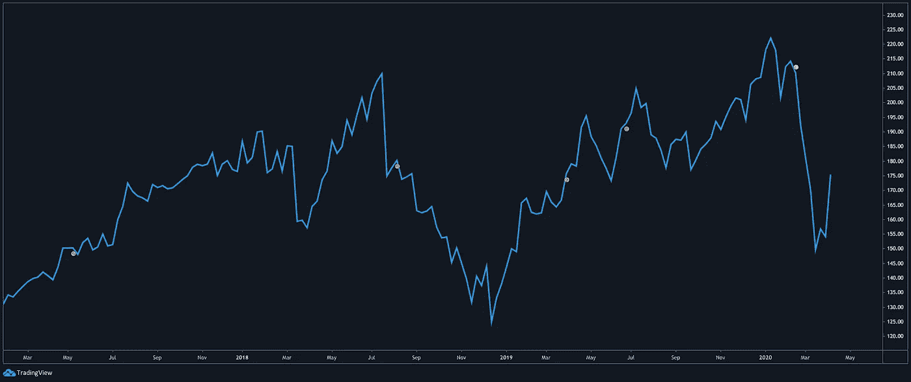
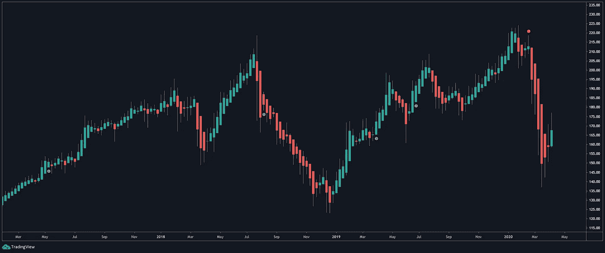
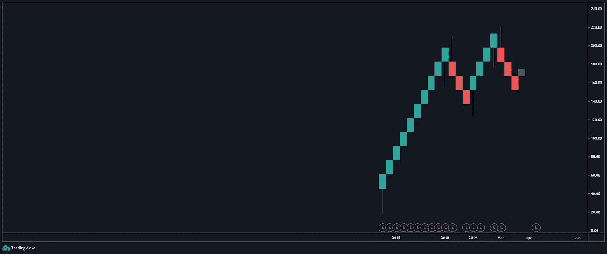
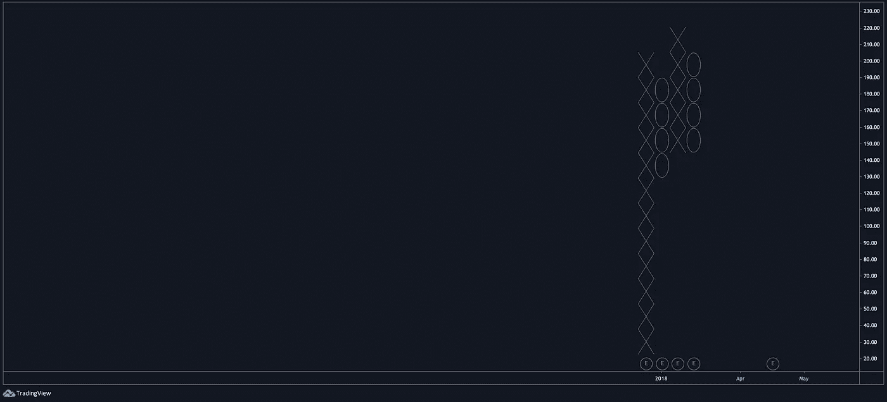
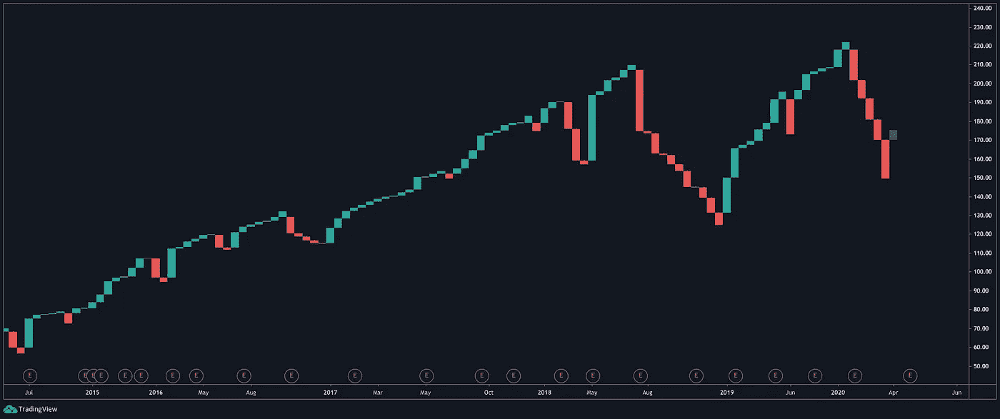
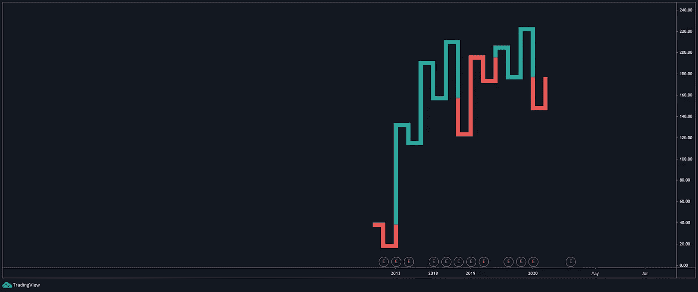

# 交易图表介绍。

> 原文：<https://medium.datadriveninvestor.com/introduction-to-charts-94ccf220ab1e?source=collection_archive---------12----------------------->

每个人在金融领域使用的主要工具是图表。两个参与者之间的每一笔市场交易都需要被记录下来并保存在某个地方以备将来参考。

例如，在 10:24 分 04 秒，有人以 10.000 美元购买了金融工具的 X 卷。现在，这个事务被存储到一个表中，从这个表中，它也可以用 X，Y 轴来表示。那是我们得到图表的地方。

这个想法是，通过研究一种金融工具的过去行为，我们可以预测它的未来走势。

绘制所有交易的主要方法如下:

# 蜡烛图

在这个特殊的例子中，我们可以看到一个图表，它是用苹果股票每天的最高价、最低价、开盘价和收盘价绘制的。这四个价格然后形成一个红色或绿色的蜡烛。

蜡烛的主体代表开盘价和收盘价，以及最高价和最低价下面和/或上面的小线。这条细线被称为灯芯、影子或尾巴。

在每张图中，代表的两个变量是价格(垂直)随时间的变化(水平)。每根蜡烛都可以代表从几年到几分钟的价格，而且是用户自定义的。

# 条形图

与蜡烛图相同的概念也适用于这里。主要区别是设计。

# 折线图

折线图是一种更简单的价格可视化方式。在这里，我们每次只能使用一个价格点，通常是收盘价，然后我们将图表中的所有价格点连接在一起。折线图被认为是观察趋势可能性的更直接的方式。

# 黑金-阿希图表

Heikin-Ashi 蜡烛使用比普通烛台更统一的颜色编码，它们非常适合潮流识别。多奇蜡烛通常显示趋势的开始或结束。它们可以用作另一个验证指示器。Heiken-Ashi 在日语中的意思是“一般的酒吧”。

# 伦科图表

Renko 棒线显示的是价格的变动，没有考虑时间因素。例如，如果我们将 Renko 图表设置为“5”，那么每当价格超过 5 点时，就会创建一个绿色方框。当价格下降“5”点时，将创建一个红框。伦科图表的全部用途是通过消除价格波动的“噪音”来平滑趋势。

# 点数图

这种类型的价格图表，不像其他图表，完全不需要时间。当我们把图表设置为“5”时，市场向上移动了“5”，这时出现了“X”。如果价格从“5”涨到“45”，就会出现另一个 8“X”。当价格下降到图表设定值的 3 倍时，在我们的例子中是“15 ”,那么我们的图表就会得到一个“O”。这张图表用于非常低的时间框架。

# 换行图表

同样，在这种类型的图表中，我们完全不考虑时间，而是关注价格。同样，这张图表的全部目的是跟上趋势。所有这些图表类型的缺点是，如果我们完全依赖它们，我们将很难对相反的大趋势做出反应。

# 卡吉图

卡吉图的工作原理与上述所有图表相同。它没有考虑时间参数，只显示了价格变动。这种图表也有助于我们确定趋势，但我们不能完全依赖它。

# 结论

上述图表类型是主要使用的图表类型。它们有许多变体，还有一些其他图表类型。极端的形式是没有用的，它们可以被一小部分人用在非常小的情况下。一些其他类型的图表是范围图，凯瑟图，卡吉图，点和数字图。

没有哪种图表类型比其他类型更好。每个图表都代表了几乎相同的信息，我的建议是选择一个并掌握它。蜡烛图被大多数散户交易者使用，折线图是机构交易者最喜欢的工具，条形图是第二受欢迎的工具。