# 探索性数据分析简介

> 原文：<https://medium.datadriveninvestor.com/introduction-to-exploratory-data-analysis-682eb64063ff?source=collection_archive---------0----------------------->

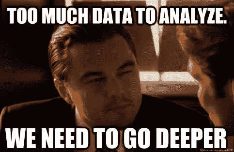

从外面看，数据科学总是由高级统计和机器学习技术组成。然而，探索性数据分析(EDA)是任何数据科学实验中最重要的组成部分之一，但却没有得到应有的重视。

简而言之，EDA 就是“先看一下数据”。这是分析实验数据的关键步骤。它用于理解和总结数据集的内容，以确保我们提供给机器学习算法的特征得到提炼，并获得有效、正确解释的结果。

一般来说，查看一列数字或整个电子表格并确定数据的重要特征是非常乏味和无聊的。这里，Python/R 提供的 EDA 技术和某些库可以帮助我们！EDA 一般分为两种方法，非图形化或图形化。每种方法都可以应用于一个变量/列(单变量)或变量/列的组合(双变量)。

此外，在动手之前理解问题陈述和数据是很好的实践，这有助于获得很多见解。我将尝试使用在 [UCI](https://archive.ics.uci.edu/ml/datasets/Adult) 机器学习库中可用的成人数据集/人口普查收入数据集来解释这个概念。

这里的问题陈述是根据人口普查数据预测年收入是否超过 50k。

让我们从加载所需的模块开始我们的实验。我将使用 numpy，pandas，seaborn 和 matplotlib。这些是最受欢迎的模块，但是您也可以随意使用其他您觉得合适的模块。

现在，我们必须下载数据集并存储它，以便我们可以开始使用它。

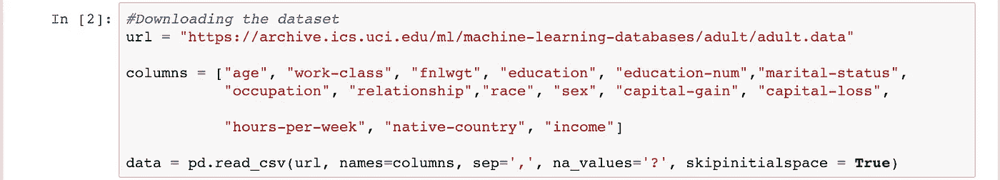

在我们进一步讨论之前，最好先看一下各个列以及数据中存在什么样的属性，这样我们就可以大致了解如何开始我们的 EDA。

现在，根据上面的结果，我们可以将各种数据列分类为数字/类别属性:

1.  数字属性:年龄，FnlWgt，教育人数，资本收益，资本损失，每周小时数。
2.  分类属性:工作阶级，教育，婚姻状况，职业，关系，种族，性别，祖国，收入。

**数据统计**

当谈到数字属性时，我们应该从观察各种统计数据开始，如计数、平均值、标准差等。让我们看看所有数字类别中的几个。

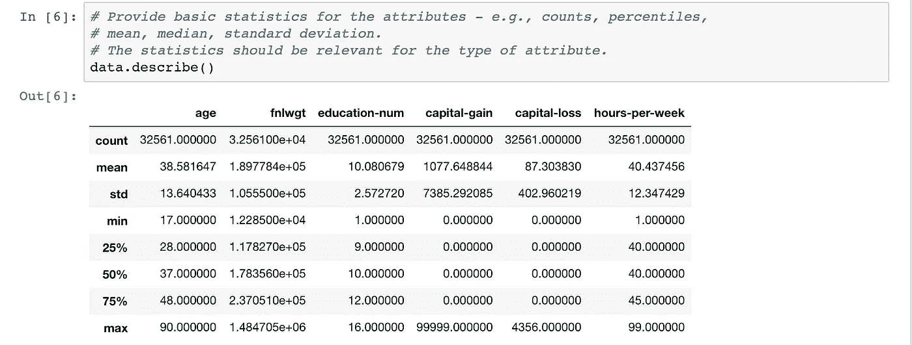

统计数据让我们了解了包含缺失值的属性、特定属性的平均值和最大值，当我们决定在将数据输入模型之前对其进行预处理时，这将非常有用。

**数据可视化**

可视化属性可能是 EDA 中最重要/最有趣的部分。如果我们有它的图像/视觉化，这个世界上的任何事情都可以被更好地理解。但是，我们应该始终记住可视化是否适合给定的数据类型。我们不应该尝试所有我们知道的可视化技术，然后说我们已经完成了 EDA。相反，我们应该做具体的可视化，并确保我们理解可视化告诉我们什么。让我们从绘制所有数字属性的直方图开始。

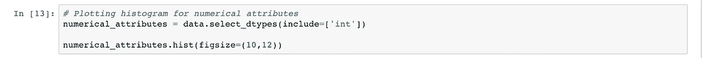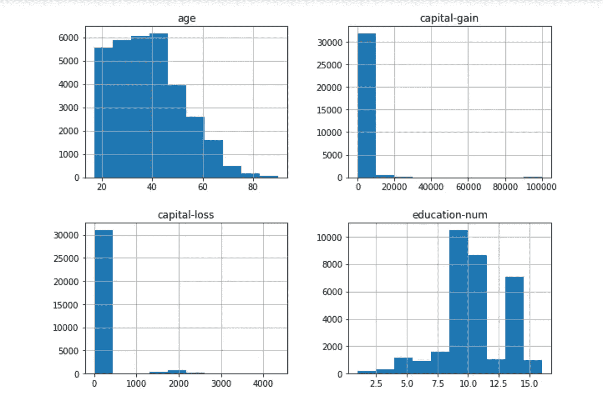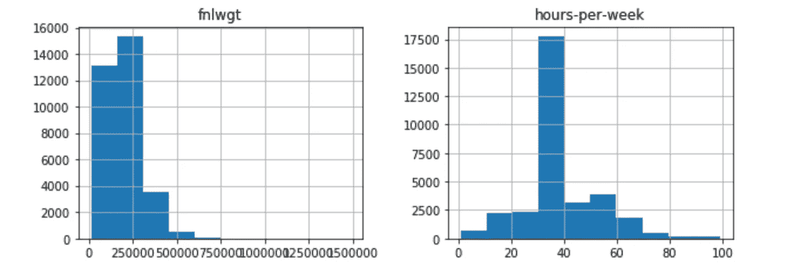

数值属性的可视化让我们对值的分布有了一些有趣的了解。

1.  大多数个体都有年龄< 50 while the maximum age is around 90.
2.  In general, people do not have investments other than their regular income. However, there are very few people who invest, and there are also a small number of outliers who earn more than 90000 via capital gains. However, among the people who had a, capital loss the average loss looks to be around 2000.
3.  On average, most of the people have studied till education number 9 or 10 in the areas where the census was taken.
4.  Most of the people work around 40 hrs per week. However there are a few who don’t work and a few who work for almost 100 hours a week.

Now, for categorical attributes, it would be better if we could view their frequency distributions. We will use count plot to achieve this.

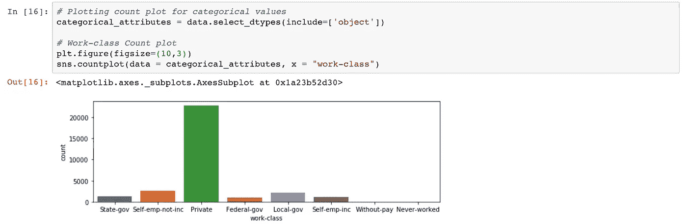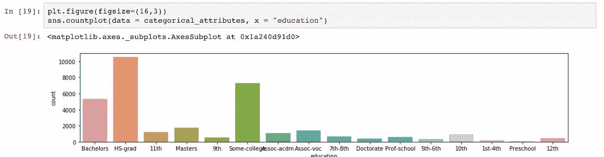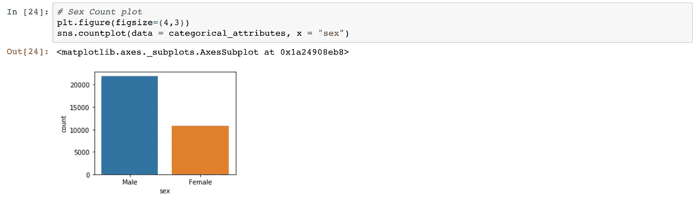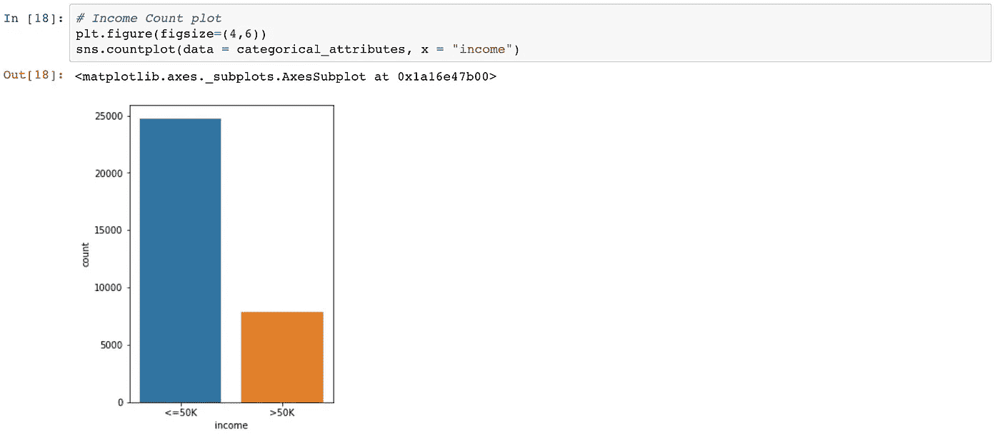

From the above plots, we can interpret the following things:

1.  Most of the people work in private sectors, and the rest are evenly distributed among state-gov, federal-gov, local-gov, self-emp-inc and self-emp-not-inc.
2.  Most of the people are high-school grads or have studied in some college. This is same as the education-num attribute, just that each of these values have been assigned a number there. We can use one of the two columns for our model, and ignore the other.
3.  Majority of the population according to the census data are male.
4.  Majority of the people have an income of less than 50k according to the data given, indicating that the data is somewhat skewed.

I haven’t included the count plot of every categorical attribute here, but I will add a github link for a Jupyter Notebook at the end, which has plots of every attribute along with explanations/interpretations.

Until now, we have tried to understand the data using both visualizations and basic statistics. Another important aspect is looking at the quality of data.

**数据质量**

当涉及到数据质量时，我们总是需要检查一些事情。

1.  缺失的价值观:有可能在进行人口普查时，很少有人拒绝提供关于他们的职业/工作阶层的信息。因此，我们没有这些人的那一栏的任何数据。一个好的做法是用列的中值替换缺失的值，或者如果这些行的数量不是很大，我们可以删除它们。
2.  异常值:也可能是一个人的资本收益是 100，000 美元，而平均资本收益是 0 美元。这些人被称为离群值。从训练数据中移除异常值是一个很好的做法，因为这些异常值往往会使您的模型向错误的结果移动。
3.  重复数据:我们也可以让同一个人的信息在数据中重复出现。我们应该删除所有重复的数据，因为如果发现大量重复数据，可能会导致过度拟合。

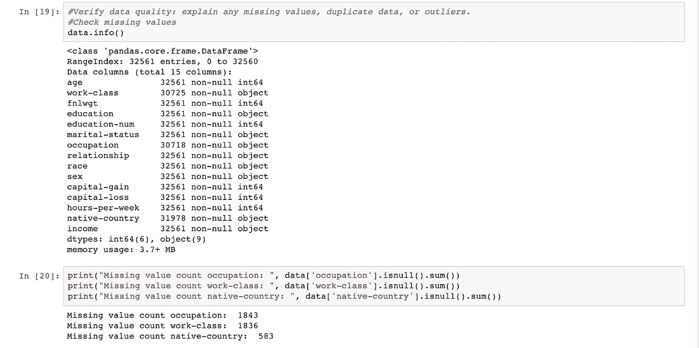

我们可以看到，与全部条目相比，丢失的计数并不多，所以我们可以删除这些行。我们也将删除重复和离群值。上面的直方图显示，资本收益存在异常值，与大多数人相比，极少数人拥有极高的资本收益。

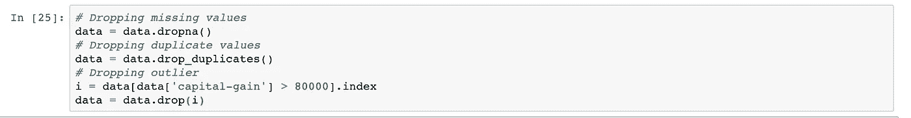

现在，我们已经对每个列进行了各种分析和质量检查，让我们看看各个列之间的关系。

**数据关系**

为了探究各种属性之间的关系，我们可以使用不同属性之间的散点图和关联热图。我们将看看除了阶级属性(即收入)之外的各种属性的相关热图。同样，我们只能为数字属性绘制它。

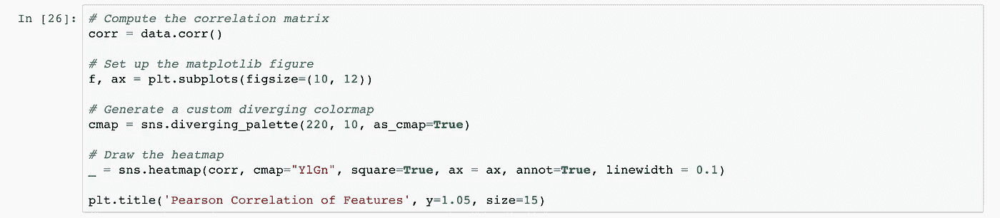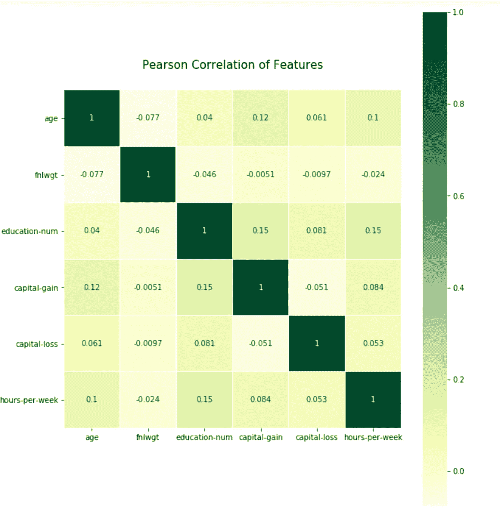

我们可以看到数字特征之间没有很大的相关性。

1.  fnlwgt 功能看起来没用。
2.  根据相关热图，年龄、每周时数和教育人数之间存在一定的相关性。
3.  资本收益和资本损失并不显著负相关，这意味着人们只有在有钱的情况下才能投资。

对于分类属性，我们可以使用交叉列表，但是在我们研究它之前，如果我们将分类属性分组到更少的类别中，对我们来说会更好更容易。例如，我可以将教育价值分为辍学、高中毕业、社区大学、学士、硕士、博士。

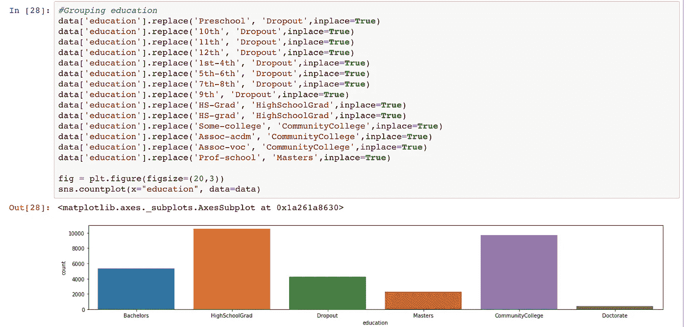

这使得我们的工作更容易，也更容易理解可视化。我们可以对有很多类别的所有分类属性都这样做，让我们再尝试一列。我们将把祖国分为美国和其他国家。

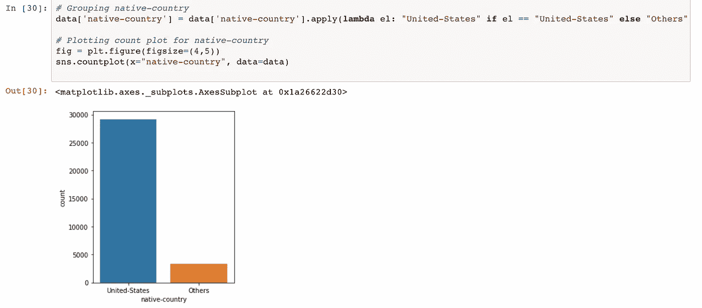

此外，交叉制表技术与任何其他列，它看起来更容易在这里解释。

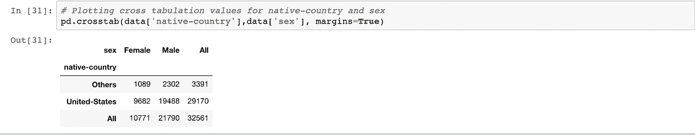

根据上述结果，我们可以说，美国人和其他土著人的男女比例或多或少是相似的，然而，美国国民的数量在数据集中要多得多。

探索属性和类属性之间的关系也很重要。这将告诉我们在最终模型中特定属性的重要性。我们来看几个关系。

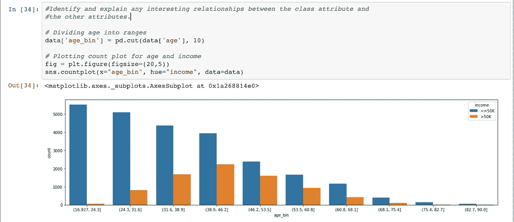

以上情节表明，经验对获得更多收入至关重要。经验丰富的人比经验不足的人挣得多。在现实世界中也是如此。现在，我们变得越来越有意义。让我们用更多的属性来尝试一下。

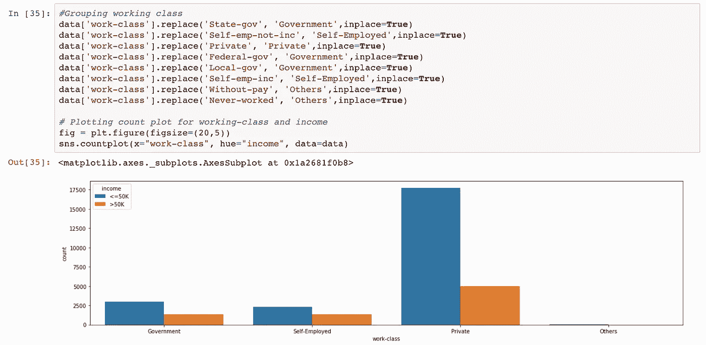

从上面两个图中，我们可以看到，一般情况下，自雇人士赚钱更多，受过高等教育的人收入更高。

现在，作为最后一步，我们将合并任何相似的列，删除不必要的列，然后我们就完成了。我们可以开始使用我们的数据来做机器学习的酷的部分，训练模型和预测东西。

最后一步，我将添加关于如何组合所有列的基本想法。这是我的看法和理解，每个人只要能说得通，都可以有自己的解读。

1.  education-num——该属性与 education 列相同，所以我们可以只使用这两个属性中的一个。
2.  fnlwgt —该属性没有用，因为它与任何属性都没有任何关联。我们将删除该属性。
3.  资本利得和资本损失——我们可以将资本利得和资本损失相加，得到一列“净资本利得”,而不是两列代表不同的价值。
4.  教育——我们可以像上面描述的那样分成不同的类别(辍学、高中毕业、社区大学、学士、硕士、博士)。这给了我们更坚实的分类，这可能对收入的预测有更大的影响。
5.  婚姻状况——类似于教育，我们可以有 4 个类别，如未婚、已婚、分居和丧偶来分类这个属性。
6.  种族——保持现状。
7.  职业——类似于教育，我们可以分为 5 类，如蓝领工作，白领工作，服务工作，专业工作，其他。
8.  工人阶级——类似于教育，我们可以有 4 个阶级，像政府，私人，个体经营者，其他。
9.  性——保持原样。
10.  每周小时数—保持不变。
11.  收入——保持现状。
12.  本国——类似于教育，我们可以只分两类，即美国和其他国家。

我希望您现在对如何处理数据有了基本的了解，或者换句话说，对探索性数据分析有了基本的了解。你可以在这里看看完整的 python 笔记本[。](https://github.com/kaushikmani/Adult_Dataset)

## 来自 DDI 的相关故事:

 [## 用 7 个步骤解释深度学习

### 和猫一起

medium.com](https://medium.com/datadriveninvestor/deep-learning-explained-in-7-steps-9ae09471721a)  [## 数据科学和软件工程哪个更有前途？

### 大约一个月前，当我坐在咖啡馆里为一个客户开发网站时，我发现了这个女人…

medium.com](https://medium.com/datadriveninvestor/which-is-more-promising-data-science-or-software-engineering-7e425e9ec4f4)