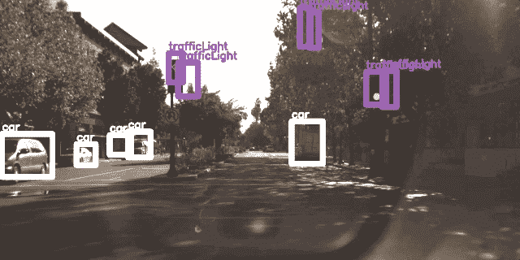
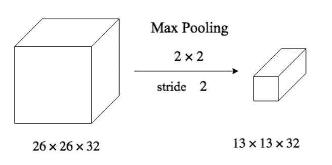

# CNN 工作原理介绍

> 原文：<https://medium.datadriveninvestor.com/introduction-to-how-cnns-work-77e0e4cde99b?source=collection_archive---------0----------------------->

神经网络的主要部分之一是**卷积神经网络** (CNN)。CNN 使用图像识别和分类来检测物体、识别面部等。它们由具有可学习的权重和偏好的神经元组成。每个特定的神经元接收许多输入，然后对它们进行加权求和，通过激活函数传递，并以输出作出响应。

CNN 主要用于对图像进行分类，根据相似性对它们进行聚类，然后执行对象识别。许多使用 CNN 的算法可以识别人脸、路标、动物等。

# CNN 是如何工作的？

它们由音量提示并利用多通道图像。与人类可以看到的只有宽度和高度的平面图像相反，CNN 无法识别这一点。由于数字彩色图像具有红-蓝-绿(RGB)编码，CNN 混合这三种颜色以产生人类感知的色谱。

 [## DDI 编辑推荐:5 本机器学习书籍，让你从新手变成数据驱动专家…

### 机器学习行业的蓬勃发展重新引起了人们对人工智能的兴趣

www.datadriveninvestor.com](https://www.datadriveninvestor.com/2019/03/03/editors-pick-5-machine-learning-books/) 

一个卷积网络将这样的图像作为三个独立的颜色层一层一层地叠加在一起。正常的彩色图像被视为一个矩形盒子，其宽度和高度由这些维度的像素数量来测量。CNN 解释的三层颜色(RGB)中的深度层被称为通道。

**CNN 网络中的第一个**层是 ***卷积层*** ，它是核心构建模块，承担大部分计算重任。使用滤波器或内核对数据或图像进行卷积。过滤器是我们通过滑动窗口应用于数据的小单元。图像的深度与输入相同，对于深度的 RGB 值为 4 的彩色图像，深度为 4 的过滤器也将应用于它。这个过程包括获取图像中滤波器的元素乘积，然后对每个滑动动作的特定值求和。具有带颜色的 3d 过滤器的卷积的输出将是 2d 矩阵。

现在，解释卷积层的最佳方式是想象一个手电筒照在图像的左上方。为了理解这是如何工作的，想象一个手电筒发出的光覆盖了一个 5 x 5 的区域。现在，让我们想象这个手电筒滑过输入图像的所有区域。这个手电筒被称为**滤光器**(或有时被称为**神经元**或**内核**)，它照亮的区域被称为**感受野**。这个过滤器也是一个数字数组(这些数字被称为**权重**或**参数**)。

**第二个**是 ***激活层*** ，其中 ***应用 ReLu(整流线性单元)*** 在这一步我们应用整流功能来增加 CNN 中的非线性。图像是由不同的对象组成的，这些对象彼此之间不是线性的。

**第三个**，是 ***池层*** ，其中涉及到特征的下采样。它应用于 3d 体积中的每一层。通常，该层中有超参数:

1.  **空间范围的维度:**这是 N 的值，我们可以把 N 交叉和特征表示并映射到单个值上
2.  **Stride:** 滑动窗口沿宽度和高度跳过多少个特征

常见的**池层**使用跨距为 2 的 2 交叉 2 最大过滤器，这是一个非重叠过滤器。最大值过滤器将返回区域内要素的最大值。最大池的示例是当有 26 个跨 26 个跨 32 个卷时，现在通过使用具有 2 个跨 2 个过滤器和 2 个跨的最大池图层，卷将减少到 13 个跨，13 个跨 32 个特征地图。

**最后的**，是 ***全连通层，*** 涉及**展平**。这包括将整个汇集的特征映射矩阵转换成单个列，然后将该列馈送到神经网络进行处理。对于完全连接的层，我们将这些特征组合在一起以创建一个模型。最后，我们有一个激活函数，如 softmax 或 sigmoid 来对输出进行分类。

# 关键要点

*   每个输入图像将通过一系列带有过滤器的**卷积层**
*   为了能像人类一样感知，CNN 拥有红-蓝-绿 **(RGB)** 编码的数字彩色图像
*   有一个**卷积层、激活层、汇集层、**和**全连接层**，这些都是互连的，以便 CNN 可以处理和感知数据，以便对图像进行分类

感谢您阅读我的文章，如果您喜欢阅读，请鼓掌并在下面评论您的任何反馈。如果你想联系我，你可以通过 [LinkedIn](https://www.linkedin.com/in/simran-bansari-77150a156/) 联系我。