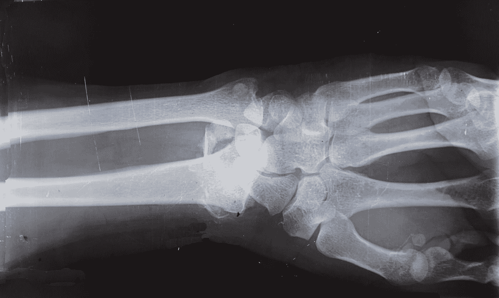
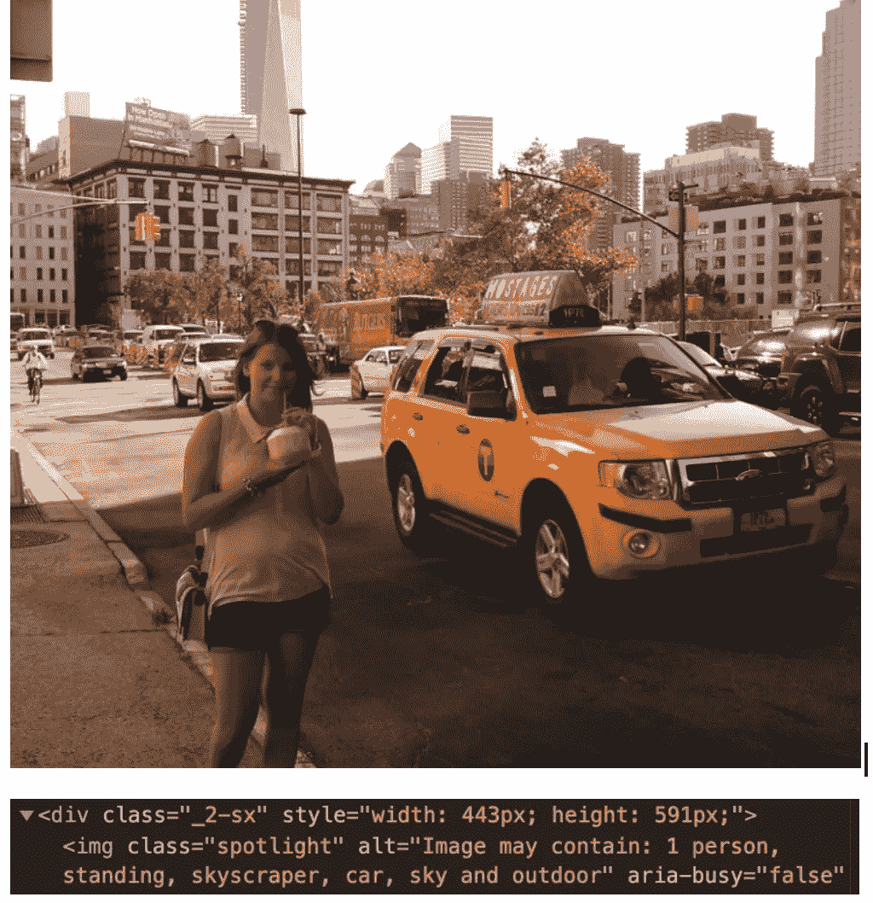
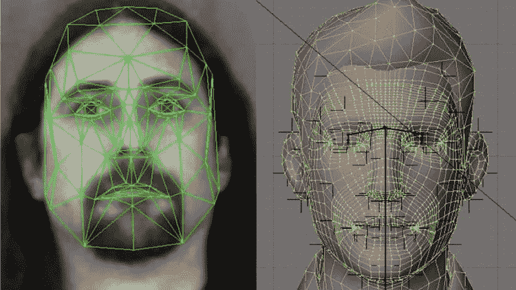
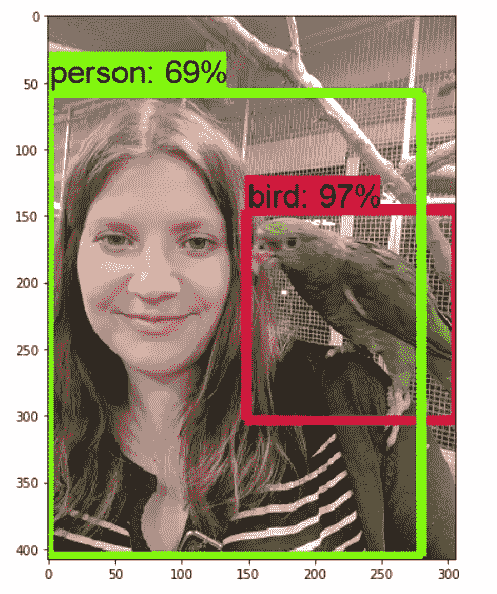
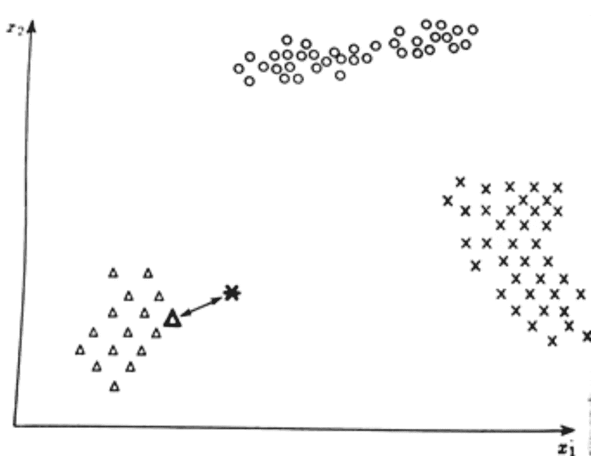

# 图像识别简介

> 原文：<https://medium.datadriveninvestor.com/introduction-to-image-recognition-d104bdf7018b?source=collection_archive---------1----------------------->

By Josef Steppan — Own work, CC BY-SA 4.0, [https://commons.wikimedia.org/w/index.php?curid=64810040](https://commons.wikimedia.org/w/index.php?curid=64810040)

视觉对于人类来说是一种非常重要的感觉。利用这种感觉，我们收集了关于我们周围世界的大部分信息。我们以这样一种方式组织我们的环境，我们通过视觉获得最重要的信息。这就是我们在工作、家庭和旅途中的工作方式。我们根据所见做出大多数决定。

此外，我们生活在一个机器无处不在的时代，无论是机械的还是数字的。我们希望以对我们来说最自然的方式与他们接触，因为我们都是视觉学习者，我们希望教会他们以我们的方式看待世界。这就是为什么我们需要计算机来识别图像。

在这篇博客文章中，我想展示什么是图像识别，它用于哪些领域，计算机如何实际识别图像以及正确分类你看到的物体的方法示例。

## 图像或模式识别？

图像识别是对机器(计算机)看到的图像进行处理，通过分析数字数据记录，可以对观察到的对象进行分类，以便做出进一步的决策。图像识别，例如在照片上识别人，实际上是应用于许多科学领域的模式识别领域的特例。它可以用于大量的领域——从制图和地质学，到医学、考古学、天文学、物理学、生物识别、安全、工业和机器人学。

Photo by [Cara Shelton](https://unsplash.com/@socalcaral?utm_source=medium&utm_medium=referral) on [Unsplash](https://unsplash.com?utm_source=medium&utm_medium=referral)

在医学上，模式识别可用于诊断疾病，包括基于放置在患者身体上的各种传感器的记录，以及基于疾病的症状，如肌肉疼痛、发烧和咳嗽，可能是流感，因为它们是这种疾病的一组特征症状。

最近有许多关于将模式识别用于图像诊断的研究。例如，神经网络被用来发现 x 光照片中的异常，以帮助早期诊断各种疾病。

你们中的大多数人可能听说过 Shazam、Soundhound 或其他用于查找从收音机中听到的歌曲名称的应用程序。这里又来了一个模式识别的例子——音频识别。计算机将物理音频记录转换成电信号，然后转换成数字信号来识别模式。音频识别通常也用于帮助残疾人用他们的声音控制计算机或生成电影字幕。

回到图像识别，它可以用于文件分析，生物识别，如指纹读取，以及导航。使用图像识别的一个例子是替代文本的脸书照片。他们的可访问性团队为视障用户引入了一项功能，该功能可以自动描述照片内容。屏幕阅读器可以帮助将这些人纳入社交网络，并更好地理解其他人发布的内容。

## 图像识别过程

根据应用的不同，图像识别的整个过程会略有不同，主要集中在它的使用目的上。然而，一般规则是相似的，所以我将在这里概述它们。这个过程的后续步骤总是从我们想要“读取”的图像引导到计算机必须在此基础上做出的决定。

第一个也是非常明显的阶段是获取我们将要处理的图像。在目前的技术水平下，获取图像非常容易——用智能手机和安装在笔记本电脑上的相机都可以拍出好照片。计算机只能分析数字输入，所以每张照片必须用一组点——像素——来表示。只有这种信号才能转化为进一步行动的决定。如果我们用数码相机来制作，那么就不用担心这一步了。

该过程的下一阶段是找到图像的数学描述。图像处理主要有三个层次。预处理用于去除噪声、锐化照片以容易地识别图像中的重要对象，或者如果颜色不是所研究问题中的重要特征，则将照片的颜色改变为灰度。

下一步是定义最能描述已识别对象的特征集。它被称为中级处理。这些特性的选择对识别有很大影响，因此它们是针对特定应用而选择的。通常使用定量特征，这些特征可以方便地表示并放在坐标轴上，如特征的大小或特征之间的距离。

[https://www.udemy.com/course/face-recognition-in-c-sharp-using-opencv-for-beginners/](https://www.udemy.com/course/face-recognition-in-c-sharp-using-opencv-for-beginners/)

例如，对于一个人的脸，它可以是它的宽度，嘴角之间的距离或瞳孔之间的距离。然后可以在空间中确定“测量”的面部，这将为我们确定特定的人并与其他人区分开来设置一个点——即使那些人非常相似。

现在，我们进入了图像识别过程的第三个阶段——分类。这是一个数学函数，可以将每个特性分配到一个类中，我们稍后将根据该类做出决策。相似的物体在特征空间中会彼此靠近，不同的——远离，这将我们引向集中的或分离良好的一组点，代表给定类别的物体。正如你所猜测的，不同类的对象将位于离其他类相当远的地方。这种分组是能够有效识别物体的先决条件。如果不同的类由于不正确的初始特征选择而混合在一起，将不可能正确地对它们进行分组。

最后一个阶段是正确的识别和决策。这一阶段的重点是以数学公式的形式对图像进行适当的描述。它指的是指示函数的概念，指示函数是由图像识别算法使用学习过程自动创建的。至关重要的是，该算法导致这样的事实，即对于每个点，可以确定对象在多大程度上满足被分类到适当类别的条件。为所有类别正确构建的指示函数选择或正确定义的类别聚类之间的边界直接导致整个过程的最后阶段——识别和决策——对象被分配到指示函数具有最高值的类别或其位于指定边界的哪一侧。

## 常用算法

有许多不同的方法可以对图像进行分类，以便计算机进行识别。这里列出的这些方法的例子包括最小距离方法、统计方法或神经网络方法。

最小距离法的特点是实施简单。它们基于系统存储器中的数据集(学习序列),必须在使用算法之前实现，以及对象的特定特征和类别。在这种方法中，观察到的物体根据其在“特征空间”中到最近邻居的距离被分类到特定的类中，如图[1]所示。然而，这种方法有其缺点，在小的教学集的情况下，当观察的对象将具有与来自教学集的特定类显著不同的特征时，很容易出错。如果学习集没有正确实现，结果的质量也可能不够好。

第二组图像分类方法是统计方法。他们使用概率论来确定所观察的对象在多大程度上符合各个类别。每一类都有对象的特定特征出现的一定概率。分类过程归结为从图像类别的概率组中确定最高概率，并确定图像属于特定类别的最大可能性。

Photo by [Robina Weermeijer](https://unsplash.com/@averey?utm_source=medium&utm_medium=referral) on [Unsplash](https://unsplash.com?utm_source=medium&utm_medium=referral)

第三组识别方法是神经网络方法。以一种简化的方式，他们绘制了位于大脑中的真实神经元的运作。每个神经细胞都有许多输入，但只有一个带有“控制”信号的输出。对于每个输入，分配特定的权重来影响神经元的行为。和以前的情况一样，最初需要一个训练集，但是特征是由网络自动定义的，基于这些特征来确定我们的图像属于哪个类。

## 摘要

在许多不同的科学领域中，识别图像或模式是每天都要进行的活动。为了让计算机识别图像，必须经过几个阶段，包括图像获取、图像的适当处理和分析准备。然后将图像分类到一个特定的组中，并在此基础上做出具体行动的决定。模式识别有许多算法，它们的选择取决于特定的应用。

资源:

[1]塔德乌西耶维奇，弗拉斯基，米；Rozpoznawanie obra zow .Wydawnictwo Naukowe PWN，Warszawa 1991 年