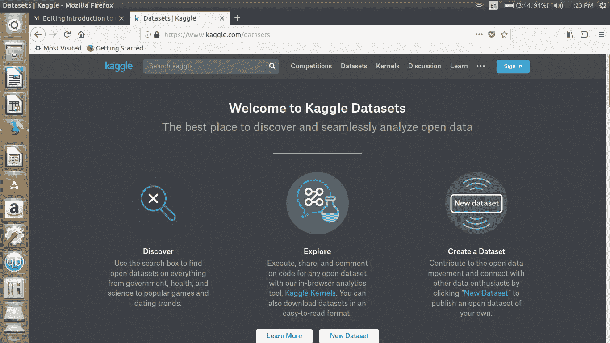
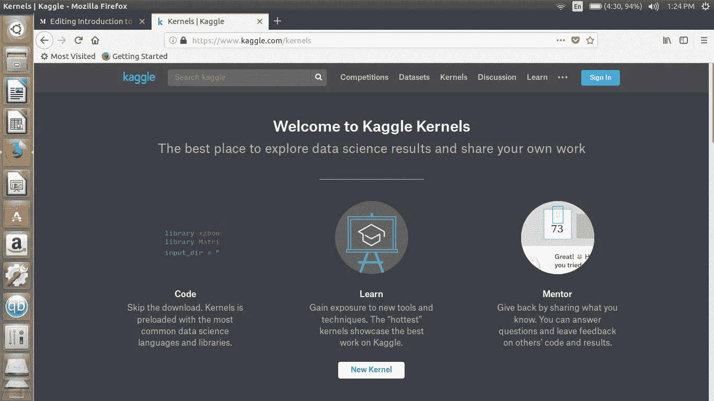
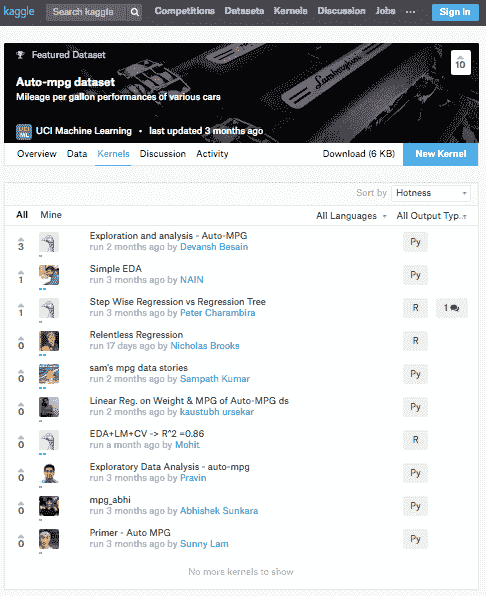
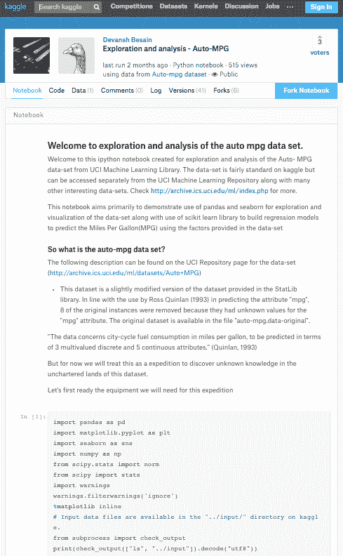
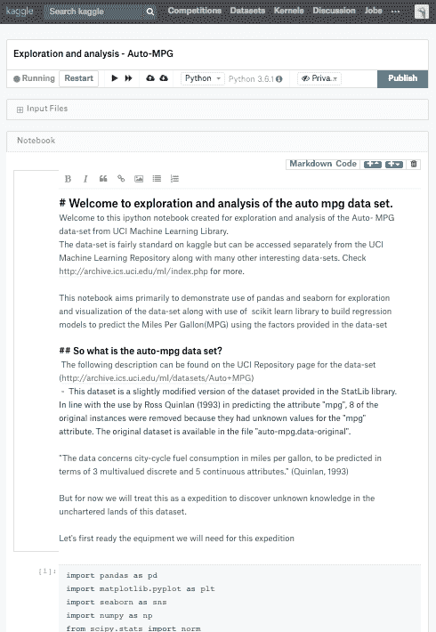
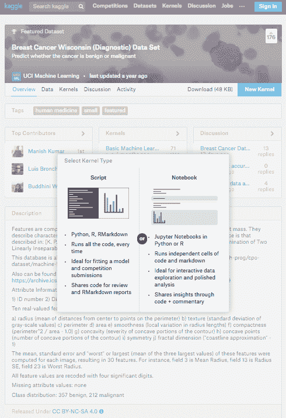
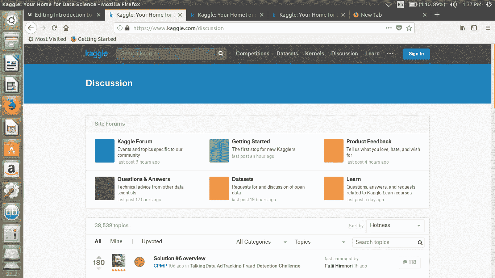
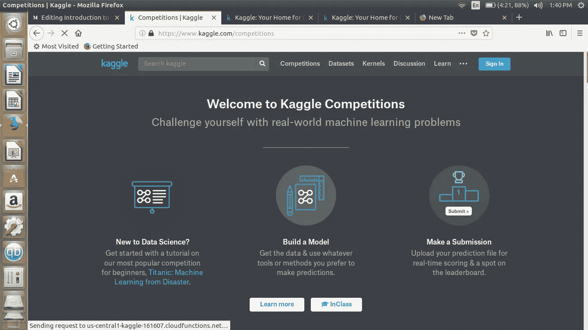

# 面向机器学习和数据科学初学者的 Kaggle 入门！

> 原文：<https://medium.datadriveninvestor.com/introduction-to-kaggle-for-beginners-in-machine-learning-and-data-science-865199d7ead2?source=collection_archive---------0----------------------->

[**ka ggle**](http://www.kaggle.com)对于那些数据科学和机器学习的初学者来说是一个极好的资源，所以你绝对是在正确的地方:)

在你去 [Kaggle](https://www.kaggle.com/) 之前，我想强调的是，先有一个坚实的基础是个好主意。如果你想知道更多，你可以随时在这里阅读:[机器如何学习:实用指南——freeCodeCamp](https://medium.freecodecamp.org/how-machines-learn-a-practical-guide-203aae23cafb)或 [Karlijn Willems 对一个完全初学者如何开始学习机器学习的回答，如果他们有一些编程语言的知识？](https://www.quora.com/How-does-a-total-beginner-start-to-learn-machine-learning-if-they-have-some-knowledge-of-programming-languages/answer/Karlijn-Willems-1)

现在，要使用 Kaggle，你不仅仅需要明白你为什么要使用它(练习，呈现你的作品，网络，…)。)，还包括您可以用它做的所有事情:

## **1。数据集**

要轻松开始，我建议你从看数据集开始， [Datasets | Kaggle](https://www.kaggle.com/datasets) 。这里的棘手之处在于，实际上没有任何方法可以(从页面本身)收集哪些数据集是好的开始。我建议使用“搜索”功能来查找一些标准数据集，如[鸢尾物种](https://www.kaggle.com/uciml/iris)、[皮马印第安人糖尿病](https://www.kaggle.com/uciml/pima-indians-diabetes-database)、[成人人口普查收入](https://www.kaggle.com/uciml/adult-census-income)、[auto pgg](https://www.kaggle.com/uciml/autompg-dataset)和[乳腺癌威斯康星州](https://www.kaggle.com/uciml/breast-cancer-wisconsin-data)数据集。

[https://www.kaggle.com/datasets](https://www.kaggle.com/datasets)

在您继续之前，请阅读数据集的描述，以理解变量确切表示的内容以及数据的含义。

## **2。内核**

仅仅查看数据集并不是你来 kaggle 的原因，所以请查看“内核”选项卡，并单击你在以下屏幕中看到的条目之一:

[https://www.kaggle.com/kernels](https://www.kaggle.com/kernels)

内核是“在线脚本编辑器，允许您在不安装 R 或 Python 的情况下执行代码(并且已经连接了数据)。”—换句话说，您可以继续在浏览器中工作，探索、建模、可视化…您的数据，而无需安装任何东西。

例如，当您单击第一个条目时，您会看到类似这样的内容:

我要说的是，检查你选择的任何内核，并尝试获得我刚才描述的内核背后的一般想法——最简单的方法是通过按下蓝色按钮“Fork Notebook”来分叉你选择的内核。系统将提示您登录(如果您尚未登录)，然后您将被带到编辑器:

您可以开始进行调整:更改代码，更改文本，添加图像，…

当你分叉并调整好笔记本后，你可以按下蓝色的“新内核”按钮，开始从头开始制作自己的笔记本和脚本(你可以在下面的截图中看到这两个选项的区别):

如果你想在 Kaggle 脚本入门方面获得一些帮助，请查看使用 Kaggle 脚本的[数据探索](https://www.datacamp.com/community/open-courses/data-exploration-with-kaggle-scripts)。

我之前没有强调的一个特点是，您可以讨论笔记本、脚本、数据集，..就在我给你看了截图的那几页里！当您试图了解人们在笔记本/脚本中做的事情是什么以及为什么做这些事情时，或者为了澄清数据或为什么数据看起来是这样时，这是一个非常方便的功能。你有任何意见，都可以直接提出来！

安东尼·戈德布卢姆在[安东尼·戈德布卢姆关于初学者应该如何开始 Kaggle 的回答中提到的其他内核？](https://www.quora.com/How-should-a-beginner-get-started-on-Kaggle/answer/Anthony-Goldbloom)有:

*   [Omar El Gabry 的内核](https://www.kaggle.com/omarelgabry/titanic/a-journey-through-titanic)，一个不错的端到端工作流，从探索数据开始，以 Python 中的一些基本机器学习模型结束
*   [梅根·里斯达尔的内核](https://www.kaggle.com/mrisdal/titanic/exploring-survival-on-the-titanic)为 r。

## **3。讨论**

除了评论选项之外，你还有一个完整的讨论区，包括 Kaggle 论坛，一个专门为初学者准备的区域，以及产品反馈。有机会一定要去看看！

[https://www.kaggle.com/discussion](https://www.kaggle.com/discussion)

 [## 学习| Kaggle

### 编辑描述

www.kaggle.com](https://www.kaggle.com/learn/overview)  [## 讨论

### 编辑描述

www.kaggle.com](https://www.kaggle.com/discussion) 

## **4。博客**

Kaggle 也有一个博客，上面有一些教程和公告。这可能对你来说也很方便，但我必须提到，你也可以在其他地方找到好的教程，如 Python/R 库的文档，[机器学习](https://chrisalbon.com/)(克里斯·阿尔邦)，[更好地构建软件，一起](http://www.github.com) (Github)。

 [## 教程-在线数据分析和解释|数据营

### DataCamp 是进入数据科学领域的人最快、最容易的平台。通读我们的在线教程…

datacamp.com](https://datacamp.com/community/tutorials) 

## **5。比赛**

当你进入网站时，你首先看到的是:比赛。当你使用内核和数据集时，参加竞赛是个好主意。

[https://www.kaggle.com/competitions](https://www.kaggle.com/competitions)

当您这样做时，请查看以下免费的互动课程，它们将帮助您开始学习:

 [## 关于机器学习的 Kaggle Python 教程

### 一直想参加卡格尔比赛，但不确定自己是否具备合适的技能？本互动教程由…

www.datacamp.com](https://www.datacamp.com/community/open-courses/kaggle-python-tutorial-on-machine-learning)  [## Kaggle R 机器学习教程

### 一直想参加 Kaggle 机器学习竞赛，但不确定自己是否具备合适的技能？这个…

www.datacamp.com](https://www.datacamp.com/community/open-courses/kaggle-r-tutorial-on-machine-learning) 

还可以查看 Kaggle 上的[“入门”竞赛](https://www.kaggle.com/competitions?group=all&page=1&segment=gettingStarted&sortBy=deadline)。

## **6。用户排名**

你总能向最优秀的人学习。查看[用户排名](https://www.kaggle.com/rankings)看看你需要做什么才能成为 **Kaggle** 高手！

## **7。工作岗位**

当你在 Kaggle 上工作的时候，你可能想看看工作部分。这对那些还在找数据科学行业工作的人来说再好不过了！

希望你喜欢它！

一定要分享给这方面愿意学习的初学者:)

您可以在下面关注我:

 [## Abhishek Bhattacharya -应用开发助理-埃森哲| LinkedIn

### 查看 Abhishek Bhattacharya 在世界上最大的职业社区 LinkedIn 上的个人资料。Abhishek 有 5 份工作…

www.linkedin.com](http://www.linkedin.com/in/abhishekbhattacharya11) 

# 来自 DDI 的相关帖子:

 [## 用 7 个步骤解释深度学习——数据驱动投资者

### 在深度学习的帮助下，自动驾驶汽车、Alexa、医学成像-小工具正在我们周围变得超级智能…

www.datadriveninvestor.com](https://www.datadriveninvestor.com/2019/01/23/deep-learning-explained-in-7-steps/)  [## 数据科学和软件工程哪个更有前途？-数据驱动型投资者

### 大约一个月前，当我坐在咖啡馆里为一个客户开发网站时，我发现了这个女人…

www.datadriveninvestor.com](https://www.datadriveninvestor.com/2019/01/23/which-is-more-promising-data-science-or-software-engineering/)