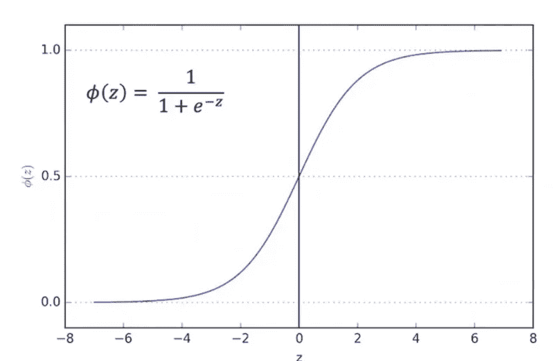
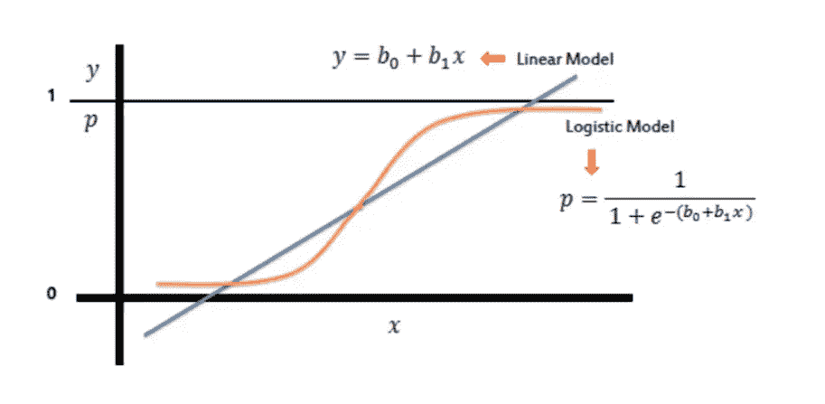
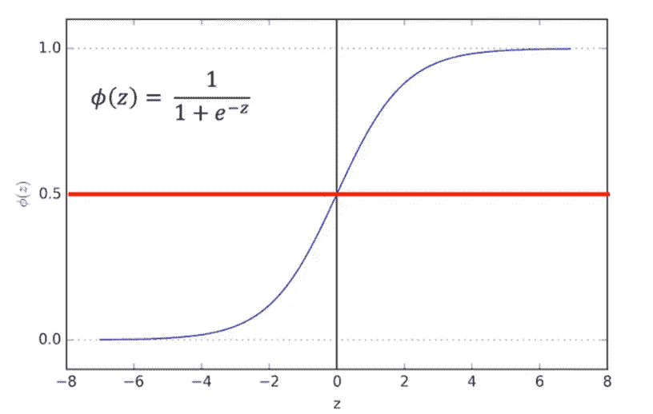

# 物流回归导论

> 原文：<https://medium.datadriveninvestor.com/introduction-to-logistics-regression-da33db80adf4?source=collection_archive---------11----------------------->

逻辑回归是被称为广义线性模型(glm)的一大类算法的一部分。逻辑回归是一种分类算法。它用于预测给定一组独立变量的二元结果(1 / 0，是/否，真/假)。为了表示二元/分类结果，我们使用虚拟变量。

虽然名字一开始可能会让人迷惑。逻辑回归允许我们解决分类问题，我们试图预测离散的类别。

 [## DDI 编辑推荐:5 本机器学习书籍，让你从新手变成数据驱动专家…

### 机器学习行业的蓬勃发展重新引起了人们对人工智能的兴趣

www.datadriveninvestor.com](https://www.datadriveninvestor.com/2019/03/03/editors-pick-5-machine-learning-books/) 

二元分类的惯例是有两个类 0 和 1。

逻辑回归线由一个 *Sigmoid(又名逻辑)*函数表示，该函数接受任何值并输出 0 到 1 之间的值。

**将线性回归转换为逻辑回归**

通过取线性回归方程的值并将其放入 Sigmoid 函数中，可以将线性回归曲线转换为逻辑回归曲线，如下所示:

**分为 0 级和 1 级**

使用 Sigmoid 函数时，输出可以是 0 到 1 之间的任何值，因此为了使其离散，我们可以设置一个阈值(本例中为 0.5)。高于 0.5，所有值都将被归类为 1，低于 0.5，所有值都将被归类为 0。

