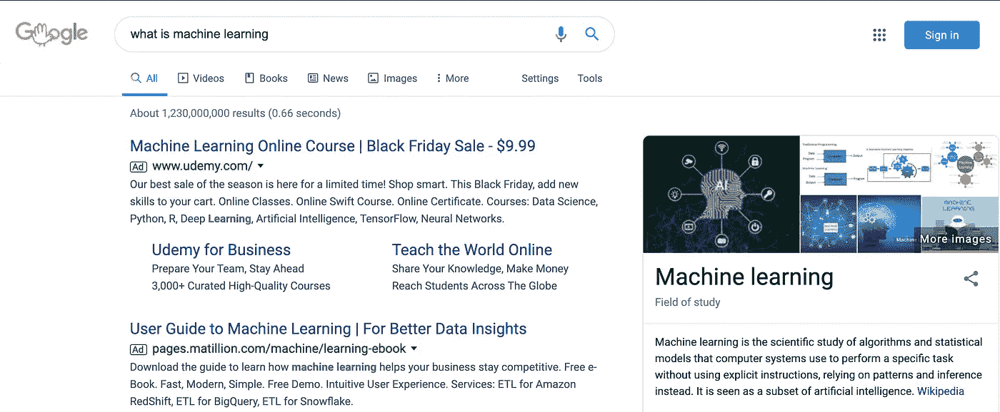
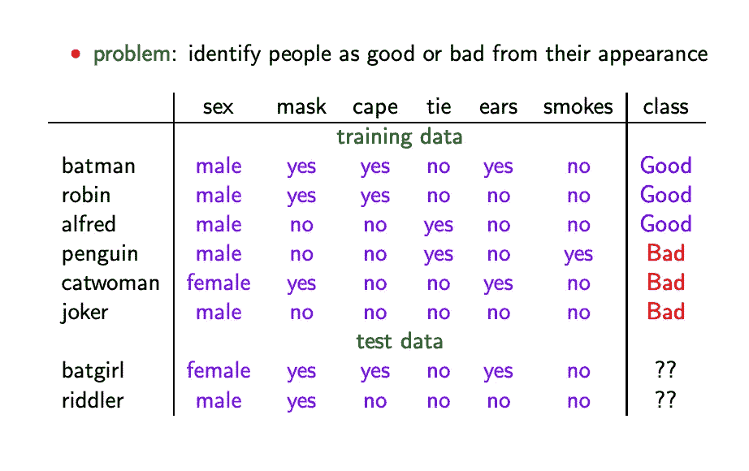
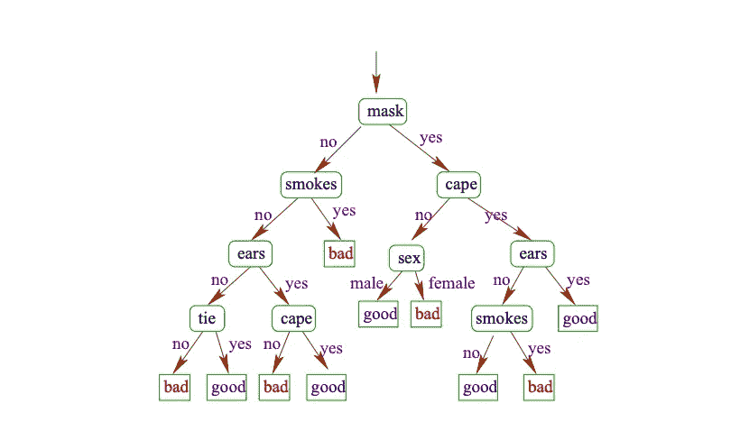
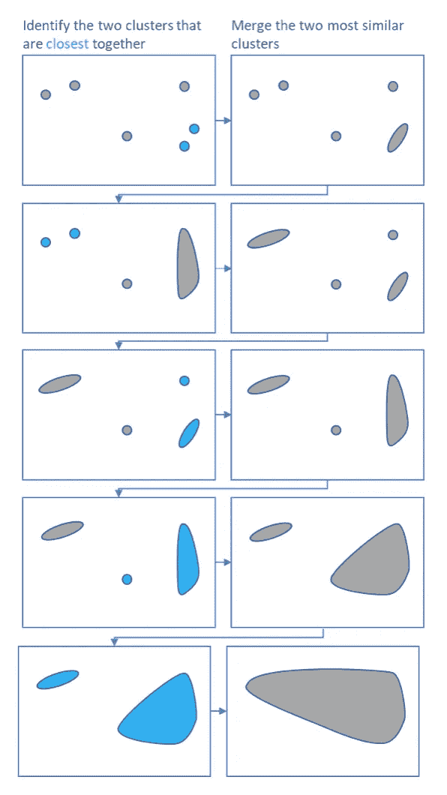
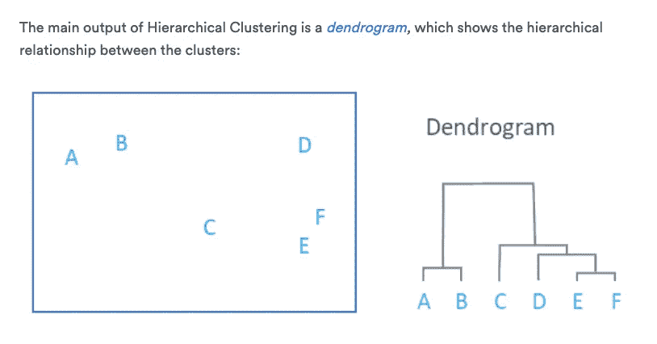
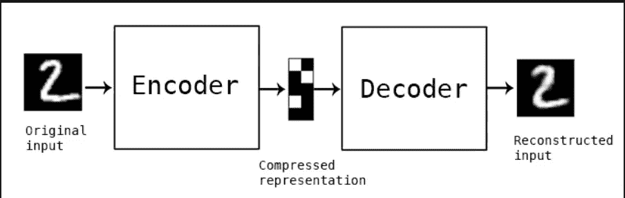
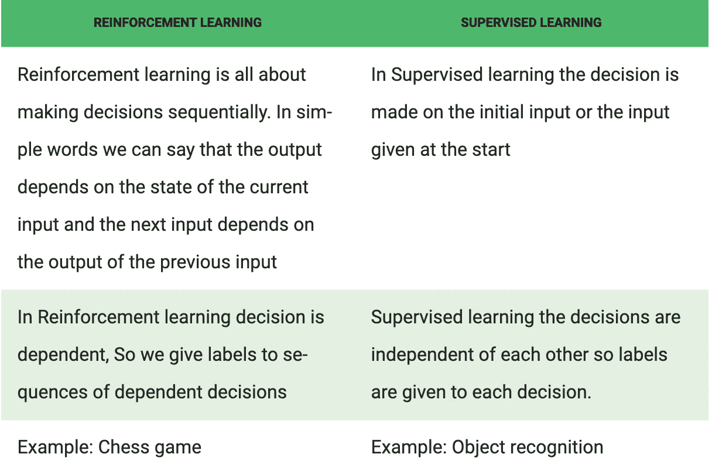
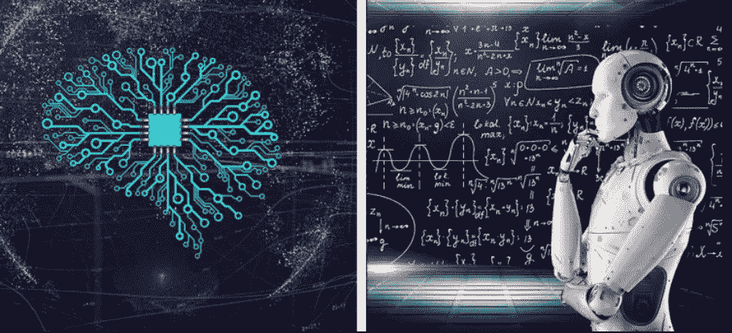

# 机器学习介绍🧠

> 原文：<https://medium.datadriveninvestor.com/introduction-to-machine-learning-3be6134ac407?source=collection_archive---------5----------------------->

什么是机器学习？让我们问问谷歌…

机器学习是人工智能的一个子领域，其目标是使用同一解决方案解决许多不同的问题。更准确地说，是从实例和经验中学习的算法研究。机器学习的三种主要类型是监督学习、非监督学习和强化学习。

*   监督学习:该算法由一个从给定的一组预测器(独立变量)中预测的结果(因变量)组成。
*   无监督学习:算法用于结构化数据。
*   强化学习:算法用于通过试错法做出具体决策。

现在我们已经了解了机器学习的一般思想，让我们更仔细地看看不同类型的学习，并更好地了解提出算法需要什么。

## 监督学习

机器学习的这一分支依赖于分类器的构建和使用，这是一种将数据作为输入并将标签作为输出的功能。想象一下，你想要建造一台机器，它可以根据一个人的外表来预测这个人本质上是好是坏。

***第一步:收集训练数据***

训练数据是用于构造分类器的一组已知输入和输出。为了确保更准确的分类器，使用信息丰富、独立和简单的特征是很重要的。同时，应该留出一些数据作为例子，以便稍后测试分类器的准确性。

***第二步:训练分类器***

有许多不同类型的分类器，其中之一是决策树。我们向分类器提供训练数据，并测量其准确性。

如果我们觉得分类器不能准确表示我们的数据，我们可以返回并调整参数。

 [## 2019 年最值得学习的编码语言|数据驱动的投资者

### 在我读大学的那几年，我跳过了很多次夜游去学习 Java，希望有一天它能帮助我在…

www.datadriveninvestor.com](https://www.datadriveninvestor.com/2019/02/21/best-coding-languages-to-learn-in-2019/) 

***第三步:预测其他数据***

根据我们的分类器，蝙蝠女侠和谜语人都不错。如果我们对我们的分类器感觉良好，我们可以继续把它的算法输入我们的机器。

## 无监督学习

机器学习的这一分支可以进一步分为两类，聚类和自动编码。

***聚类***

聚类是将数据分组在一起的行为，可以进一步分为两个子类别，k-means 和 hierarchical。

*K-表示:*

将数据分成 k 个组，其中 k 越高，组越多，组中的数据越相似。而 k 越低，组越大，数据组越不相似。

步伐

*   随机定义 k 个质心
*   将每个数据点分配给最近的质心聚类
*   根据新添加的数据点更新每个聚类的质心，直到质心停止变化/算法收敛

K-means 聚类不能基于准确性来测量，而是通过轮廓分数来测量，轮廓分数测量相同聚类中的数据点之间的内聚性、相似性以及不同聚类中的数据点之间的分离、差异。

*分级:*

以最高级别具有最大多样性的方式对数据进行分组，然后分组分支为更具体和相似的数据点。

步伐

*   将不同的数据点分成单独的组
*   合并彼此最相似的组
*   继续这样做，直到最终所有的数据点都聚集在一个大的集群中。

系统聚类的结果可以用一个树状图来表示，描述哪些是更一般的聚类(终点)，哪些是更具体的聚类(起点)。

## 自动编码

一种神经网络，它重建输入以忽略信号噪声，分为编码和解码两个过程。自动编码的成功取决于原始数据和重建数据之间的“损失”,损失越少越成功。

## 强化学习

机器学习的这一分支与监督学习非常相似，只是没有训练数据。没有一套标签可供选择，而是机器必须从经验中学习。

***设置***

*   输入:模型的初始状态
*   输出:没有预先确定的标签/结果
*   培训:基于输入。用户将根据其输出决定奖励或惩罚模型。
*   最佳解决方案是根据最大回报来决定的。

现在你已经理解了机器学习和人工智能的基本原理/概念，你可以开始概念化机器人如何工作了…

## 参考